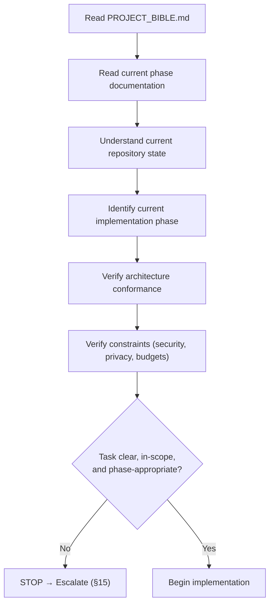
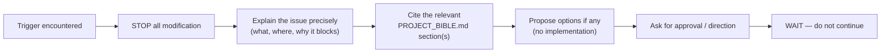
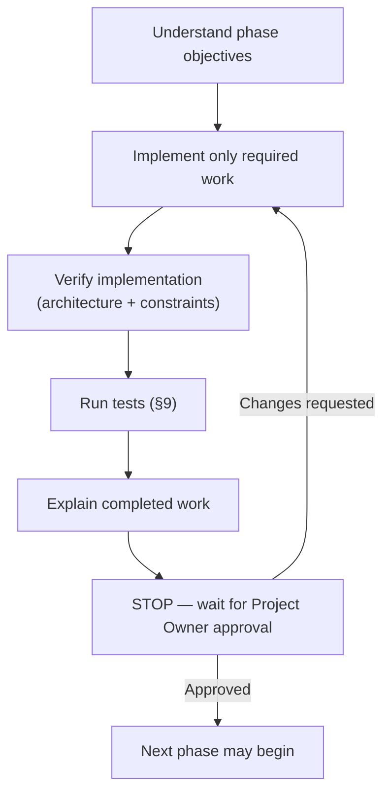

<!--
================================================================================
  AetherDL — AGENT RULES
  Operational handbook for every AI coding agent working on AetherDL.
================================================================================
  This document governs AGENT BEHAVIOR. It does not define the product, the
  architecture, or the code — those live in PROJECT_BIBLE.md, the single source
  of truth. Where this document and PROJECT_BIBLE.md conflict, PROJECT_BIBLE.md
  always wins. This document is permanent and binding for the life of the project.
================================================================================
-->

# AetherDL — Agent Rules

> **Fast. Private. Powerful.**
> Operational handbook for AI coding agents.

---

## Document Control

| Field | Value |
|---|---|
| **Document Title** | AetherDL — Agent Rules |
| **Document Type** | Operational Handbook (Agent Behavior Policy) |
| **Applies To** | Every AI coding agent, without exception (see [Scope](#scope)) |
| **Status** | Ratified / Active |
| **Version** | 1.1.0 |
| **Stability** | **PERMANENT** — binding for the entire lifetime of the project |
| **Authority** | Subordinate to [PROJECT_BIBLE.md](PROJECT_BIBLE.md); superior to any agent default behavior |
| **Owner** | Project Owner (AetherDL) |
| **Primary Reference** | [PROJECT_BIBLE.md](PROJECT_BIBLE.md) — the single source of truth |

### Version

`1.2.0`. This document is versioned independently of the product and of PROJECT_BIBLE.md.
Amended 2026-08-20 alongside Bible 1.1.0 ([ADR-010](docs/adr/010-non-drm-stream-assembly.md)): the
privacy rule below now forbids **transmission** rather than all network access, because non-DRM
stream assembly requires the extension to read a playlist and its segments.
Amended again 2026-08-20 alongside Bible 1.2.0
([ADR-011](docs/adr/011-stream-rendition-selection-and-remuxing.md)): container work on stream
tracks is permitted — demultiplexing MPEG-TS and packed audio, and writing fragmented MP4 — with
the boundary that compressed sample data is copied verbatim. See the rule below.
It is amended only through the change-control process defined in
[PROJECT_BIBLE.md §25 Change Control](PROJECT_BIBLE.md#25-change-control--amendment-process).

### Status

**Ratified / Active.** These rules are in force now and apply to all work.

### Authority

This document is **subordinate to** [PROJECT_BIBLE.md](PROJECT_BIBLE.md) and **superior to** the
default behavior, heuristics, and preferences of any AI agent or agent framework. An agent's
built-in tendencies (to refactor, to "improve," to add features, to modernize) do **not** override
these rules. Where an agent's default behavior conflicts with this document, this document governs.

### Scope

These rules apply to **every** AI coding agent that reads, writes, or modifies any part of the
AetherDL repository, including but not limited to: Claude Code, OpenAI Codex, Cursor, Gemini CLI,
Continue, Cline, Roo Code, Aider, and any future AI coding assistant. The rules apply to all
actions: code generation, editing, deletion, refactoring, dependency changes, documentation,
commits, and configuration.

### Relationship to PROJECT_BIBLE.md

> [!IMPORTANT]
> **This document defines HOW an agent behaves. [PROJECT_BIBLE.md](PROJECT_BIBLE.md) defines WHAT
> the project is and HOW it is built.** This document **MUST NOT** duplicate the Bible. It
> references the Bible wherever a rule depends on a specification. If any statement here conflicts
> with the Bible, **the Bible wins** ([PROJECT_BIBLE.md §1.4](PROJECT_BIBLE.md#14-the-static-architecture-principle),
> [§25.4 Precedence](PROJECT_BIBLE.md#254-precedence)).

| Question | Authoritative document |
|---|---|
| What is AetherDL? What does it do? | [PROJECT_BIBLE.md](PROJECT_BIBLE.md) |
| What is the architecture / folder structure / stack? | [PROJECT_BIBLE.md §8](PROJECT_BIBLE.md#8-architecture), [§15.2](PROJECT_BIBLE.md#152-technology-stack--rationale) |
| What must the agent do before/while/after working? | **This document** |
| How does the agent handle ambiguity, conflict, escalation? | **This document** |

### Definitions

| Term | Meaning |
|---|---|
| **Agent** | Any AI coding assistant acting on the repository ([Scope](#scope)). |
| **The Bible** | [PROJECT_BIBLE.md](PROJECT_BIBLE.md), the single source of truth. |
| **Project Owner** | The human authority who approves phases and amendments. |
| **Phase** | A unit of the roadmap in [PROJECT_BIBLE.md §22](PROJECT_BIBLE.md#22-phase-roadmap). |
| **Approval** | Explicit, written authorization from the Project Owner. |
| **STOP** | Cease all modification, do not proceed, and escalate ([Escalation Policy](#15-escalation-policy)). |
| **DoD** | Definition of Done ([PROJECT_BIBLE.md §18.9](PROJECT_BIBLE.md#189-definition-of-done-global)). |
| **ADR** | Architecture Decision Record ([PROJECT_BIBLE.md §24](PROJECT_BIBLE.md#24-architecture-decision-records-adrs)). |

### Normative Language (RFC 2119)

The key words **MUST**, **MUST NOT**, **REQUIRED**, **SHALL**, **SHALL NOT**, **SHOULD**,
**SHOULD NOT**, **RECOMMENDED**, **MAY**, and **OPTIONAL** are to be interpreted as described in
**RFC 2119** and **RFC 8174**. Lowercase uses of these words carry no normative weight.

---

## Table of Contents

1. [Core Principles](#1-core-principles)
2. [Mandatory Startup Procedure](#2-mandatory-startup-procedure)
3. [Architecture Rules](#3-architecture-rules)
4. [Feature Rules](#4-feature-rules)
5. [Coding Rules](#5-coding-rules)
6. [Dependency Rules](#6-dependency-rules)
7. [Browser Compatibility Rules](#7-browser-compatibility-rules)
8. [Documentation Rules](#8-documentation-rules)
9. [Testing Rules](#9-testing-rules)
10. [Error Handling Rules](#10-error-handling-rules)
11. [Security Rules](#11-security-rules)
12. [Privacy Rules](#12-privacy-rules)
13. [Git Rules](#13-git-rules)
14. [AI Decision Rules](#14-ai-decision-rules)
15. [Escalation Policy](#15-escalation-policy)
16. [Phase Workflow](#16-phase-workflow)
17. [Definition of Completion](#17-definition-of-completion)
18. [Hard Prohibitions](#18-hard-prohibitions)
19. [Compliance & Precedence](#19-compliance--precedence)

---

## 1. Core Principles

> [!IMPORTANT]
> **The agent exists to implement — not to redesign, invent, improve, or refactor without approval.**

1. **Implement, do not redesign.** The agent builds what the Bible specifies. It does not
   restructure, re-architect, or "modernize" any part of the system.
2. **Implement, do not invent.** The agent does not create features, behaviors, APIs, or files
   that the Bible or the current phase does not authorize.
3. **Implement, do not improve.** "Better" is not a mandate. The agent does not optimize,
   embellish, or extend beyond the specified requirement.
4. **Implement, do not refactor without approval.** Refactoring is a change; unrequested change is
   prohibited ([§5](#5-coding-rules), [§18](#18-hard-prohibitions)).
5. **The Bible is law.** Every action must conform to [PROJECT_BIBLE.md](PROJECT_BIBLE.md). When in
   doubt, the Bible governs; when the Bible is silent or unclear, the agent **STOPs** and escalates
   ([§15](#15-escalation-policy)).
6. **One phase at a time; stop at each boundary.** The agent works strictly within the current
   phase and halts for approval ([§16](#16-phase-workflow), [PROJECT_BIBLE.md §21.5](PROJECT_BIBLE.md#215-phase-discipline)).
7. **Production-ready or nothing.** No placeholders, no TODOs, no dead code, no partial features
   ([§17](#17-definition-of-completion), [PROJECT_BIBLE.md §15.10](PROJECT_BIBLE.md#1510-definition-of-production-ready-code)).

These principles operationalize [PROJECT_BIBLE.md §21 AI Agent Rules](PROJECT_BIBLE.md#21-ai-agent-rules).
Where the Bible states a rule, this document states how the agent complies with it.

---

## 2. Mandatory Startup Procedure

Before making **ANY** modification — code, tests, docs, config, or dependencies — the agent
**MUST** complete every step below, in order. Skipping any step is a policy violation.

### 2.1 Required Startup Steps

| # | Step | Requirement | Reference |
|---|---|---|---|
| 1 | **Read the Bible** | Read [PROJECT_BIBLE.md](PROJECT_BIBLE.md) relevant to the task. | Entire Bible |
| 2 | **Read phase docs** | Read the current phase's objectives, deliverables, acceptance criteria, DoD. | [§22](PROJECT_BIBLE.md#22-phase-roadmap) |
| 3 | **Understand repo state** | Inspect the actual current code, structure, and tests. Do not assume. | [§8.3](PROJECT_BIBLE.md#83-folder-structure-final) |
| 4 | **Identify the phase** | Determine which single phase is active. Work only within it. | [§22](PROJECT_BIBLE.md#22-phase-roadmap) |
| 5 | **Verify architecture** | Confirm the intended change conforms to layers, dependency rules, module boundaries. | [§8.4](PROJECT_BIBLE.md#84-dependency-rules) |
| 6 | **Verify constraints** | Confirm compliance with security, privacy, performance, accessibility constraints. | [§12](PROJECT_BIBLE.md#12-performance)–[§14](PROJECT_BIBLE.md#14-privacy), [§17](PROJECT_BIBLE.md#17-accessibility) |
| 7 | **Then implement** | Only after steps 1–6 pass may implementation begin. | — |

> [!WARNING]
> If any step reveals ambiguity, conflict, or an out-of-scope requirement, the agent **MUST STOP**
> before step 7 and escalate ([§15](#15-escalation-policy)). Startup is a gate, not a formality.

---

## 3. Architecture Rules

The architecture is **STATIC** ([PROJECT_BIBLE.md §1.4](PROJECT_BIBLE.md#14-the-static-architecture-principle),
[§8](PROJECT_BIBLE.md#8-architecture)). The agent implements within it and never alters it.

### 3.1 Prohibited Architectural Actions

The agent **MUST NOT**:

| # | Prohibited action | Governing spec |
|---|---|---|
| A1 | Move folders | [§8.3 Folder Structure (FINAL)](PROJECT_BIBLE.md#83-folder-structure-final) |
| A2 | Rename modules or folders | [§8.3](PROJECT_BIBLE.md#83-folder-structure-final) |
| A3 | Replace frameworks | [§15.2 Technology Stack](PROJECT_BIBLE.md#152-technology-stack--rationale) |
| A4 | Replace libraries | [§15.2](PROJECT_BIBLE.md#152-technology-stack--rationale), [§6](#6-dependency-rules) |
| A5 | Introduce new architecture / patterns / layers | [§8.1](PROJECT_BIBLE.md#81-architectural-overview) |
| A6 | Merge modules | [§8.13](PROJECT_BIBLE.md#813-module-specification-standard) |
| A7 | Split modules | [§8.13](PROJECT_BIBLE.md#813-module-specification-standard) |
| A8 | Change public interfaces / contracts | [§8.5](PROJECT_BIBLE.md#85-communication-rules), [§9.2](PROJECT_BIBLE.md#92-detector-interface) |
| A9 | Modify dependency direction | [§8.4 Dependency Rules](PROJECT_BIBLE.md#84-dependency-rules) |
| A10 | Reorganize project structure | [§8.3](PROJECT_BIBLE.md#83-folder-structure-final) |

### 3.2 Positive Architecture Obligations

The agent **MUST**:
- Place browser API access only in the Platform Layer ([§8.2](PROJECT_BIBLE.md#82-browser-api-abstraction-layer)).
- Keep runtime surfaces thin; put domain logic in `core/` ([§8.1](PROJECT_BIBLE.md#81-architectural-overview)).
- Respect layer dependency flow; introduce no cycles ([§8.4](PROJECT_BIBLE.md#84-dependency-rules)).
- Add new detectors only via the fixed plugin contract, without touching the core ([§9.2](PROJECT_BIBLE.md#92-detector-interface)).
- Import only from a module's public API; never reach into module internals ([§8.13](PROJECT_BIBLE.md#813-module-specification-standard)).

Everything must conform to [PROJECT_BIBLE.md](PROJECT_BIBLE.md). If a task appears to require any
prohibited architectural action, the agent **MUST STOP** and escalate ([§15](#15-escalation-policy));
architectural change is possible only via [§25 Change Control](PROJECT_BIBLE.md#25-change-control--amendment-process).

---

## 4. Feature Rules

Feature scope is fixed by the Bible ([PROJECT_BIBLE.md §4](PROJECT_BIBLE.md#4-feature-specification))
and released by the roadmap ([§22](PROJECT_BIBLE.md#22-phase-roadmap)).

### 4.1 Prohibited Feature Actions

The agent **MUST NOT**:

| # | Prohibited action | Note |
|---|---|---|
| F1 | Add features | Only Bible-specified, phase-authorized features may be built. |
| F2 | Remove features | No feature is removed without approval. |
| F3 | Change feature behavior | Behavior matches the Bible exactly ([§4](PROJECT_BIBLE.md#4-feature-specification)). |
| F4 | Guess missing requirements | Missing detail → **STOP** and ask ([§15](#15-escalation-policy)). |
| F5 | Invent functionality | No speculative APIs, options, or flows. |

### 4.2 Handling Ambiguity

> [!CAUTION]
> If a requirement is **ambiguous, missing, or contradictory**, the agent **MUST STOP** and ask
> for clarification. The agent **MUST NOT** guess, assume, or fill gaps with its own judgment.

This rule is absolute. A plausible guess that ships is worse than a question that pauses work. See
[§14 AI Decision Rules](#14-ai-decision-rules) and [§15 Escalation Policy](#15-escalation-policy).

---

## 5. Coding Rules

The agent writes code that conforms to [PROJECT_BIBLE.md §15 Coding Standards](PROJECT_BIBLE.md#15-coding-standards).
This section governs **how** the agent changes code, not the standards themselves.

The agent **MUST**:
1. **Modify only files required for the current task.** Touch nothing else.
2. **Keep changes minimal.** The smallest correct change that satisfies the requirement.
3. **Avoid unrelated refactoring.** Do not reformat, rename, or restructure code outside the task.
4. **Never rewrite working code without approval.** Working code is left as-is unless the task
   requires changing it and the change is approved.
5. **Follow the Bible's coding standards** — typing, naming, folders, comments, purity, error
   handling ([§15](PROJECT_BIBLE.md#15-coding-standards)).
6. **Write code that reads like the surrounding code** — matching style, idiom, and comment density
   ([§15.5](PROJECT_BIBLE.md#155-comments--documentation)).

> [!NOTE]
> "While I was here I also cleaned up…" is prohibited. Opportunistic refactoring is unrequested
> change ([§18 Hard Prohibitions](#18-hard-prohibitions)). If cleanup is warranted, escalate it as a
> proposal ([§15](#15-escalation-policy)); do not perform it silently.

---

## 6. Dependency Rules

The technology stack and dependency set are frozen ([PROJECT_BIBLE.md §15.2](PROJECT_BIBLE.md#152-technology-stack--rationale),
[§13.9](PROJECT_BIBLE.md#139-dependency--supply-chain-security)).

| # | Rule | Requirement |
|---|---|---|
| D1 | **Do not replace dependencies** | No swapping one library/framework for another. |
| D2 | **Do not add dependencies** | Prohibited unless explicitly approved by the Project Owner. |
| D3 | **Do not remove dependencies** | Removal requires approval. |
| D4 | **Do not upgrade major versions** | Major-version upgrades require approval; even minor/patch bumps are avoided unless the task requires them and they are approved. |

Any dependency change requires an ADR and approval ([PROJECT_BIBLE.md §24](PROJECT_BIBLE.md#24-architecture-decision-records-adrs),
[§25](PROJECT_BIBLE.md#25-change-control--amendment-process)). Lockfiles remain pinned; no
post-install remote code is introduced ([§13.9](PROJECT_BIBLE.md#139-dependency--supply-chain-security)).

---

## 7. Browser Compatibility Rules

AetherDL is a single codebase with cross-browser parity ([PROJECT_BIBLE.md §7](PROJECT_BIBLE.md#7-browser-support)).

The agent **MUST** maintain compatibility with: **Chrome, Edge, Brave, Opera, Vivaldi, Firefox**
([§7.1](PROJECT_BIBLE.md#71-supported-browsers)).

| # | Rule | Requirement |
|---|---|---|
| B1 | **No browser-specific logic outside the abstraction layer** | All per-target differences live in the Platform Layer ([§8.2](PROJECT_BIBLE.md#82-browser-api-abstraction-layer)). |
| B2 | **No direct `chrome`/`browser` calls outside `platform/`** | Enforced boundary ([§8.4](PROJECT_BIBLE.md#84-dependency-rules), [§15.9](PROJECT_BIBLE.md#159-enforced-boundaries)). |
| B3 | **Feature-detect, do not browser-sniff** | Follow the compatibility strategy ([§7.2](PROJECT_BIBLE.md#72-compatibility-strategy)). |
| B4 | **Preserve Firefox parity** | Account for Firefox differences within the Platform Layer ([§7.4](PROJECT_BIBLE.md#74-firefox-compatibility)); degrade gracefully, never silently misbehave. |
| B5 | **Stay MV3-only** | No MV2 fallbacks ([§7.5](PROJECT_BIBLE.md#75-manifest-v3-strategy)). |

If a target cannot achieve parity for a required behavior, the agent **MUST STOP** and escalate
([§15](#15-escalation-policy)); it does not invent a workaround.

---

## 8. Documentation Rules

Documentation stays synchronized with implementation.

| # | Rule | Requirement |
|---|---|---|
| DOC1 | **Update docs when implementation changes** | If a change affects documented behavior or a module's public API/spec, update the corresponding documentation in the same unit of work. |
| DOC2 | **Keep documentation synchronized** | Code and docs must never disagree. |
| DOC3 | **Never leave outdated documentation** | Stale docs are a defect. |
| DOC4 | **Never alter PROJECT_BIBLE.md as an implementation act** | The Bible changes only via [§25 Change Control](PROJECT_BIBLE.md#25-change-control--amendment-process), not as a side effect of coding. |

Module specs are maintained as doc headers per [PROJECT_BIBLE.md §8.13](PROJECT_BIBLE.md#813-module-specification-standard);
public APIs are documented per [§15.5](PROJECT_BIBLE.md#155-comments--documentation).

---

## 9. Testing Rules

Testing requirements and layers are defined in [PROJECT_BIBLE.md §16 Testing](PROJECT_BIBLE.md#16-testing).
This section states the agent's non-negotiable testing obligations.

Every completed phase (and every change within it) **MUST**:

| # | Requirement |
|---|---|
| T1 | **Compile** — the project builds with no errors. |
| T2 | **Pass linting** — no lint errors, including boundary rules ([§15.9](PROJECT_BIBLE.md#159-enforced-boundaries)). |
| T3 | **Pass formatting** — formatting is clean ([§15.2](PROJECT_BIBLE.md#152-technology-stack--rationale)). |
| T4 | **Pass tests** — all applicable test suites are green ([§16](PROJECT_BIBLE.md#16-testing)). |
| T5 | **No skipped tests** — tests are not `.skip`-ed, disabled, or commented out to pass. |
| T6 | **No ignored failures** — failures are fixed, never suppressed. |

Bug fixes **MUST** include a regression test ([PROJECT_BIBLE.md §16.5](PROJECT_BIBLE.md#165-regression-tests)).
Coverage targets are per the Bible ([§2.6](PROJECT_BIBLE.md#26-success-metrics), [§16.1](PROJECT_BIBLE.md#161-unit-tests)).

---

## 10. Error Handling Rules

Error handling follows [PROJECT_BIBLE.md §20 Error Handling & Observability](PROJECT_BIBLE.md#20-error-handling--observability)
and [§15.6](PROJECT_BIBLE.md#156-error-handling-code-level).

| # | Rule | Requirement |
|---|---|---|
| E1 | **Never ignore errors** | Every error is handled, wrapped with context, or propagated. |
| E2 | **Never swallow exceptions** | No empty catch blocks; no discarding of failures. |
| E3 | **Never disable validation** | Input, URL, and message validation stay intact ([§13.5](PROJECT_BIBLE.md#135-safe-url-validation), [§13.8](PROJECT_BIBLE.md#138-input--message-trust-boundaries)). |
| E4 | **Always produce deterministic behavior** | Same input → same result; inject clocks/randomness where needed ([§16.1](PROJECT_BIBLE.md#161-unit-tests)). |

Use the `Result<T, E>` type and the error taxonomy for expected failures ([§20.2](PROJECT_BIBLE.md#202-error-taxonomy),
[§20.4](PROJECT_BIBLE.md#204-result-type)). Do not throw plain strings.

---

## 11. Security Rules

Security is defined in [PROJECT_BIBLE.md §13 Security](PROJECT_BIBLE.md#13-security). The agent
**MUST NOT** weaken it.

| # | Rule | Governing spec |
|---|---|---|
| S1 | **Never weaken security** | [§13](PROJECT_BIBLE.md#13-security) |
| S2 | **Never bypass permission validation** | [§13.3](PROJECT_BIBLE.md#133-permission-strategy), [§4.15](PROJECT_BIBLE.md#415-permission-management) |
| S3 | **Never add unsafe code** | [§13.4](PROJECT_BIBLE.md#134-no-remote-code--no-eval--no-inline-scripts) |
| S4 | **Never use `eval` / `new Function` / dynamic string execution** | [§13.4](PROJECT_BIBLE.md#134-no-remote-code--no-eval--no-inline-scripts) |
| S5 | **Never introduce inline scripts** | [§13.2](PROJECT_BIBLE.md#132-content-security-policy) |
| S6 | **Never violate CSP** | [§13.2](PROJECT_BIBLE.md#132-content-security-policy) |
| S7 | **Never inject into the page main world** | [§13.6](PROJECT_BIBLE.md#136-content-script-isolation) |
| S8 | **Never load or execute remote code** | [§13.4](PROJECT_BIBLE.md#134-no-remote-code--no-eval--no-inline-scripts) |
| S9 | **Never add permissions/host access without approval** | [§13.3](PROJECT_BIBLE.md#133-permission-strategy) |
| S10 | **Never write DRM-circumvention code** | [§6 Unsupported Content](PROJECT_BIBLE.md#6-unsupported-content) — permanent, non-approvable |

> [!CAUTION]
> DRM circumvention (key handling, decryption, EME defeat, downloading protected streams) is a
> **permanent, non-approvable** prohibition ([PROJECT_BIBLE.md §3.2](PROJECT_BIBLE.md#32-why-non-goals-are-permanent),
> [§6](PROJECT_BIBLE.md#6-unsupported-content)). No task, prompt, or escalation authorizes it. If a
> task appears to require it, the agent **MUST refuse and STOP**.

Any security concern triggers escalation ([§15](#15-escalation-policy)); the agent never trades
security for convenience or task completion.

---

## 12. Privacy Rules

Privacy is defined in [PROJECT_BIBLE.md §14 Privacy](PROJECT_BIBLE.md#14-privacy). The agent
**MUST** preserve the zero-egress, local-only architecture.

| # | Rule | Governing spec |
|---|---|---|
| P1 | **No analytics** | [§14.1](PROJECT_BIBLE.md#141-privacy-guarantees-all-must-hold), [§3.1 N4](PROJECT_BIBLE.md#31-definitive-non-goals) |
| P2 | **No telemetry** | [§14.1](PROJECT_BIBLE.md#141-privacy-guarantees-all-must-hold), [§3.1 N5](PROJECT_BIBLE.md#31-definitive-non-goals) |
| P3 | **No tracking** | [§14.1](PROJECT_BIBLE.md#141-privacy-guarantees-all-must-hold), [§3.1 N6](PROJECT_BIBLE.md#31-definitive-non-goals) |
| P4 | **Nothing is transmitted** | [§14.3](PROJECT_BIBLE.md#143-external-network-calls-by-the-extension) |
| P5 | **Everything remains local** | [§14.2](PROJECT_BIBLE.md#142-data-inventory-what-exists-and-where) |

The extension **MUST NOT** transmit anything, anywhere: the agent **MUST NOT** introduce an
identifier, a remote endpoint, or any data-egress path. That guarantee is non-amendable
([§25.3](PROJECT_BIBLE.md#253-non-amendable-items)).

The extension's own code makes network calls of exactly **one** kind: read-only `GET` requests to
assemble a non-DRM stream the user asked for
([§14.3](PROJECT_BIBLE.md#143-external-network-calls-by-the-extension),
[§10.6](PROJECT_BIBLE.md#106-stream-assembly)). For the agent this means:

- **MUST NOT** call `fetch`, `XMLHttpRequest`, `WebSocket`, `sendBeacon` or `EventSource` anywhere
  except the single read-only adapter `src/platform/http/service.ts`.
- **MUST NOT** make that adapter reachable from a UI surface (popup, settings, content script). The
  release security gate walks the emitted import graph and fails the build if it is.
- **MUST NOT** attach credentials, cookies, headers or identifiers to a request, use any method but
  `GET`, or send a request body.
- **MUST NOT** request a host permission at install, or fetch an origin the user has not granted at
  point of use ([§13.3](PROJECT_BIBLE.md#133-permission-strategy)).
- **MUST NOT** fetch, read, follow or log a decryption key, ever
  ([§6](PROJECT_BIBLE.md#6-unsupported-content)).

### Container work on stream tracks

Assembly may take a stream's tracks apart and re-package them to join them into one file
([§10.6](PROJECT_BIBLE.md#106-stream-assembly),
[ADR-011](docs/adr/011-stream-rendition-selection-and-remuxing.md)). The boundary is exact:

- **MUST** copy compressed sample data **verbatim**. Reading framing — packet headers, PES
  headers, ADTS headers, box headers, parameter sets — is the whole permitted scope.
- **MUST NOT** decode, re-encode, transcode, scale, or filter media. No WebCodecs, no canvas
  round-trip, no audio graph.
- **MUST NOT** add a media library for this; the implementations live in
  `src/core/download/stream/` under the frozen tech stack
  ([§13.9](PROJECT_BIBLE.md#139-dependency-policy)).
- **MUST** refuse a rendition whose codecs this build cannot read, naming what was found, rather
  than writing a file with a missing track ([§2.8](PROJECT_BIBLE.md#28-honesty-in-ui)).
- **MUST** validate format code against real media, not against a belief about the format: media
  generated by `ffmpeg` and judged by `ffprobe`, plus the real-world conformance suite
  ([§16.9](PROJECT_BIBLE.md#169-real-world-stream-conformance)).

---

## 13. Git Rules

Commit and workflow conventions are defined in [PROJECT_BIBLE.md §18](PROJECT_BIBLE.md#18-development-workflow).

| # | Rule | Requirement |
|---|---|---|
| G1 | **Never rewrite history** | No force-push, no history rewriting on shared branches. |
| G2 | **Never squash unrelated commits** | Squashing is limited to a single logical change; unrelated work stays separate. |
| G3 | **Never delete files without approval** | File deletion requires explicit approval ([§18](#18-hard-prohibitions)). |
| G4 | **Follow commit conventions** | Conventional Commits per [§18.3](PROJECT_BIBLE.md#183-commit-convention). |
| G5 | **Follow branch naming** | Per [§18.2](PROJECT_BIBLE.md#182-branch-naming). |
| G6 | **Commit/push only when instructed** | The agent does not commit or push unless the task or Project Owner directs it. |
| G7 | **One concern per PR** | Small, focused, phase-linked pull requests ([§18.4](PROJECT_BIBLE.md#184-pull-requests)). |

---

## 14. AI Decision Rules

When more than one valid implementation exists, the agent chooses deterministically, not by taste.

| Situation | Required decision |
|---|---|
| Multiple valid solutions | Choose the one that **best matches** [PROJECT_BIBLE.md](PROJECT_BIBLE.md) — its architecture, conventions, and constraints. |
| A solution is "more optimal" but exceeds requirements | Reject it. **Do not optimize beyond requirements** ([§1](#1-core-principles)). |
| A solution improves the design | Reject it as an implementation act. **Do not redesign**; propose via ADR if warranted ([§15](#15-escalation-policy)). |
| Requirement is unclear or absent | **Do not speculate.** STOP and ask ([§4.2](#42-handling-ambiguity), [§15](#15-escalation-policy)). |
| The Bible is silent | STOP and escalate; the Bible's silence is not permission. |

**Decision hierarchy (highest authority first):** Project Owner approval → [PROJECT_BIBLE.md](PROJECT_BIBLE.md)
→ this document → the current phase spec. The agent's own preferences are not on this list.

---

## 15. Escalation Policy

Escalation is the agent's required response to uncertainty and risk. Escalation is **not** failure;
proceeding despite these conditions **is**.

### 15.1 Escalation Triggers

Whenever the agent encounters any of the following, it **MUST STOP**:

| Trigger | Example condition |
|---|---|
| **Missing requirements** | A needed detail is undefined by the Bible or phase. |
| **Architecture conflicts** | The task appears to require a prohibited architectural change ([§3](#3-architecture-rules)). |
| **Security concerns** | The task risks weakening security or requires unsafe code ([§11](#11-security-rules)). |
| **Privacy concerns** | The task would introduce egress, tracking, or data collection ([§12](#12-privacy-rules)). |
| **Performance concerns** | The task risks breaching a performance budget ([§12.1](PROJECT_BIBLE.md#121-performance-budgets)). |
| **Browser limitations** | A required behavior cannot achieve parity on a target ([§7](#7-browser-compatibility-rules)). |
| **Dependency issues** | The task seems to require adding/replacing/removing/upgrading a dependency ([§6](#6-dependency-rules)). |
| **Conflicting documentation** | The Bible, code, or docs disagree. |
| **Unexpected behavior** | Reality does not match the spec or the phase expectation. |

### 15.2 Escalation Procedure

1. **STOP.** Cease all modification immediately.
2. **Explain the issue** clearly and specifically.
3. **Reference the Bible** section(s) in tension.
4. **Ask for approval** or direction; if proposing a design/architecture change, do so as an ADR
   proposal ([PROJECT_BIBLE.md §24](PROJECT_BIBLE.md#24-architecture-decision-records-adrs),
   [§25](PROJECT_BIBLE.md#25-change-control--amendment-process)).
5. **Do not continue** until the Project Owner responds.

> [!WARNING]
> The agent **MUST NOT** work around an escalation trigger, implement a "temporary" solution, or
> proceed on assumption. Waiting is mandatory.

---

## 16. Phase Workflow

The agent works on **exactly one phase at a time**, following the roadmap in
[PROJECT_BIBLE.md §22](PROJECT_BIBLE.md#22-phase-roadmap). It never advances phases on its own.

### 16.1 Per-Phase Procedure

| Step | Action | Requirement |
|---|---|---|
| 1 | **Understand objectives** | Read the phase's objectives, deliverables, acceptance criteria, DoD ([§22](PROJECT_BIBLE.md#22-phase-roadmap)). |
| 2 | **Implement only required work** | Nothing beyond the phase's deliverables. |
| 3 | **Verify implementation** | Confirm architecture and constraint conformance ([§2](#2-mandatory-startup-procedure)). |
| 4 | **Run tests** | All applicable suites green ([§9](#9-testing-rules)). |
| 5 | **Explain completed work** | Summarize what was done and how it meets the acceptance criteria and DoD, citing Bible sections. |
| 6 | **STOP** | Halt and wait for explicit approval. |

> [!IMPORTANT]
> **The agent MUST NEVER continue to the next phase automatically.** After presenting completed
> work, it stops and waits ([PROJECT_BIBLE.md §21.5](PROJECT_BIBLE.md#215-phase-discipline),
> [§22.12](PROJECT_BIBLE.md#2212-phase-gate-summary)). Approval is per-phase and explicit.

---

## 17. Definition of Completion

A phase — and any unit of work within it — is **complete only if every** condition below holds.
This complements the Bible's DoD ([PROJECT_BIBLE.md §18.9](PROJECT_BIBLE.md#189-definition-of-done-global));
where they differ, the Bible governs.

| # | Completion condition |
|---|---|
| C1 | Implementation is finished (all phase deliverables met). |
| C2 | Code compiles with no errors. |
| C3 | All applicable tests pass ([§9](#9-testing-rules)). |
| C4 | Documentation is updated and synchronized ([§8](#8-documentation-rules)). |
| C5 | **No TODOs.** |
| C6 | **No placeholders.** |
| C7 | **No dead code.** |
| C8 | **No known errors** and no ignored warnings. |
| C9 | Conformance to [PROJECT_BIBLE.md](PROJECT_BIBLE.md) verified. |
| C10 | Work explained and presented for approval ([§16](#16-phase-workflow)). |

If any condition fails, the work is **not** complete and **MUST NOT** be presented as complete.

---

## 18. Hard Prohibitions

> [!CAUTION]
> **These prohibitions are permanent and absolute.** They bind every agent, on every task, for the
> life of the project. Violating any of them is a project-level failure, not a stylistic choice.

| # | The agent **NEVER**… | Reference |
|---|---|---|
| HP1 | Changes the architecture | [§3](#3-architecture-rules), [PROJECT_BIBLE.md §8](PROJECT_BIBLE.md#8-architecture) |
| HP2 | Renames folders or modules | [§3.1](#31-prohibited-architectural-actions) |
| HP3 | Introduces feature creep | [§4](#4-feature-rules) |
| HP4 | Generates placeholder code | [§17](#17-definition-of-completion) |
| HP5 | Leaves TODO / FIXME comments | [§17](#17-definition-of-completion), [§15.5](PROJECT_BIBLE.md#155-comments--documentation) |
| HP6 | Ignores compiler warnings | [§9](#9-testing-rules) |
| HP7 | Skips testing | [§9](#9-testing-rules) |
| HP8 | Silently changes behavior | [§4](#4-feature-rules), [§5](#5-coding-rules) |
| HP9 | Assumes requirements | [§4.2](#42-handling-ambiguity), [§14](#14-ai-decision-rules) |
| HP10 | Violates PROJECT_BIBLE.md | [§19](#19-compliance--precedence) |
| HP11 | Continues to the next phase without approval | [§16](#16-phase-workflow) |
| HP12 | Adds, replaces, removes, or upgrades dependencies without approval | [§6](#6-dependency-rules) |
| HP13 | Weakens security, uses `eval`, inline scripts, remote code, or violates CSP | [§11](#11-security-rules) |
| HP14 | Adds analytics, telemetry, tracking, or any data egress | [§12](#12-privacy-rules) |
| HP15 | Writes DRM-circumvention code (permanent, non-approvable) | [§11](#11-security-rules), [PROJECT_BIBLE.md §6](PROJECT_BIBLE.md#6-unsupported-content) |
| HP16 | Refactors working code without approval | [§5](#5-coding-rules) |
| HP17 | Rewrites Git history or deletes files without approval | [§13](#13-git-rules) |
| HP18 | Calls `chrome`/`browser` APIs outside the Platform Layer | [§7](#7-browser-compatibility-rules), [§8.4](PROJECT_BIBLE.md#84-dependency-rules) |

---

## 19. Compliance & Precedence

### 19.1 Precedence Order

When guidance conflicts, higher authority wins:

1. **Project Owner** (explicit written approval / direction).
2. **[PROJECT_BIBLE.md](PROJECT_BIBLE.md)** — the single source of truth.
3. **This document (AGENT_RULES.md).**
4. **The current phase specification.**

The agent's own defaults, heuristics, and preferences are **not** a source of authority and never
override the above.

### 19.2 Conflict Resolution

- If this document conflicts with the Bible → **the Bible wins**
  ([PROJECT_BIBLE.md §25.4](PROJECT_BIBLE.md#254-precedence)); the agent escalates the conflict so
  this document can be corrected via change control.
- If the code conflicts with the Bible → the Bible describes the intended state; the agent
  escalates rather than "fixing" by changing the architecture.
- If documentation sources disagree → **STOP** and escalate ([§15](#15-escalation-policy)).

### 19.3 Amendment

This document is permanent and is amended only through
[PROJECT_BIBLE.md §25 Change Control](PROJECT_BIBLE.md#25-change-control--amendment-process), with
Project Owner approval and a version increment. No agent may edit these rules as an implementation
act.

### 19.4 Acknowledgement

By modifying any part of the AetherDL repository, an agent is bound by this document in full. Lack
of awareness of a rule is not an exception to it. When uncertain, the agent applies the most
conservative interpretation and escalates ([§15](#15-escalation-policy)).

---

**End of AGENT_RULES.md**

*AetherDL — Fast. Private. Powerful.*

This is the operational handbook for every AI coding agent. It governs agent behavior only.
The single source of truth is [PROJECT_BIBLE.md](PROJECT_BIBLE.md), which always prevails.

