<!--
================================================================================
  AetherDL — ARCHITECTURE
  Definitive technical architecture handbook.
================================================================================
  This document EXPANDS and DOCUMENTS the architecture frozen in PROJECT_BIBLE.md.
  It never redesigns, improves, or contradicts it. Where this document and
  PROJECT_BIBLE.md disagree, PROJECT_BIBLE.md always wins. This is a technical
  reference for engineers; it defines HOW the system is designed, not what to
  build (ROADMAP.md) or how agents behave (AGENT_RULES.md).
================================================================================
-->

# AetherDL — Architecture

> **Fast. Private. Powerful.**
> Definitive technical architecture handbook.

---

## Document Control

| Field | Value |
|---|---|
| **Document Title** | AetherDL — Architecture |
| **Document Type** | Technical Architecture Reference (Descriptive) |
| **Status** | Ratified / Active |
| **Version** | 1.1.0 |
| **Audience** | Software engineers, reviewers, AI implementation agents |
| **Authority** | Descriptive of [PROJECT_BIBLE.md](PROJECT_BIBLE.md); subordinate to it |
| **Owner** | Principal Architect (AetherDL) |
| **Primary References** | [PROJECT_BIBLE.md](PROJECT_BIBLE.md), [AGENT_RULES.md](AGENT_RULES.md), [ROADMAP.md](ROADMAP.md) |

### Version

`1.1.0`. Versioned independently. Amended 2026-08-20 alongside Bible 1.1.0
([ADR-010](docs/adr/010-non-drm-stream-assembly.md)): stream assembly is implemented, so the
network description below states read requests instead of none. Amended only when the Bible's
architecture is amended via
[PROJECT_BIBLE.md §25 Change Control](PROJECT_BIBLE.md#25-change-control--amendment-process).

### Status

**Ratified / Active.**

### Authority

This document is **descriptive**, not **prescriptive**. The architectural authority is
[PROJECT_BIBLE.md §8](PROJECT_BIBLE.md#8-architecture). This document expands that architecture into
engineering-level technical detail. It holds **no** authority to introduce, alter, or reinterpret
architecture; it only explains what the Bible already froze.

### Scope

In scope: technical explanation of subsystems, layers, modules, data/message/state flows,
lifecycles, and cross-cutting architecture (security, privacy, performance, error, dependency,
testing, build). Out of scope: project goals, coding standards, agent behavior, scheduling,
implementation code, and tutorials.

### Relationship to PROJECT_BIBLE.md

> [!IMPORTANT]
> [PROJECT_BIBLE.md](PROJECT_BIBLE.md) is the single source of truth and the architectural authority.
> This document **MUST NEVER** contradict it. Where a conflict exists, **the Bible wins**
> ([PROJECT_BIBLE.md §1.4](PROJECT_BIBLE.md#14-the-static-architecture-principle),
> [§25.4](PROJECT_BIBLE.md#254-precedence)). This document adds detail; it does not add design.

### Relationship to AGENT_RULES.md

[AGENT_RULES.md](AGENT_RULES.md) governs agent behavior. This document informs agents *what the
system looks like*; the Agent Rules govern *how they may act on it* — notably the prohibition on
changing architecture ([AGENT_RULES.md §3](AGENT_RULES.md#3-architecture-rules)).

### Relationship to ROADMAP.md

[ROADMAP.md](ROADMAP.md) schedules *when* architectural components are built. This document
describes those components' design. Phase references here point to [ROADMAP.md §4](ROADMAP.md#4-complete-phase-roadmap)
and [PROJECT_BIBLE.md §22](PROJECT_BIBLE.md#22-phase-roadmap).

### Normative Language (RFC 2119)

The key words **MUST**, **MUST NOT**, **REQUIRED**, **SHALL**, **SHOULD**, **MAY**, and **OPTIONAL**
follow **RFC 2119** / **RFC 8174**. In this descriptive document, normative words restate constraints
already established in the Bible; they create no new requirements.

---

## Table of Contents

1. [System Overview](#1-system-overview)
2. [Architectural Principles](#2-architectural-principles)
3. [High-Level Architecture](#3-high-level-architecture)
4. [Layered Architecture](#4-layered-architecture)
5. [Folder Structure](#5-folder-structure)
6. [Module Responsibilities](#6-module-responsibilities)
7. [Browser Abstraction Layer](#7-browser-abstraction-layer)
8. [Detection Architecture](#8-detection-architecture)
9. [Download Architecture](#9-download-architecture)
10. [User Interface Architecture](#10-user-interface-architecture)
11. [Data Flow](#11-data-flow)
12. [Messaging Architecture](#12-messaging-architecture)
13. [State Management](#13-state-management)
14. [Storage Architecture](#14-storage-architecture)
15. [Extension Lifecycle](#15-extension-lifecycle)
16. [Build Architecture](#16-build-architecture)
17. [Security Architecture](#17-security-architecture)
18. [Privacy Architecture](#18-privacy-architecture)
19. [Performance Architecture](#19-performance-architecture)
20. [Error Architecture](#20-error-architecture)
21. [Dependency Architecture](#21-dependency-architecture)
22. [Testing Architecture](#22-testing-architecture)
23. [Architectural Constraints](#23-architectural-constraints)
24. [Architectural Decision Records](#24-architectural-decision-records)
25. [Future Architecture](#25-future-architecture)
26. [Appendices](#26-appendices)

---

## 1. System Overview

### 1.1 Purpose

AetherDL is a cross-browser, Manifest V3, privacy-first media downloader implemented as a single
codebase producing per-target extension packages. It detects downloadable, non-DRM media on the
active tab, describes it, and downloads it through native browser facilities — entirely on-device.
The authoritative product definition is [PROJECT_BIBLE.md §1–§2](PROJECT_BIBLE.md#1-introduction--purpose-of-this-document).

### 1.2 Major Subsystems

| Subsystem | Role | Authority |
|---|---|---|
| **Platform Layer** | Sole boundary to browser/WebExtension APIs. | [PROJECT_BIBLE.md §8.2](PROJECT_BIBLE.md#82-browser-api-abstraction-layer) |
| **Detection Engine** | Plugin-based discovery of media candidates → normalized `MediaItem[]`. | [PROJECT_BIBLE.md §9](PROJECT_BIBLE.md#9-detection-system) |
| **Download Manager** | Queue, transfer, retry, and history of downloads. | [PROJECT_BIBLE.md §10](PROJECT_BIBLE.md#10-download-system) |
| **UI Layer** | Material Design 3 popup, settings, history surfaces. | [PROJECT_BIBLE.md §11](PROJECT_BIBLE.md#11-user-interface) |
| **Runtime Surfaces** | Background, content script, popup, settings entry points. | [PROJECT_BIBLE.md §8.8–§8.12](PROJECT_BIBLE.md#88-extension-lifecycle) |
| **Storage** | Local, versioned persistence (settings, queue, history). | [PROJECT_BIBLE.md §8.14](PROJECT_BIBLE.md#814-storage-architecture) |
| **Shared Layer** | Types, contracts, `Result`/errors, pure utilities, tokens. | [PROJECT_BIBLE.md §8.16](PROJECT_BIBLE.md#816-the-shared-layer) |

### 1.3 Architectural Philosophy

The system is a **layered, plugin-extensible** extension with **pure core, impure edges**. Domain
logic is deterministic and side-effect-free; all I/O and browser interaction are pushed to the
edges (Platform Layer and runtime surfaces). Cross-browser differences are isolated to exactly one
place. Extensibility is achieved through a fixed detector plugin contract rather than core change.

### 1.4 Static Architecture Principle

> [!WARNING]
> The architecture is **STATIC and FINAL** ([PROJECT_BIBLE.md §1.4](PROJECT_BIBLE.md#14-the-static-architecture-principle)).
> Folder structure, layer boundaries, dependency rules, the detector contract, the download
> pipeline, the messaging protocol, and the technology stack are frozen. This document describes the
> frozen design; it does not evolve it. Evolution occurs only via
> [PROJECT_BIBLE.md §25](PROJECT_BIBLE.md#25-change-control--amendment-process).

### 1.5 Layered Design

Six layers with strictly downward dependencies: **Presentation → Application → Domain →
Infrastructure → Platform → Shared** (see [§4](#4-layered-architecture)). The Bible expresses these
as `runtime/` (surfaces) + `ui/` (presentation/application), `core/` (domain + infrastructure
repositories), `platform/` (platform), and `shared/` (leaf). This document maps the classical layer
model onto the Bible's folders in [§4.8](#48-layer-to-folder-mapping).

### 1.6 Modularity

Every folder under `core/`, `platform/`, `ui/`, and `runtime/` is a **module** with a five-part
contract — Purpose, Responsibilities, Restrictions, Dependencies, Public API
([PROJECT_BIBLE.md §8.13](PROJECT_BIBLE.md#813-module-specification-standard)). Only a module's
Public API is importable across boundaries; internals are encapsulated.

### 1.7 Cross-Browser Strategy

One source tree; per-target manifests generated at build; all runtime differences resolved inside
the Platform Layer. No component outside `platform/` references `chrome`/`browser`
([PROJECT_BIBLE.md §7](PROJECT_BIBLE.md#7-browser-support), [§8.4](PROJECT_BIBLE.md#84-dependency-rules)).
Detail in [§7](#7-browser-abstraction-layer).

---

## 2. Architectural Principles

These principles are the architectural expression of [PROJECT_BIBLE.md §2.9](PROJECT_BIBLE.md#29-engineering-principles)
and [§15.7](PROJECT_BIBLE.md#157-solid-composition-dependency-inversion). They are descriptive here.

| Principle | Architectural meaning | Enforced by |
|---|---|---|
| **Separation of concerns** | Each layer/module owns one concern; surfaces wire, core decides, platform adapts. | Layer boundaries ([§4](#4-layered-architecture)) |
| **Single responsibility** | A module has exactly one reason to change. | Module contract ([§6](#6-module-responsibilities)) |
| **Composition over inheritance** | Behavior assembled from small units; no deep hierarchies. | [PROJECT_BIBLE.md §15.7](PROJECT_BIBLE.md#157-solid-composition-dependency-inversion) |
| **Dependency inversion** | `core/` depends on platform *interfaces*; implementations injected at composition roots. | [§21](#21-dependency-architecture) |
| **Immutable architecture** | Structure is frozen; only implementations within it change. | [PROJECT_BIBLE.md §1.4](PROJECT_BIBLE.md#14-the-static-architecture-principle) |
| **Least privilege** | Minimal permissions; capability requested at point-of-use. | [§17](#17-security-architecture) |
| **Deterministic behavior** | Same inputs → same outputs; clocks/randomness injected. | [§8](#8-detection-architecture), [§20](#20-error-architecture) |
| **Plugin-based extensibility** | New media sources added as detectors, not core edits. | [§8.2](#82-detector-interface) |
| **Minimal coupling** | Modules depend on narrow contracts, never internals. | Public-API rule ([§6](#6-module-responsibilities)) |
| **High cohesion** | Related logic lives together within a module. | Folder structure ([§5](#5-folder-structure)) |
| **Cross-browser abstraction** | All target differences isolated to the Platform Layer. | [§7](#7-browser-abstraction-layer) |
| **Local-first / zero egress** | No architecture path emits user data off-device. | [§18](#18-privacy-architecture) |

---

## 3. High-Level Architecture

The component diagram below shows all major components and their relationships. Arrows denote
"depends on / calls." Browser APIs are reachable **only** through the Platform Layer.

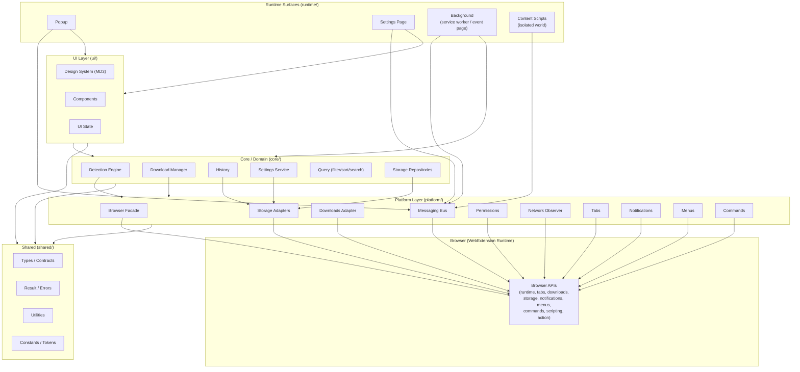

**Reading the diagram:**
- Surfaces (`runtime/`) are thin; they mount UI and delegate to core via the messaging bus.
- `ui/` never reaches the Platform Layer directly; it consumes `core/` services
  ([PROJECT_BIBLE.md §8.4](PROJECT_BIBLE.md#84-dependency-rules)).
- Only Platform Layer components touch **Browser APIs**.
- `shared/` is the leaf: everything may depend on it; it depends on nothing internal.

---

## 4. Layered Architecture

AetherDL's design maps to six classical layers. The Bible groups them into four top-level folders;
[§4.8](#48-layer-to-folder-mapping) reconciles the two views.

### 4.1 Presentation Layer

- **Purpose.** Render UI and capture user intent (popup, settings, history).
- **Responsibilities.** Views, components, MD3 rendering, theming, accessibility, UI-local state.
- **Allowed dependencies.** Application Layer, Domain Layer (via services), Shared Layer.
- **Forbidden dependencies.** Platform Layer directly; Infrastructure internals; browser globals.
- **Home.** `ui/` (+ `runtime/popup`, `runtime/settings` as mount points).

### 4.2 Application Layer

- **Purpose.** Orchestrate use cases and coordinate surfaces (wiring, composition roots, command
  handling, message brokering at the surface).
- **Responsibilities.** Compose domain services with platform implementations; register listeners;
  translate user intents into domain operations.
- **Allowed dependencies.** Domain, Infrastructure, Platform (composition roots only), Shared.
- **Forbidden dependencies.** Presentation internals; embedding business rules (those belong to Domain).
- **Home.** `runtime/` surfaces (esp. `runtime/background`) and `ui/state`.

### 4.3 Domain Layer

- **Purpose.** Pure business logic: detection, download orchestration, query, settings/history rules.
- **Responsibilities.** Detectors, pipeline, dedupe, scoring, quality, queue policy, retry policy,
  filename policy — all deterministic.
- **Allowed dependencies.** Platform *interfaces* (injected), Shared.
- **Forbidden dependencies.** UI, Runtime, concrete Platform implementations, browser globals.
- **Home.** `core/` (detection, download, history, settings, query).

### 4.4 Infrastructure Layer

- **Purpose.** Domain-facing implementations of persistence and cross-cutting concerns (repositories).
- **Responsibilities.** Storage repositories over platform adapters; schema/versioning/migration policy.
- **Allowed dependencies.** Platform adapters, Shared, Domain contracts.
- **Forbidden dependencies.** UI, Runtime.
- **Home.** `core/storage` (repositories) atop `platform/storage` (adapters).

### 4.5 Platform Layer

- **Purpose.** The sole boundary to browser/WebExtension APIs; normalize per-target differences.
- **Responsibilities.** Browser facade, messaging bus, downloads/storage/permissions/tabs/network/
  notifications/menus/commands adapters.
- **Allowed dependencies.** Shared, browser globals.
- **Forbidden dependencies.** Domain, UI, Runtime; product/business logic.
- **Home.** `platform/`.

### 4.6 Shared Layer

- **Purpose.** Leaf layer of types, contracts, error taxonomy, pure utilities, and token mirrors.
- **Responsibilities.** `MediaItem`, `DownloadTask`, message types, `Result`/`AppError`, formatting.
- **Allowed dependencies.** None internal; no side effects at import.
- **Forbidden dependencies.** Everything internal.
- **Home.** `shared/`.

### 4.7 Layer Dependency Rule

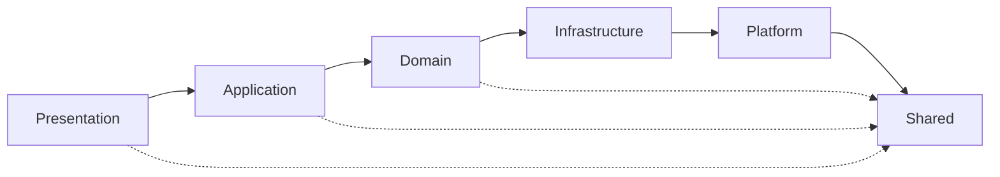

Dependencies flow **downward only**; there are no cycles. This restates
[PROJECT_BIBLE.md §8.4](PROJECT_BIBLE.md#84-dependency-rules) in classical-layer terms.

### 4.8 Layer-to-Folder Mapping

| Classical Layer | Bible Folder(s) | Bible Reference |
|---|---|---|
| Presentation | `ui/` (+ `runtime/popup`, `runtime/settings`) | [§8.3](PROJECT_BIBLE.md#83-folder-structure-final), [§11](PROJECT_BIBLE.md#11-user-interface) |
| Application | `runtime/` (esp. `background`), `ui/state` | [§8.8–§8.12](PROJECT_BIBLE.md#88-extension-lifecycle) |
| Domain | `core/` (detection, download, query, settings, history) | [§8.13](PROJECT_BIBLE.md#813-module-specification-standard) |
| Infrastructure | `core/storage` repositories | [§8.14](PROJECT_BIBLE.md#814-storage-architecture) |
| Platform | `platform/` | [§8.2](PROJECT_BIBLE.md#82-browser-api-abstraction-layer) |
| Shared | `shared/` | [§8.16](PROJECT_BIBLE.md#816-the-shared-layer) |

> [!NOTE]
> The classical six-layer model is a **descriptive lens** over the Bible's four-folder structure.
> The folders in [PROJECT_BIBLE.md §8.3](PROJECT_BIBLE.md#83-folder-structure-final) are authoritative;
> this mapping adds no new layer to the codebase.

---

## 5. Folder Structure

The canonical tree is defined in [PROJECT_BIBLE.md §8.3](PROJECT_BIBLE.md#83-folder-structure-final)
and is **FINAL**. This section documents each top-level directory's architectural role. It restates
the Bible's structure for reference; it does not modify it.

### 5.1 Directory Reference

| Directory | Purpose | Allowed Contents | Restrictions | Depends On | Ownership |
|---|---|---|---|---|---|
| `build/` | Build tooling, per-target manifest generation, packaging. | Config, generators, scripts. | No runtime product code. | — | Build/Release |
| `public/` | Static assets copied verbatim (icons, `_locales`). | Assets, i18n catalogs. | No logic. | — | UI / i18n |
| `src/shared/` | Leaf layer: types, `Result`/errors, utils, constants, tokens. | Pure code, contracts. | No internal deps; no side effects. | Nothing internal | Shared |
| `src/platform/` | Browser API abstraction (sole browser boundary). | Facade + adapters. | No business logic; only layer touching `chrome`/`browser`. | `shared/` | Platform |
| `src/core/` | Domain logic: detection, download, history, settings, query, storage repos. | Pure domain + repositories. | No UI; no runtime; platform via interfaces. | `platform/` (interfaces), `shared/` | Domain |
| `src/ui/` | Presentation: design system, components, popup/settings/history apps, UI state. | UI code, MD3 tokens/components. | No direct `platform/`; no browser globals. | `core/`, `shared/` | UI |
| `src/runtime/` | Thin surface entry points: background, content, popup, settings. | Wiring, lifecycle, composition roots. | No heavy logic; stays thin. | `core/`, `ui/`, `platform/`, `shared/` | Application |
| `tests/` | Unit/integration/e2e/performance/accessibility suites. | Tests + fixtures. | No production code. | Mirrors `src/` | QA |
| `docs/adr/` | Architecture Decision Records. | ADR files. | Never supersedes the Bible. | — | Architecture |

### 5.2 Sub-Module Directories

`core/detection/`, `core/download/`, and `platform/` decompose further exactly as listed in
[PROJECT_BIBLE.md §8.3](PROJECT_BIBLE.md#83-folder-structure-final). Their architectural roles are
detailed in [§6 Module Responsibilities](#6-module-responsibilities), [§7](#7-browser-abstraction-layer),
[§8](#8-detection-architecture), and [§9](#9-download-architecture).

> [!WARNING]
> Folders **MUST NOT** be renamed, moved, merged, split, or added at the top level without a Bible
> amendment ([PROJECT_BIBLE.md §8.3](PROJECT_BIBLE.md#83-folder-structure-final),
> [AGENT_RULES.md §3.1](AGENT_RULES.md#31-prohibited-architectural-actions)).

---

## 6. Module Responsibilities

Every module follows the five-part contract of [PROJECT_BIBLE.md §8.13](PROJECT_BIBLE.md#813-module-specification-standard).
Below, each module is documented as: Purpose, Responsibilities, Public Interfaces, Dependencies,
Consumers, Lifecycle, Restrictions. Public interface names restate contracts from the Bible.

### 6.1 Platform Modules

| Module | Purpose | Public Interface (summary) | Consumers | Lifecycle |
|---|---|---|---|---|
| `platform/browser` | Promisified, normalized browser facade. | `browser` facade | All platform modules | Loaded per surface |
| `platform/messaging` | Typed, validated message bus. | `sendMessage`, `onMessage`, `MessageType` | Runtime surfaces, core (via injection) | Per surface |
| `platform/downloads` | Downloads API wrapper. | `download`, `cancel`, `onChanged` mapping | `core/download` | Background-owned |
| `platform/storage` | `storage.local`/`sync` + IndexedDB adapters. | KV + object-store adapters | `core/storage` | Per surface |
| `platform/permissions` | Optional-permission request/query/revoke. | `request`, `contains`, `remove` | `core`, settings | On demand |
| `platform/network` | Least-privilege media-request observation. | observation registration | `core/detection` | Background-owned |
| `platform/tabs` | Tab/activeTab queries. | `query`, `onActivated`, `onUpdated` | Background, badge | Background-owned |
| `platform/notifications` | Notifications API wrapper. | `create`, `onClicked` | Background notifications | On demand |
| `platform/menus` | `contextMenus`/`menus` abstraction. | `create`, `onClicked` | Background context menu | On demand |
| `platform/commands` | Keyboard command registration. | `onCommand` | Background commands | Registered at startup |

- **Dependencies (all platform modules).** `shared/` and browser globals only.
- **Restrictions.** No business logic; no persistence policy; no UI. Adapters adapt; they do not decide.
- **Full contract.** [PROJECT_BIBLE.md §8.2](PROJECT_BIBLE.md#82-browser-api-abstraction-layer); detail in [§7](#7-browser-abstraction-layer).

### 6.2 Core (Domain) Modules

| Module | Purpose | Public Interface (summary) | Consumers | Lifecycle |
|---|---|---|---|---|
| `core/detection/manager` | Orchestrate detection. | `DetectorManager` (`registerDetector`, `detect`, `invalidate`) | Background | Background-owned |
| `core/detection/pipeline` | Fixed detection stages. | pipeline runner | `manager` | Per detection |
| `core/detection/detectors` | Detector plugins. | `Detector` implementations | `manager` (registry) | Registered at composition |
| `core/detection/dedupe` | Identity-key de-duplication. | dedupe function | `pipeline` | Per detection |
| `core/detection/scoring` | Deterministic media scoring. | scoring function | `pipeline` | Per detection |
| `core/detection/quality` | Variant/quality parsing. | quality parser, `MediaVariant` | `pipeline`, UI | Per detection |
| `core/detection/metadata` | Best-effort metadata extraction. | metadata extractor | `pipeline` | Per detection |
| `core/detection/cache` | Per-tab in-memory result cache. | get/set/invalidate | `manager` | Per tab, ephemeral |
| `core/download/manager` | Own all downloads. | `DownloadManager` | Background, UI (via messaging) | Background-owned |
| `core/download/queue` | Persisted task queue (source of truth). | queue ops, `DownloadTask` | `manager` | Durable |
| `core/download/concurrency` | Bounded active-download pool. | slot acquisition | `manager` | Background-owned |
| `core/download/retry` | Exponential backoff w/ jitter. | retry policy | `manager` | Per task |
| `core/download/progress` | Progress derivation + throttling. | progress events | `manager`, UI | Per task |
| `core/download/filename` | Deterministic filename generation. | filename generator | `manager` | Per task |
| `core/download/stream` | Non-DRM HLS/DASH assembly. | assembler | `manager` | Per stream task |
| `core/history` | Local history store & policy. | history repository/service | UI, `download/manager` | Durable |
| `core/settings` | Settings schema, defaults, validation. | settings service | All surfaces | Durable |
| `core/query` | Filter/sort/search engine. | query functions | UI | Per query |
| `core/storage` | Repository abstraction over adapters. | repositories | `history`, `settings`, `queue` | Durable |

- **Dependencies (all core modules).** `platform/` interfaces (injected) + `shared/`.
- **Restrictions.** No UI; no runtime; no direct browser globals; deterministic.
- **Detail.** [§8 Detection](#8-detection-architecture), [§9 Download](#9-download-architecture),
  [§14 Storage](#14-storage-architecture).

### 6.3 UI Modules

| Module | Purpose | Consumers | Lifecycle |
|---|---|---|---|
| `ui/design-system` | Tokens, theming, MD3 primitives. | All UI | Per surface |
| `ui/components` | Reusable components (cards, buttons…). | popup/settings/history | Per surface |
| `ui/popup` | Popup application. | `runtime/popup` | Per popup open |
| `ui/settings` | Settings application. | `runtime/settings` | Per options open |
| `ui/history` | History view. | popup/settings | On demand |
| `ui/state` | UI-local state (filters, selection). | UI apps | Ephemeral, per surface |

- **Dependencies.** `core/`, `shared/`. **Restrictions.** No direct `platform/`; no browser globals;
  no domain state ownership. Detail in [§10](#10-user-interface-architecture).

### 6.4 Runtime (Surface) Modules

| Module | Purpose | Lifecycle | Restrictions |
|---|---|---|---|
| `runtime/background` | Coordinator: detection results, badge, downloads, notifications, menus, commands, message broker. | Ephemeral (service worker / event page) | Thin; state durable ([§15](#15-extension-lifecycle)) |
| `runtime/content` | Isolated-world DOM observer + reporter. | Injected per page | No UI; no main-world; minimal |
| `runtime/popup` | Mounts `ui/popup`. | Per open | Thin |
| `runtime/settings` | Mounts `ui/settings`. | Per open | Thin |

- **Dependencies.** `core/`, `ui/`, `platform/`, `shared/` (composition roots).
- **Full contract.** [PROJECT_BIBLE.md §8.8–§8.12](PROJECT_BIBLE.md#88-extension-lifecycle).

---

## 7. Browser Abstraction Layer

The Browser Abstraction Layer (`platform/`) is the architectural mechanism for cross-browser parity.
It is the **only** place browser/WebExtension APIs are referenced. Authority:
[PROJECT_BIBLE.md §7](PROJECT_BIBLE.md#7-browser-support) and [§8.2](PROJECT_BIBLE.md#82-browser-api-abstraction-layer).

### 7.1 Isolation Model

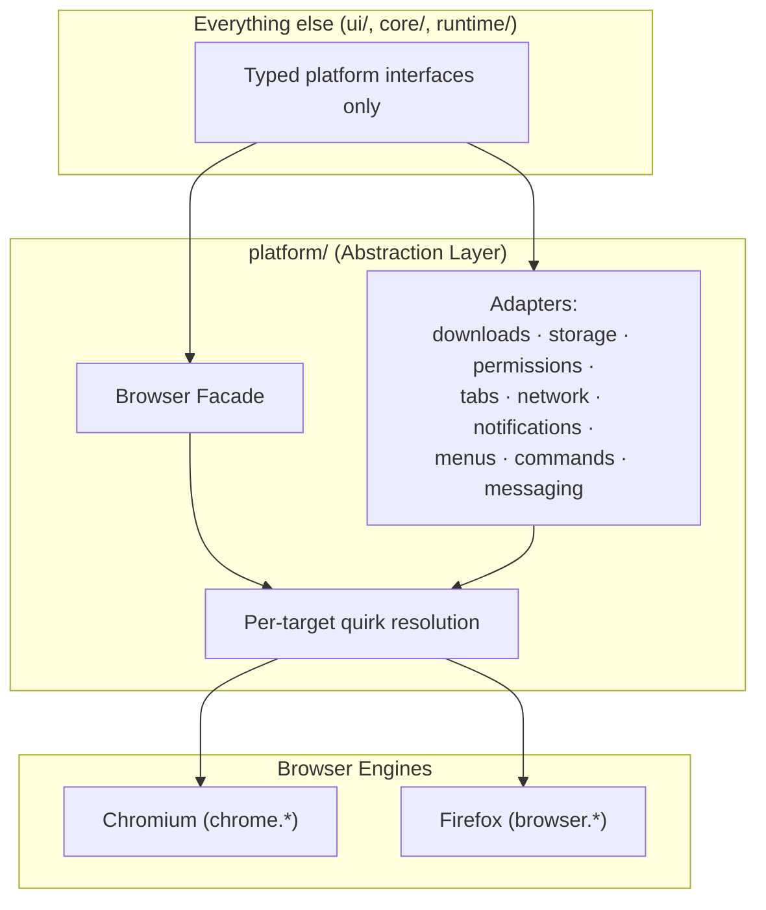

### 7.2 Browser Adapters

Each adapter presents a single typed, `Promise`-based interface and hides the underlying API shape.
Adapters normalize: callback→promise conversion, namespace (`chrome` vs `browser`), event payload
shapes, and capability differences.

### 7.3 API Abstraction Strategy

- **Standardized surface.** The facade exposes a `browser`-style promise API regardless of engine.
- **Capability detection over sniffing.** Behavior branches on detected capability; explicit target
  flags are used only where capabilities cannot be detected ([PROJECT_BIBLE.md §7.2](PROJECT_BIBLE.md#72-compatibility-strategy)).
- **Single point of change.** A new browser quirk is handled here and nowhere else.

### 7.4 Compatibility Strategy

| Concern | Handling |
|---|---|
| Background type (SW vs event page) | Manifest generated per target; runtime code is lifecycle-agnostic ([§15](#15-extension-lifecycle)). |
| `contextMenus` vs `menus` | Unified behind `platform/menus`. |
| Downloads nuances | Normalized in `platform/downloads` ([§9.9](#99-browser-download-api)). |
| Permissions model | Optional permissions at point-of-use via `platform/permissions`. |
| Network observation | Least-privileged per-target mechanism in `platform/network`. |

### 7.5 Firefox Support

Firefox differences (event-page background, `browser.*` promises, `menus`, granular permissions,
Downloads nuances) are resolved inside the abstraction layer per
[PROJECT_BIBLE.md §7.4](PROJECT_BIBLE.md#74-firefox-compatibility). Parity is a requirement; where a
capability is absent, the feature degrades gracefully and the UI communicates the limitation.

### 7.6 Chromium Support

Chrome, Edge, Brave, Opera, and Vivaldi share the Chromium/Blink engine and MV3 service-worker
background. They are treated as one target family with capability-detected variations
([PROJECT_BIBLE.md §7.1](PROJECT_BIBLE.md#71-supported-browsers)).

### 7.7 Manifest Strategy

MV3-only; per-target manifests generated from a single source at build time
([PROJECT_BIBLE.md §7.5](PROJECT_BIBLE.md#75-manifest-v3-strategy), [§7.6](PROJECT_BIBLE.md#76-build-targets--manifest-generation)).
Background key, menus permission name, and other target-specific manifest fields are selected by the
generator. Detail in [§16 Build Architecture](#16-build-architecture).

### 7.8 Platform Isolation Guarantee

> [!IMPORTANT]
> No module outside `platform/` may import `chrome`/`browser` or any adapter's internals. This is an
> enforced boundary ([PROJECT_BIBLE.md §8.4](PROJECT_BIBLE.md#84-dependency-rules),
> [§15.9](PROJECT_BIBLE.md#159-enforced-boundaries)). It is what makes cross-browser support
> maintainable: differences never leak upward.

---

## 8. Detection Architecture

The detection subsystem is a **plugin architecture**: detectors conform to a fixed interface,
register with the manager, and run through a fixed pipeline. Adding a source never changes the core.
Authority: [PROJECT_BIBLE.md §9](PROJECT_BIBLE.md#9-detection-system).

### 8.1 Detector Manager

`core/detection/manager` orchestrates detection for a tab: maintains the detector registry, runs the
pipeline, applies priority/dedupe/scoring, owns the per-tab cache, and enforces DRM refusal. Public
API: `registerDetector`, `detect`, `invalidate` ([PROJECT_BIBLE.md §9.1](PROJECT_BIBLE.md#91-detector-manager)).

### 8.2 Detector Interface

Every detector implements the frozen contract: `id`, `name`, `priority`, `canDetect(ctx)`,
`detect(ctx)` ([PROJECT_BIBLE.md §9.2](PROJECT_BIBLE.md#92-detector-interface)). Detectors are pure
with respect to inputs, depend only on the contract + `shared/`, and never touch browser globals or
attempt DRM circumvention.

### 8.3 Detection Pipeline

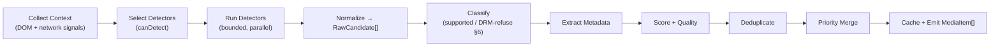

Each stage is pure given its inputs plus injected platform interfaces. The **Classify** stage removes
or flags DRM/protected content before further work ([PROJECT_BIBLE.md §9.3](PROJECT_BIBLE.md#93-detection-pipeline),
[§6.3](PROJECT_BIBLE.md#63-detection--refusal-behavior)).

### 8.4 Detector Registration & Execution Order

- Detectors are registered at the background composition root ([§2.4 App Layer](#42-application-layer)).
- Execution order within the run stage is bounded and parallel; **priority** governs conflict
  resolution and pre-sort tiebreaks, not raw execution timing
  ([PROJECT_BIBLE.md §9.4](PROJECT_BIBLE.md#94-priority-system)).

### 8.5 Priority System

Higher-priority detectors win identity ties; richer metadata from lower-priority candidates is merged
in (never discarded if it adds information). Direct/unambiguous sources rank above heuristic hints
([PROJECT_BIBLE.md §9.4](PROJECT_BIBLE.md#94-priority-system)).

### 8.6 Duplicate Removal

A stable **identity key** (canonical URL + container + salient discriminators) merges duplicate
candidates deterministically and locally ([PROJECT_BIBLE.md §9.5](PROJECT_BIBLE.md#95-duplicate-removal)).

### 8.7 Media Scoring

A transparent, deterministic function of kind, resolution/quality, size, prominence hints, detector
priority, and metadata richness. No remote data; fully explainable
([PROJECT_BIBLE.md §9.7](PROJECT_BIBLE.md#97-media-scoring)).

### 8.8 Quality Detection

For adaptive manifests, variants are parsed and labeled (`QualityLabel`, `MediaVariant`) for user
selection; for direct/HTML5 media, quality derives from track metadata
([PROJECT_BIBLE.md §9.8](PROJECT_BIBLE.md#98-quality-detection)).

### 8.9 Metadata Extraction

Best-effort extraction of title, type, resolution, duration, bitrate, size, host into the
`MediaItem` model; missing fields are "Unknown," never fabricated
([PROJECT_BIBLE.md §4.2](PROJECT_BIBLE.md#42-media-metadata), [§9.6](PROJECT_BIBLE.md#96-media-metadata-model)).

### 8.10 Caching

Per-tab, in-memory, LRU-bounded, invalidated on navigation/refresh; never persisted to disk
([PROJECT_BIBLE.md §9.9](PROJECT_BIBLE.md#99-detection-caching)). The cache is the source the popup
and badge read.

### 8.11 Resource Cleanup & Lifecycle

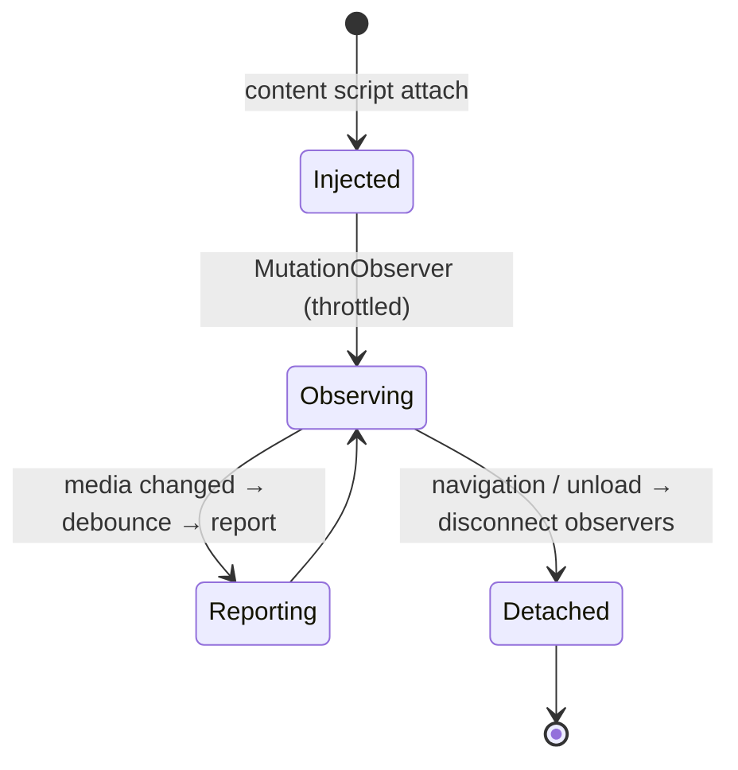

Observers are throttled/debounced and disconnected on unload; detectors run under per-detector time
budgets; candidate sets are bounded ([PROJECT_BIBLE.md §9.10](PROJECT_BIBLE.md#910-detection-performance--memory-management)).

### 8.12 Performance Considerations

Detection must fit the latency budget ([PROJECT_BIBLE.md §12.1](PROJECT_BIBLE.md#121-performance-budgets));
the content script payload is minimal; caches are bounded and evicted. Detail in [§19](#19-performance-architecture).

---

## 9. Download Architecture

The download subsystem owns the path from user intent to on-disk file recorded in history. It prefers
the native Downloads API, with a documented exception for non-DRM stream assembly. Authority:
[PROJECT_BIBLE.md §10](PROJECT_BIBLE.md#10-download-system).

### 9.1 Download Manager

`core/download/manager` is the single authority over all downloads: accepts enqueue intents,
maintains the queue, enforces concurrency, drives each task, applies retry, supports
cancel/pause/resume, persists state, and records history. Background-owned. Public API:
`enqueue`, `cancel`, `pause`, `resume`, `retry`, `getQueue`, `subscribe`
([PROJECT_BIBLE.md §10.1](PROJECT_BIBLE.md#101-download-manager)).

### 9.2 Queue

The queue holds `DownloadTask`s and is the **single source of truth** for download state, persisted
to IndexedDB and reconstructed on background wake
([PROJECT_BIBLE.md §10.2](PROJECT_BIBLE.md#102-queue)).

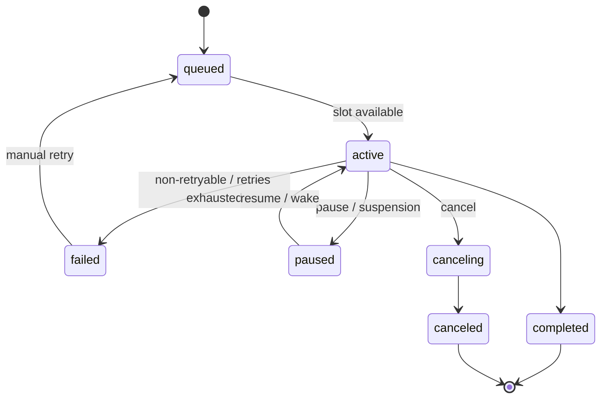

### 9.3 Scheduler & Concurrency

A bounded pool (`core/download/concurrency`) limits simultaneous active downloads (default 3, 1–10).
When a slot frees, the next task by priority/FIFO becomes active. Stream assembly is bounded more
tightly and independently than native downloads
([PROJECT_BIBLE.md §10.3](PROJECT_BIBLE.md#103-concurrency), [§10.9](PROJECT_BIBLE.md#109-concurrency-vs-streams-resource-discipline)).

### 9.4 Retry Strategy

Exponential backoff with jitter, capped attempts (default 3, 0–10). Retryable vs non-retryable
failures are distinguished by the error taxonomy; non-retryable failures fail fast
([PROJECT_BIBLE.md §10.4](PROJECT_BIBLE.md#104-retry-strategy), [§20](#20-error-architecture)).

### 9.5 Cancellation

`active`/`queued` → `canceling` → `canceled`; prompt and idempotent. Native cancellation cleans
partial files per target; assembly cancellation stops segment fetches and releases resources
([PROJECT_BIBLE.md §10.10](PROJECT_BIBLE.md#1010-cancellation)).

### 9.6 Filename Generator

Deterministic generation from a template with tokens (`{title}`, `{host}`, `{ext}`, `{quality}`,
`{date}`, `{index}`); default `{title}.{ext}`, sanitized to OS-safe form
([PROJECT_BIBLE.md §10.7](PROJECT_BIBLE.md#107-filename-generation)).

### 9.7 Collision Resolution

Delegated to the browser conflict action (`uniquify` by default) so files never silently overwrite;
normalized across targets in `platform/downloads`
([PROJECT_BIBLE.md §10.7](PROJECT_BIBLE.md#107-filename-generation)).

### 9.8 Stream Assembly (Non-DRM)

`core/download/stream` parses non-DRM HLS/DASH, selects a variant, fetches segments under bounded
concurrency, and assembles a single output. **Any** encryption/DRM signal aborts assembly and
reclassifies the item unsupported — no key handling, no decryption, ever
([PROJECT_BIBLE.md §10.6](PROJECT_BIBLE.md#106-stream-assembly), [§6](PROJECT_BIBLE.md#6-unsupported-content)).

### 9.9 Browser Download API

Native downloads go through `platform/downloads` over `downloads.download(...)`, with events mapped
into the manager's progress/state model and cancel/pause/resume mapped where supported
([PROJECT_BIBLE.md §10.8](PROJECT_BIBLE.md#108-browser-downloads-api)).

### 9.10 Progress Tracking

Progress derives from Downloads API events (native) or segments completed (assembly), throttled
before reaching the UI; unknown totals show indeterminate progress, never fabricated percentages
([PROJECT_BIBLE.md §10.5](PROJECT_BIBLE.md#105-progress)).

### 9.11 Failure Recovery

Retryable failures auto-retry with backoff; exhausted retries enter `failed` with an actionable
`AppError`; the user may manually retry. Storage writes are guarded so a crash mid-write cannot
corrupt the queue ([PROJECT_BIBLE.md §10.4](PROJECT_BIBLE.md#104-retry-strategy), [§20.7](PROJECT_BIBLE.md#207-crash-resilience)).

---

## 10. User Interface Architecture

The UI implements Material Design 3 across all surfaces from a single design system. Authority:
[PROJECT_BIBLE.md §11](PROJECT_BIBLE.md#11-user-interface). UI is a **view** over domain state; it
owns no domain state.

### 10.1 Surface Composition

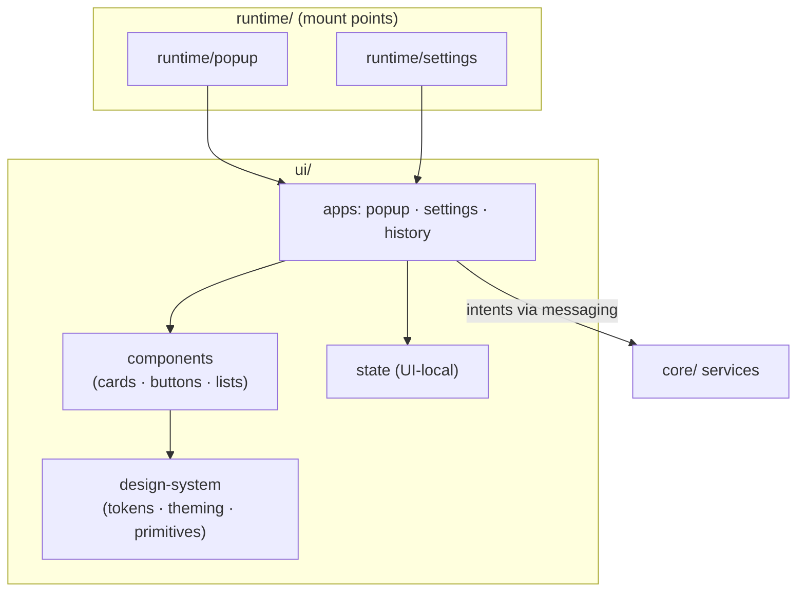

### 10.2 Popup & Settings

The popup is the primary surface (results, actions, queue, search/filter/sort, links to settings and
history); the settings page hosts configuration, history, permissions, and about
([PROJECT_BIBLE.md §11.1](PROJECT_BIBLE.md#111-popup), [§11.2](PROJECT_BIBLE.md#112-settings-page)).

### 10.3 Components

Reusable MD3 components (media cards, buttons, lists, menus, dialogs) consume the design system
exclusively; no component defines its own colors/spacing/type
([PROJECT_BIBLE.md §11.6–§11.12](PROJECT_BIBLE.md#116-media-cards), [§11.17](PROJECT_BIBLE.md#1117-design-system-ownership)).

### 10.4 State Management

UI state (filters, selection, view mode) is local to each surface, ephemeral, never persisted. Domain
state (results, queue, settings, history) is read from core services; UI never mutates it directly
([§13](#13-state-management), [PROJECT_BIBLE.md §8.7](PROJECT_BIBLE.md#87-state-flow)).

### 10.5 Navigation & Rendering

Popup navigation is shallow (list ↔ detail, queue, entry points to settings/history). Rendering
follows the UI-state catalog: loading, results, empty, error, unsupported, degraded
([PROJECT_BIBLE.md §11.5](PROJECT_BIBLE.md#115-ui-states)). Long lists are virtualized
([§19](#19-performance-architecture)).

### 10.6 Material Design 3 & Theme System

A tokenized MD3 system (color roles, type scale, spacing grid, elevation) drives all styling. Themes:
`system` (default), `light`, `dark`, meeting AA contrast in both
([PROJECT_BIBLE.md §11.13–§11.15](PROJECT_BIBLE.md#1113-color-tokens)). A non-visual token mirror in
`shared/tokens` serves logic that needs token values (e.g. badge color).

### 10.7 Localization Integration

All UI strings resolve through message catalogs; formatting uses `Intl`; layout uses logical
properties for future RTL ([PROJECT_BIBLE.md §19](PROJECT_BIBLE.md#19-internationalization--localization)).

### 10.8 Accessibility Integration

Accessibility is part of the UI architecture: keyboard operability, focus management, AA contrast,
screen-reader semantics, reduced motion ([PROJECT_BIBLE.md §17](PROJECT_BIBLE.md#17-accessibility)).
It is not a separate layer; every component satisfies it.

---

## 11. Data Flow

This section documents the principal data flows. Ownership: detection results are owned by the
background per tab; queue state by the Download Manager; settings/history by their core services
([PROJECT_BIBLE.md §8.6](PROJECT_BIBLE.md#86-data-flow), [§8.7](PROJECT_BIBLE.md#87-state-flow)).

### 11.1 Detection Flow

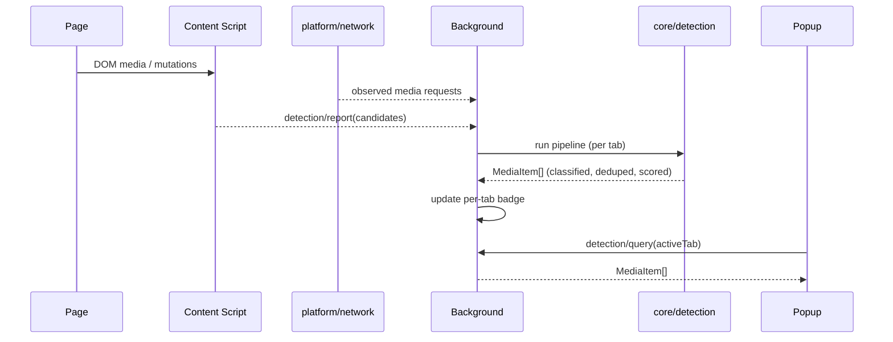

### 11.2 Download Flow

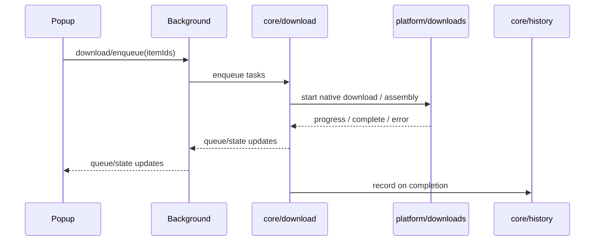

### 11.3 Settings Flow

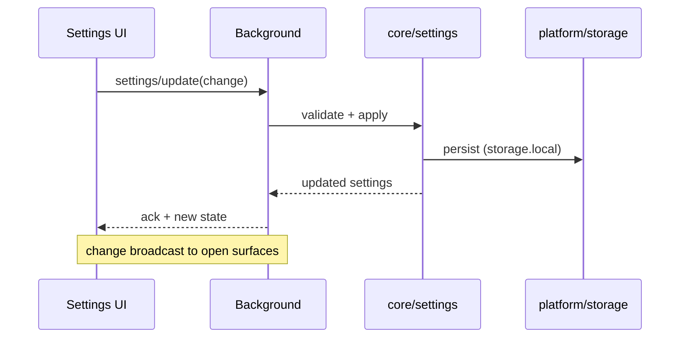

### 11.4 Storage Flow

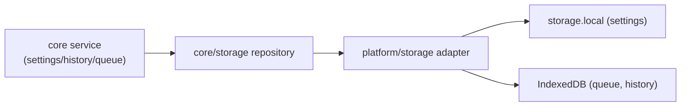

### 11.5 Lifecycle Flow

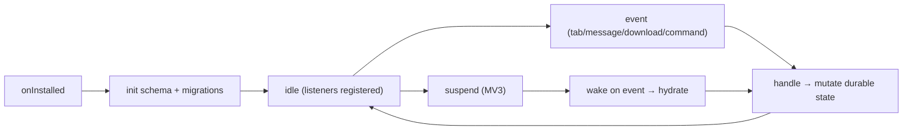

### 11.6 Message Flow

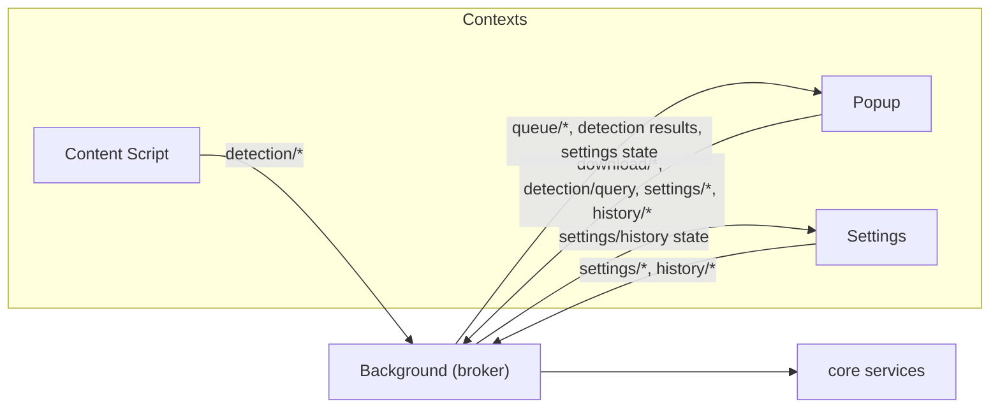

---

## 12. Messaging Architecture

All cross-context communication uses the typed, validated message bus in `platform/messaging`.
Authority: [PROJECT_BIBLE.md §8.5](PROJECT_BIBLE.md#85-communication-rules).

### 12.1 Communicating Parties

| From | To | Purpose |
|---|---|---|
| Content Script | Background | Report detected candidates (`detection/*`) |
| Popup | Background | Query results; enqueue/cancel/pause/resume/retry; settings/history ops |
| Settings | Background/Core | Read/update settings; manage history |
| Background | Popup/Settings | Push queue/progress, results, settings/history state |
| Background | Core services | Invoke detection/download/history/settings (in-process) |
| Platform adapters | Browser APIs | Perform the actual API calls |

### 12.2 Message Ownership

- The **Background** is the coordinator/broker: it owns per-tab detection results, drives the Download
  Manager, and brokers all inter-surface messages.
- Surfaces (popup/settings/content) are **clients**: they issue intents and render pushed state; they
  never own domain state ([§13](#13-state-management)).

### 12.3 Request/Response Pattern

- Every message is a typed discriminated union with defined request and response contracts in
  `shared/types`.
- Payloads are validated at the boundary; malformed messages are rejected, not trusted
  ([PROJECT_BIBLE.md §13.8](PROJECT_BIBLE.md#138-input--message-trust-boundaries)).
- Large/streamed data is referenced by ID/URL, not passed as monolithic blobs.

### 12.4 Event Flow

- **Push events** (queue/progress, result changes) flow background → surfaces as state updates.
- **Intents** flow surface → background as request/response.
- Content scripts and the page never share a world; content runs isolated only
  ([PROJECT_BIBLE.md §13.6](PROJECT_BIBLE.md#136-content-script-isolation)).

### 12.5 Message Families

`detection/*`, `download/*`, `queue/*`, `settings/*`, `history/*`, `badge/*` as defined in
[PROJECT_BIBLE.md §8.5](PROJECT_BIBLE.md#85-communication-rules). The set is fixed; new families
require a Bible amendment.

---

## 13. State Management

State is partitioned by **single ownership**; each piece has exactly one owner. Authority:
[PROJECT_BIBLE.md §8.7](PROJECT_BIBLE.md#87-state-flow).

### 13.1 State Categories

| Category | Example | Owner | Backing | Lifetime |
|---|---|---|---|---|
| **Runtime state** | Per-tab detection results | Background (via `detection/cache`) | In-memory | Per tab; invalidated on nav |
| **Persistent state** | Settings; download queue; history | `core/settings`, `core/download/queue`, `core/history` | `storage.local` / IndexedDB | Durable |
| **Temporary state** | UI filters, selection, view mode | `ui/state` (per surface) | In-memory | Ephemeral, per surface |
| **Cached state** | Detection results, metadata memoization | Detection cache | In-memory, bounded | Bounded/evicted |

### 13.2 Ownership Rules

- Domain state changes flow through the owning core service; UI never mutates domain state directly.
- UI state is local to a surface and never persisted.
- The queue is the sole source of truth for download status shown anywhere
  ([PROJECT_BIBLE.md §4.4](PROJECT_BIBLE.md#44-download-queue)).

### 13.3 Synchronization Rules

- Surfaces reflect domain state by reading it and subscribing to pushed updates; they do not
  duplicate it.
- On settings change, the new state is broadcast to open surfaces ([§11.3](#113-settings-flow)).
- On background wake, in-memory state that must survive is reconstructed from durable storage
  ([§15](#15-extension-lifecycle)).

### 13.4 State Lifecycle

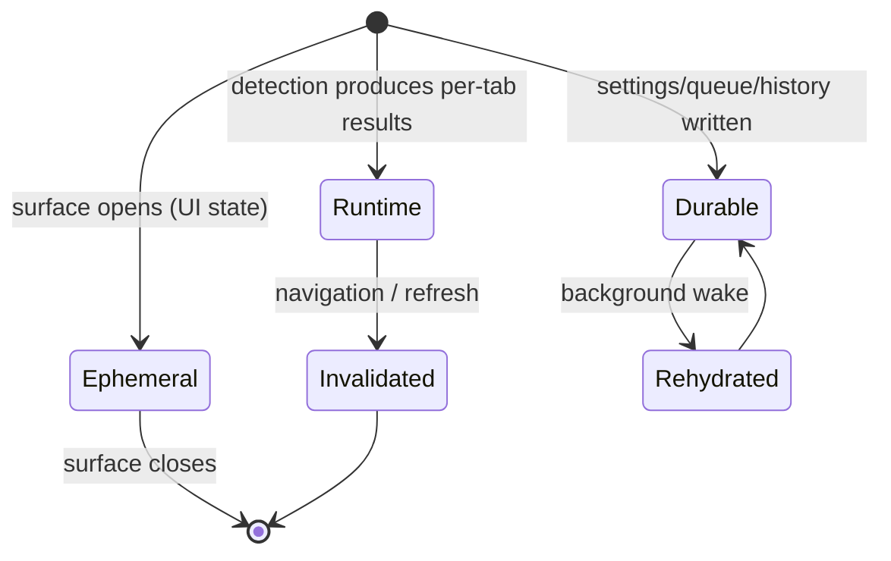

---

## 14. Storage Architecture

Storage is local-only, versioned, and accessed through repository abstractions. Authority:
[PROJECT_BIBLE.md §8.14](PROJECT_BIBLE.md#814-storage-architecture), [§14 Privacy](PROJECT_BIBLE.md#14-privacy).

### 14.1 Stores

| Store | Backend | Contents | Rationale |
|---|---|---|---|
| Settings | `storage.local` | User settings | Small, fast key-value |
| Queue | IndexedDB | Persisted download tasks | Survives suspension; structured |
| History | IndexedDB | Download history records | Larger; queryable |
| Detection cache | In-memory | Per-tab results | Ephemeral; never on disk |

### 14.2 Local vs Sync Storage

Settings live in `storage.local` by default. `storage.sync` is used **only** if a specific setting is
explicitly designed for sync and the user opts in; by default nothing syncs
([PROJECT_BIBLE.md §8.14](PROJECT_BIBLE.md#814-storage-architecture)).

### 14.3 Repository Abstraction

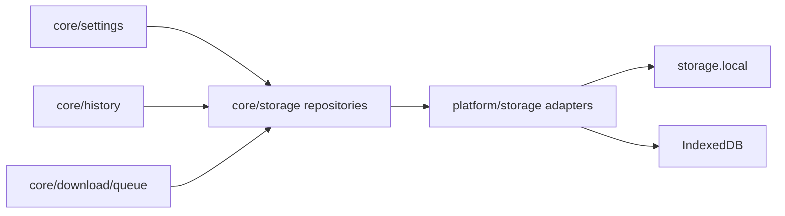

No surface touches IndexedDB or `storage` directly; access is via repositories over adapters.

### 14.4 Caching

Detection and metadata caches are in-memory, bounded, and evicted (LRU / cycle-lifetime); nothing is
cached to disk except user-owned data ([PROJECT_BIBLE.md §12.5](PROJECT_BIBLE.md#125-caching-strategy)).

### 14.5 Retention

History retention follows the user setting (`forever` / `30d` / `90d` / `session`); pruning is a
local policy in `core/history` ([PROJECT_BIBLE.md §4.9](PROJECT_BIBLE.md#49-settings), [§4.11](PROJECT_BIBLE.md#411-history)).

### 14.6 Migration Strategy

Schemas are versioned; migrations run on install/update and never silently drop user data
([PROJECT_BIBLE.md §8.8](PROJECT_BIBLE.md#88-extension-lifecycle), [§8.14](PROJECT_BIBLE.md#814-storage-architecture)).

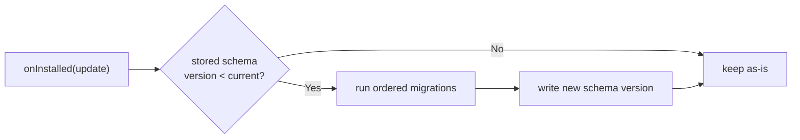

### 14.7 Limitations

- IndexedDB/`storage` quotas are browser-governed; large histories are pruned per retention policy.
- All data is device-local; there is no cloud backup ([§18](#18-privacy-architecture)).
- `storage.sync` (if ever used) is size-limited by the browser and opt-in only.

---

## 15. Extension Lifecycle

The extension runs across ephemeral and per-surface contexts. Authority:
[PROJECT_BIBLE.md §8.8–§8.12](PROJECT_BIBLE.md#88-extension-lifecycle).

### 15.1 Whole-Extension Lifecycle

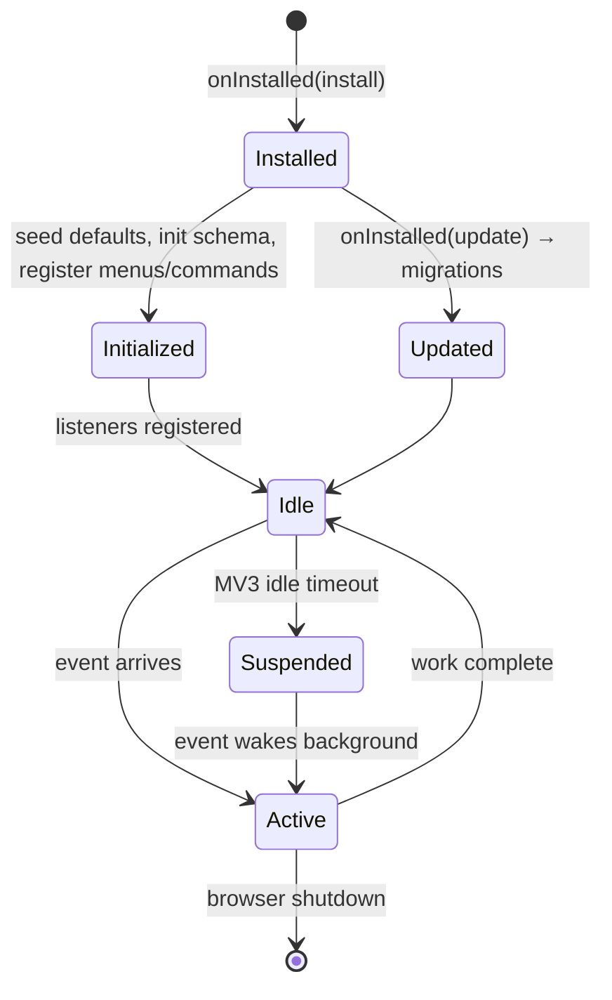

### 15.2 Installation & Updates

Install seeds default settings and initializes storage schema. Update runs migrations, preserves user
data, and reconciles settings schema ([§14.6](#146-migration-strategy)).

### 15.3 Startup & Activation

The background registers all event listeners **synchronously at top level** so they survive re-spawn,
and defers heavy work until needed ([PROJECT_BIBLE.md §8.9](PROJECT_BIBLE.md#89-background-lifecycle)).

### 15.4 Tab Changes & Navigation

The badge is per-tab; switching tabs switches the badge to that tab's count. Navigation invalidates
the tab's detection cache and triggers fresh detection ([§8.10](#810-caching),
[PROJECT_BIBLE.md §4.7](PROJECT_BIBLE.md#47-badge-counter)).

### 15.5 Background Lifecycle (Ephemeral)

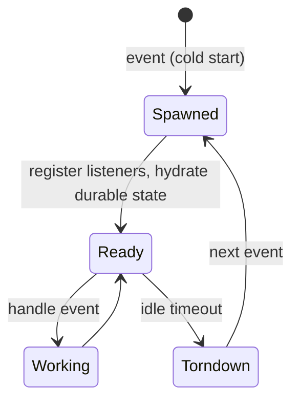

The background assumes suspension at any moment; critical state is durable; handlers are idempotent;
long-running work (downloads/assembly) is resumable from persisted state.

### 15.6 Content Script Lifecycle

Injected per matching page (or programmatically via `scripting`); observes throttled/debounced,
reports, and disconnects on unload; isolated world only ([§8.11](#811-resource-cleanup--lifecycle)).

### 15.7 Popup Lifecycle

Opens → loads active-tab results → renders results/empty/error → acts → closes (teardown). Stateless
across opens except via durable domain state ([PROJECT_BIBLE.md §8.11](PROJECT_BIBLE.md#811-popup-lifecycle)).

### 15.8 Download Lifecycle

Governed by the queue state machine ([§9.2](#92-queue)) and retry/cancel policies; survives background
suspension via the persisted queue.

### 15.9 Shutdown & Cleanup

Every surface tears down listeners, observers, timers, subscriptions, and revokes object URLs on
close/unload; the background holds no references preventing idle suspension
([PROJECT_BIBLE.md §12.7](PROJECT_BIBLE.md#127-garbage-collection--cleanup), [§12.8](PROJECT_BIBLE.md#128-resource-cleanup-checklist-normative)).

---

## 16. Build Architecture

One source tree produces per-target extension packages via generated manifests. Authority:
[PROJECT_BIBLE.md §8.15](PROJECT_BIBLE.md#815-build--packaging-architecture), [§7.6](PROJECT_BIBLE.md#76-build-targets--manifest-generation).

### 16.1 Build Pipeline

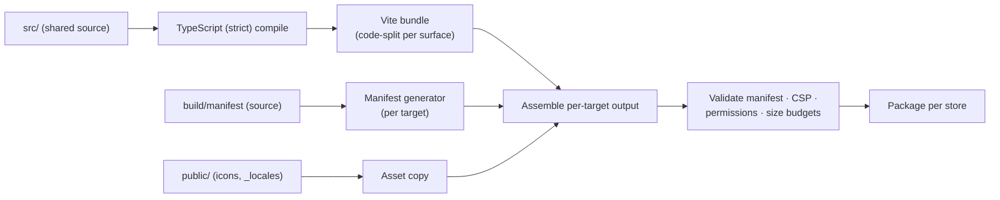

### 16.2 Source Structure

Source is layered under `src/` ([§5](#5-folder-structure)); build tooling under `build/`; assets under
`public/`. Shared code is compiled once and bundled per surface (background, content, popup, settings).

### 16.3 Shared Code

All targets share the same `src/`. There is no per-browser code fork; differences resolve at build
(manifest generation) and runtime (Platform Layer) ([§7](#7-browser-abstraction-layer)).

### 16.4 Chromium Build

Produces an MV3 package with a service-worker background and Chromium manifest keys, for Chrome, Edge,
Brave, Opera, and Vivaldi ([§7.6](#76-chromium-support)).

### 16.5 Firefox Build

Produces an MV3 package with an event-page background and Firefox-specific manifest keys (e.g. `menus`
naming), for AMO ([§7.5](#75-firefox-support)).

### 16.6 Manifest Generation

Manifests are generated from a single source; the generator selects background type, permission names,
and target-specific fields ([§7.7](#77-manifest-strategy)). Version numbers are synchronized across
targets ([PROJECT_BIBLE.md §18.7](PROJECT_BIBLE.md#187-versioning)).

### 16.7 Asset Pipeline

`public/` assets (icons at required sizes, `_locales` catalogs) are copied verbatim into each package;
no remote assets are fetched ([§17](#17-security-architecture), [§18](#18-privacy-architecture)).

### 16.8 Packaging & Distribution Outputs

One distributable per store target: Chrome Web Store, Edge Add-ons, Firefox AMO, and
Chromium-compatible stores. Builds are deterministic; no runtime remote code
([PROJECT_BIBLE.md §8.15](PROJECT_BIBLE.md#815-build--packaging-architecture), [§18.6](PROJECT_BIBLE.md#186-release-strategy)).

---

## 17. Security Architecture

Security is structural, following Principle of Least Privilege and a strict MV3 posture. Authority:
[PROJECT_BIBLE.md §13](PROJECT_BIBLE.md#13-security).

### 17.1 Trust Boundaries

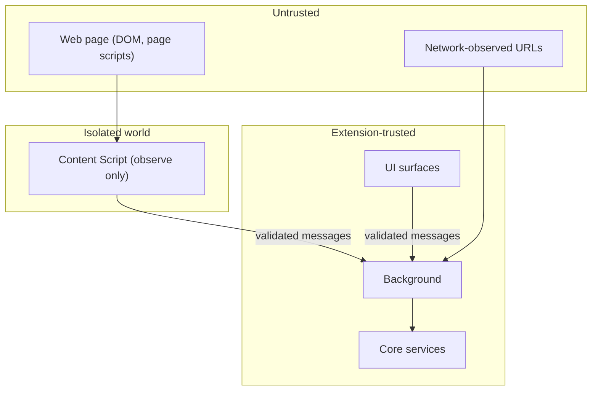

Page content, DOM data, observed URLs, and cross-context messages are **untrusted** and validated at
the boundary ([PROJECT_BIBLE.md §13.8](PROJECT_BIBLE.md#138-input--message-trust-boundaries)).

### 17.2 Permission Boundaries

Minimal install-time permissions (`storage`, `downloads`, `activeTab`, `scripting`); elevated
capabilities via optional, point-of-use, revocable permissions; no broad host permissions at install
([PROJECT_BIBLE.md §13.3](PROJECT_BIBLE.md#133-permission-strategy), [§13.7](PROJECT_BIBLE.md#137-host-permission-policy)).

### 17.3 Content Security Policy

Strict MV3 CSP: no inline scripts, no `eval`/`new Function`, no remote scripts/styles/fonts;
`object-src 'none'`, `script-src 'self'` ([PROJECT_BIBLE.md §13.2](PROJECT_BIBLE.md#132-content-security-policy)).

### 17.4 Safe Messaging

Typed, validated messages only; malformed messages rejected; no untrusted `innerHTML`; render via safe
DOM/escaped bindings ([§12](#12-messaging-architecture), [PROJECT_BIBLE.md §13.8](PROJECT_BIBLE.md#138-input--message-trust-boundaries)).

### 17.5 URL Validation

URLs are validated and canonicalized before use; only `http:`/`https:` (and conditionally feasible
`blob:`) are eligible; execution/navigation schemes are rejected
([PROJECT_BIBLE.md §13.5](PROJECT_BIBLE.md#135-safe-url-validation)).

### 17.6 Sandboxing

Content scripts run only in the isolated world; no main-world injection; no page-context escalation
([PROJECT_BIBLE.md §13.6](PROJECT_BIBLE.md#136-content-script-isolation), [N15](PROJECT_BIBLE.md#31-definitive-non-goals)).

### 17.7 Browser Security Model & Least Privilege

The design relies on the browser's extension security model (isolated worlds, permission prompts, CSP)
and requests the minimum required capability, no more ([§17.2](#172-permission-boundaries)). No remote
code executes at runtime ([PROJECT_BIBLE.md §13.4](PROJECT_BIBLE.md#134-no-remote-code--no-eval--no-inline-scripts)).

> [!CAUTION]
> The architecture contains **no** DRM-circumvention path — no key handling, decryption, or EME
> engagement. This is a permanent, non-approvable boundary
> ([PROJECT_BIBLE.md §6](PROJECT_BIBLE.md#6-unsupported-content), [§3.2](PROJECT_BIBLE.md#32-why-non-goals-are-permanent)).

---

## 18. Privacy Architecture

Privacy is enforced by structure: there is no server and no egress path for user data. Authority:
[PROJECT_BIBLE.md §14](PROJECT_BIBLE.md#14-privacy).

### 18.1 Local-Only Processing

All detection, metadata, scoring, query, and history processing occurs on-device
([PROJECT_BIBLE.md §14.1](PROJECT_BIBLE.md#141-privacy-guarantees-all-must-hold)).

### 18.2 No Telemetry / No Analytics / No Tracking

The architecture contains no analytics, telemetry, tracking, or identifier of any kind — no user IDs,
install IDs, device IDs, or fingerprints ([PROJECT_BIBLE.md §14.1–§14.2](PROJECT_BIBLE.md#141-privacy-guarantees-all-must-hold)).

### 18.3 No External Communication

```mermaid
flowchart LR
    EXT["AetherDL code"] -->|zero calls| SRV["Any first/third-party server"]
    EXT --> DLS["User-initiated browser downloads"]
    EXT --> OBS["Least-privilege media-request observation"]
    style SRV stroke-dasharray: 5 5
```

The extension **transmits nothing**. Network activity is limited to (a) user-initiated downloads
performed by the browser, (b) read-only `GET` requests that assemble a non-DRM stream the user asked
for — manifest and segments, no credentials, on origins granted at point of use — and (c)
least-privilege observation of the page's existing media requests, which issues no request of its
own. None of the three carries user data anywhere
([PROJECT_BIBLE.md §14.3](PROJECT_BIBLE.md#143-external-network-calls-by-the-extension),
[§10.6](PROJECT_BIBLE.md#106-stream-assembly)).

Structurally: exactly one module may reach the network (`platform/http`), and the release security
gate fails the build if a network API appears elsewhere or becomes reachable from the popup, the
settings page or the content script.

### 18.4 Data Ownership

All local data belongs to the user; history/settings can be exported (local JSON) and fully erased
([PROJECT_BIBLE.md §14.4](PROJECT_BIBLE.md#144-data-ownership--erasure)).

### 18.5 Data Lifecycle

```mermaid
flowchart LR
    CREATE["User creates data<br/>(settings/history/queue)"] --> STORE["Stored locally"]
    STORE --> USE["Used on-device only"]
    USE --> PRUNE["Retention pruning (history)"]
    STORE --> ERASE["User erase / uninstall"]
    ERASE --> GONE["Removed from device"]
```

Data is created locally, used locally, retained per policy, and erasable at will. It never leaves the
device ([§14](#14-storage-architecture)).

---

## 19. Performance Architecture

Performance is a budgeted contract. Authority: [PROJECT_BIBLE.md §12](PROJECT_BIBLE.md#12-performance).

### 19.1 Performance Budgets

Budgets (popup TTI ≤ 150 ms, idle memory ≤ 25 MB, detection ≤ 300 ms, download start ≤ 200 ms, bundle
sizes, 60 fps) are defined in [PROJECT_BIBLE.md §12.1](PROJECT_BIBLE.md#121-performance-budgets) and
enforced per [§12.9](PROJECT_BIBLE.md#129-performance-regression-policy).

### 19.2 Caching

Bounded, in-memory, evicted caches (detection results per tab, metadata memoization, virtualized list
windows) avoid redundant work ([§14.4](#144-caching), [PROJECT_BIBLE.md §12.5](PROJECT_BIBLE.md#125-caching-strategy)).

### 19.3 Lazy Loading

Surfaces mount a minimal shell first, then hydrate; code-splitting keeps each surface's initial payload
minimal ([PROJECT_BIBLE.md §12.2](PROJECT_BIBLE.md#122-startup-time)).

### 19.4 DOM Observation

Content-script `MutationObserver` is scoped, throttled, and debounced, and disconnected on unload; no
polling ([PROJECT_BIBLE.md §12.4](PROJECT_BIBLE.md#124-cpu-usage--dom-observation-strategy)).

### 19.5 Memory Management & Resource Cleanup

Caches bounded; assembly buffering capped; listeners/observers/timers/object URLs/subscriptions
released on teardown per the cleanup checklist
([PROJECT_BIBLE.md §12.3](PROJECT_BIBLE.md#123-memory-usage), [§12.7](PROJECT_BIBLE.md#127-garbage-collection--cleanup), [§12.8](PROJECT_BIBLE.md#128-resource-cleanup-checklist-normative)).

### 19.6 Background Processing

The background is event-driven and holds no idle timers; it does the minimum on cold start and defers
heavy work ([§15.5](#155-background-lifecycle-ephemeral)). Stream assembly runs under tighter,
independent bounds ([§9.3](#93-scheduler--concurrency)).

### 19.7 Optimization Principles

Measure against budgets; prefer bounded structures; avoid unnecessary re-renders and message traffic
(progress throttled); keep the content script tiny ([PROJECT_BIBLE.md §12](PROJECT_BIBLE.md#12-performance)).

---

## 20. Error Architecture

Errors are handled uniformly and never reported externally. Authority:
[PROJECT_BIBLE.md §20](PROJECT_BIBLE.md#20-error-handling--observability).

### 20.1 Error Taxonomy

A single `AppError` with a discriminated `category`: `network`, `http`, `drm`, `validation`,
`storage`, `permission`, `capability`, `internal`
([PROJECT_BIBLE.md §20.2](PROJECT_BIBLE.md#202-error-taxonomy)).

### 20.2 Propagation

Expected failures return `Result<T, AppError>`; callers handle both arms. Exceptions are reserved for
programmer errors and are caught at surface boundaries and converted to `internal` `AppError`s
([PROJECT_BIBLE.md §20.4](PROJECT_BIBLE.md#204-result-type)).

```mermaid
flowchart LR
    OP["core operation"] -->|Result.ok| OK["consume value"]
    OP -->|Result.err| ERR["AppError"]
    ERR --> CAT{"category"}
    CAT -->|retryable| RETRY["retry policy (§9.4)"]
    CAT -->|non-retryable| SURFACE["surface to UI (§20.5)"]
```

### 20.3 Recovery & Retry

Retryable categories (`network`, transient `http` 5xx) auto-retry with backoff; non-retryable fail
fast with an actionable message ([PROJECT_BIBLE.md §20.3](PROJECT_BIBLE.md#203-error-categories), [§9.4](#94-retry-strategy)).

### 20.4 Logging

Dev-only logger writes to the console in development builds; production strips logs; nothing leaves the
device; no PII ([PROJECT_BIBLE.md §20.6](PROJECT_BIBLE.md#206-logging)).

### 20.5 User-Facing vs Internal Errors

User-facing errors are plain-language, localized, with a recovery action and no stack traces or
internal codes; internal detail is confined to dev logs
([PROJECT_BIBLE.md §20.5](PROJECT_BIBLE.md#205-user-facing-error-presentation)).

---

## 21. Dependency Architecture

Dependencies flow downward only; the internal graph is a DAG. Authority:
[PROJECT_BIBLE.md §8.4](PROJECT_BIBLE.md#84-dependency-rules), [§13.9](PROJECT_BIBLE.md#139-dependency--supply-chain-security).

### 21.1 Allowed vs Forbidden (Internal)

| Layer | MAY depend on | MUST NOT depend on |
|---|---|---|
| `shared/` | (nothing internal) | anything internal |
| `platform/` | `shared/` | `core/`, `ui/`, `runtime/` |
| `core/` | `platform/` interfaces, `shared/` | `ui/`, `runtime/` |
| `ui/` | `core/`, `shared/` | `platform/` directly, `runtime/` |
| `runtime/` | `core/`, `ui/`, `platform/`, `shared/` | (top layer; stays thin) |

### 21.2 Dependency Direction

```mermaid
flowchart TB
    RUNTIME["runtime/"] --> UI["ui/"]
    RUNTIME --> CORE["core/"]
    UI --> CORE
    CORE --> PLATFORM["platform/"]
    UI --> SHARED["shared/"]
    CORE --> SHARED
    PLATFORM --> SHARED
```

Dependency inversion applies across the core/platform boundary: `core/` depends on platform
**interfaces**; concrete implementations are injected at `runtime/` composition roots.

### 21.3 External Libraries

Minimal, vetted, pinned dependencies as fixed by the stack ([PROJECT_BIBLE.md §15.2](PROJECT_BIBLE.md#152-technology-stack--rationale)):
TypeScript, Vite, Vitest, Playwright, ESLint, Prettier, and the fixed UI framework (ADR-003). No
runtime dependency fetches remote code.

### 21.4 Version Strategy

Lockfiles pinned; builds reproducible; dependency additions/replacements/removals/major upgrades
require an ADR and approval ([PROJECT_BIBLE.md §13.9](PROJECT_BIBLE.md#139-dependency--supply-chain-security),
[AGENT_RULES.md §6](AGENT_RULES.md#6-dependency-rules)).

### 21.5 Enforcement

Import boundaries are enforced by ESLint rules and CI; violations (cross-layer imports, cycles, direct
browser globals outside `platform/`) fail the build ([PROJECT_BIBLE.md §15.9](PROJECT_BIBLE.md#159-enforced-boundaries)).

---

## 22. Testing Architecture

The architecture is built for testability: pure core, injected platform, mockable boundaries.
Authority: [PROJECT_BIBLE.md §16](PROJECT_BIBLE.md#16-testing).

### 22.1 Test Layers

```mermaid
flowchart TB
    UNIT["Unit (Vitest)<br/>pure core + shared"] --> INT["Integration<br/>module collaborations, platform mocked"]
    INT --> E2E["Browser E2E (Playwright)<br/>Chromium + Firefox"]
    E2E --> PERF["Performance"]
    PERF --> A11Y["Accessibility"]
    A11Y --> REG["Regression"]
```

### 22.2 Unit Testing

Targets pure domain logic (detection pipeline, dedupe, scoring, quality, retry/backoff, filename,
query) at ≥ 90% coverage; deterministic via injected clocks/randomness
([PROJECT_BIBLE.md §16.1](PROJECT_BIBLE.md#161-unit-tests)).

### 22.3 Integration Testing

Exercises module collaborations with platform interfaces mocked (e.g. DownloadManager + Queue + Retry
against a fake downloads adapter) and validates messaging contracts
([PROJECT_BIBLE.md §16.2](PROJECT_BIBLE.md#162-integration-tests)).

### 22.4 Browser Testing

Playwright drives real builds on Chromium + Firefox against **local, non-DRM** fixtures; never against
real protected services ([PROJECT_BIBLE.md §16.3](PROJECT_BIBLE.md#163-browser-tests)).

### 22.5 Mock Strategy

The Platform Layer's interface boundary is the primary seam: platform implementations are replaced with
fakes/mocks; domain logic is tested without a browser
([§21.2](#212-dependency-direction), [PROJECT_BIBLE.md §16.2](PROJECT_BIBLE.md#162-integration-tests)).

### 22.6 Test Isolation

Tests mirror `src/` structure, use fake timers, and never touch the network or rely on machine
locale/timezone ([PROJECT_BIBLE.md §16.8](PROJECT_BIBLE.md#168-test-conventions)).

### 22.7 Coverage Goals

≥ 90% statements/branches for core logic; regression test required for every bug fix; coverage and
gates enforced in CI ([PROJECT_BIBLE.md §16.5](PROJECT_BIBLE.md#165-regression-tests), [§2.6](PROJECT_BIBLE.md#26-success-metrics)).

---

## 23. Architectural Constraints

These constraints are **permanent** and restate frozen rules from the Bible. They bind all
contributors ([PROJECT_BIBLE.md §1.4](PROJECT_BIBLE.md#14-the-static-architecture-principle),
[AGENT_RULES.md §3](AGENT_RULES.md#3-architecture-rules)).

| # | Constraint | Source |
|---|---|---|
| AC1 | **Static architecture** — structure is frozen; only implementations change. | [§1.4](PROJECT_BIBLE.md#14-the-static-architecture-principle) |
| AC2 | **Immutable folder structure** — no rename/move/merge/split/add without amendment. | [§8.3](PROJECT_BIBLE.md#83-folder-structure-final) |
| AC3 | **No browser-specific logic outside the Platform Layer.** | [§7.3](PROJECT_BIBLE.md#73-browser-api-abstraction) |
| AC4 | **No direct browser API usage outside the abstraction layer.** | [§8.4](PROJECT_BIBLE.md#84-dependency-rules) |
| AC5 | **No circular dependencies** — the layer graph is a DAG. | [§8.4](PROJECT_BIBLE.md#84-dependency-rules) |
| AC6 | **No UI business logic** — UI is a view; logic lives in `core/`. | [§8.1](PROJECT_BIBLE.md#81-architectural-overview) |
| AC7 | **No hidden dependencies** — import only from module public APIs. | [§8.13](PROJECT_BIBLE.md#813-module-specification-standard) |
| AC8 | **No cross-layer violations** — dependencies flow downward only. | [§8.4](PROJECT_BIBLE.md#84-dependency-rules) |
| AC9 | **Fixed detector contract** — new sources are plugins, not core edits. | [§9.2](PROJECT_BIBLE.md#92-detector-interface) |
| AC10 | **Fixed messaging protocol** — typed, validated, background-brokered. | [§8.5](PROJECT_BIBLE.md#85-communication-rules) |
| AC11 | **Frozen tech stack** — no framework/library swaps without ADR + approval. | [§15.2](PROJECT_BIBLE.md#152-technology-stack--rationale) |
| AC12 | **Local-only, zero transmission** — extension code sends nothing; its only network calls are read-only `GET`s for stream assembly, through one adapter, on granted origins. | [§14.3](PROJECT_BIBLE.md#143-external-network-calls-by-the-extension) |
| AC13 | **No DRM-circumvention path** — permanent, non-approvable. | [§6](PROJECT_BIBLE.md#6-unsupported-content) |
| AC14 | **MV3-only, no remote code** — all logic ships in the package. | [§7.5](PROJECT_BIBLE.md#75-manifest-v3-strategy), [§13.4](PROJECT_BIBLE.md#134-no-remote-code--no-eval--no-inline-scripts) |

---

## 24. Architectural Decision Records

This section **summarizes** the ADRs established in [PROJECT_BIBLE.md §24](PROJECT_BIBLE.md#24-architecture-decision-records-adrs).
It creates **no** new ADRs; new decisions require the Bible's change-control process
([PROJECT_BIBLE.md §25](PROJECT_BIBLE.md#25-change-control--amendment-process)).

| ADR | Decision | Rationale (summary) | Reference |
|---|---|---|---|
| **ADR-001** | MV3, cross-browser, single codebase; all browser access behind the Platform Layer. | Future-proof, parity, isolation of differences. | [PROJECT_BIBLE.md ADR-001](PROJECT_BIBLE.md#adr-001-manifest-v3-cross-browser-single-codebase) |
| **ADR-002** | TypeScript + Vite + Vitest + Playwright; minimal, vetted dependencies; stack frozen. | Safety, fast builds, testability, small audit surface. | [PROJECT_BIBLE.md ADR-002](PROJECT_BIBLE.md#adr-002-typescript--vite--vitest--playwright-minimal-dependencies) |
| **ADR-003** | Single UI framework + tokenized MD3 design system across all surfaces. | Visual consistency, shared components, accessibility. | [PROJECT_BIBLE.md ADR-003](PROJECT_BIBLE.md#adr-003-single-ui-approach-with-a-tokenized-material-design-3-system) |
| **ADR-004** | Plugin-based detection (fixed interface + manager). | Open for extension, closed for modification. | [PROJECT_BIBLE.md ADR-004](PROJECT_BIBLE.md#adr-004-plugin-based-detection) |
| **ADR-005** | Native downloads first; bounded non-DRM stream assembly; never handle keys. | Reliability + strict, permanent DRM boundary. | [PROJECT_BIBLE.md ADR-005](PROJECT_BIBLE.md#adr-005-native-downloads-first-bounded-non-drm-stream-assembly) |
| **ADR-006** | Local-only, zero-egress privacy architecture. | Privacy by structure; auditable "no telemetry." | [PROJECT_BIBLE.md ADR-006](PROJECT_BIBLE.md#adr-006-local-only-zero-egress-privacy-architecture) |

---

## 25. Future Architecture

> [!NOTE]
> **Informational only. Not approved. Not scheduled. MUST NOT influence current implementation.**
> Future architectural possibilities may enter the design only via
> [PROJECT_BIBLE.md §25 Change Control](PROJECT_BIBLE.md#25-change-control--amendment-process). None
> override the [Non-Goals](PROJECT_BIBLE.md#3-non-goals); none introduce DRM circumvention, telemetry,
> cloud, accounts, or tracking.

The Bible catalogues future *possibilities* ([PROJECT_BIBLE.md §23](PROJECT_BIBLE.md#23-future-roadmap)).
Architecturally, the current design already accommodates several without structural change:

| Possibility | Why it fits the current architecture (informational) |
|---|---|
| Additional non-DRM detectors | Added via the fixed detector plugin contract; core untouched ([§8.2](#82-detector-interface)). |
| Full RTL / more locales | UI uses logical properties and message catalogs; no structural change ([§10.7](#107-localization-integration)). |
| Settings import/export | Local repositories already own settings; export is a local read ([§14](#14-storage-architecture)). |
| Optional encrypted local history | A storage-layer concern behind existing repositories; remains local ([§14.3](#143-repository-abstraction)). |
| Batch/session downloads | The queue and manager already model many tasks ([§9](#9-download-architecture)). |

These notes describe *fit*, not *intent*. No such work is authorized by this document.

---

## 26. Appendices

### 26.A Glossary

| Term | Definition |
|---|---|
| **Platform Layer** | `platform/`; sole boundary to browser APIs ([§7](#7-browser-abstraction-layer)). |
| **Domain Layer** | `core/`; pure business logic ([§4.3](#43-domain-layer)). |
| **Surface** | A runtime context: background, content, popup, settings ([§15](#15-extension-lifecycle)). |
| **Detector** | A plugin implementing the fixed detection contract ([§8.2](#82-detector-interface)). |
| **MediaItem** | Normalized model of detected media ([§8.9](#89-metadata-extraction)). |
| **DownloadTask** | A queued/active/finished download and state ([§9.2](#92-queue)). |
| **Identity key** | Stable dedup key for candidates ([§8.6](#86-duplicate-removal)). |
| **Composition root** | Where implementations are injected into domain services (`runtime/`) ([§4.2](#42-application-layer)). |
| **Isolated world** | Content-script sandbox separate from the page ([§17.6](#176-sandboxing)). |
| **Trust boundary** | The line between untrusted input and extension-trusted code ([§17.1](#171-trust-boundaries)). |

### 26.B Abbreviations

| Abbrev. | Expansion |
|---|---|
| **API** | Application Programming Interface |
| **CSP** | Content Security Policy ([§17.3](#173-content-security-policy)) |
| **DAG** | Directed Acyclic Graph ([§21](#21-dependency-architecture)) |
| **DASH** | Dynamic Adaptive Streaming over HTTP |
| **DRM** | Digital Rights Management (permanently unsupported) |
| **HLS** | HTTP Live Streaming |
| **IDB** | IndexedDB ([§14](#14-storage-architecture)) |
| **LRU** | Least Recently Used (cache eviction) |
| **MD3** | Material Design 3 ([§10.6](#106-material-design-3--theme-system)) |
| **MV3** | Manifest V3 ([§7.7](#77-manifest-strategy)) |
| **SW** | Service Worker (Chromium background) |

### 26.C Architecture Summary Table

| Aspect | Design | Reference |
|---|---|---|
| Style | Layered, plugin-extensible; pure core, impure edges | [§1](#1-system-overview) |
| Cross-browser | Single codebase; differences isolated to Platform Layer | [§7](#7-browser-abstraction-layer) |
| Detection | Plugin detectors + fixed pipeline | [§8](#8-detection-architecture) |
| Download | Manager + persisted queue + native API + non-DRM assembly | [§9](#9-download-architecture) |
| UI | MD3, tokenized design system, all surfaces | [§10](#10-user-interface-architecture) |
| Messaging | Typed, validated, background-brokered | [§12](#12-messaging-architecture) |
| State | Single-owner partitions | [§13](#13-state-management) |
| Storage | Local-only, versioned, repository-abstracted | [§14](#14-storage-architecture) |
| Privacy | Zero egress by structure | [§18](#18-privacy-architecture) |

### 26.D Layer Summary Table

| Layer | Folder | MAY depend on | MUST NOT depend on |
|---|---|---|---|
| Presentation | `ui/` (+ popup/settings mounts) | Application, Domain (services), Shared | Platform directly, Runtime |
| Application | `runtime/`, `ui/state` | Domain, Infrastructure, Platform (roots), Shared | Presentation internals |
| Domain | `core/` | Platform interfaces, Shared | UI, Runtime, concrete Platform |
| Infrastructure | `core/storage` | Platform adapters, Shared, Domain contracts | UI, Runtime |
| Platform | `platform/` | Shared, browser globals | Domain, UI, Runtime |
| Shared | `shared/` | (nothing internal) | everything internal |

### 26.E Module Summary Table

| Group | Modules | Reference |
|---|---|---|
| Platform | browser, messaging, downloads, storage, permissions, network, tabs, notifications, menus, commands | [§6.1](#61-platform-modules) |
| Detection | manager, pipeline, detectors, dedupe, scoring, quality, metadata, cache | [§6.2](#62-core-domain-modules), [§8](#8-detection-architecture) |
| Download | manager, queue, concurrency, retry, progress, filename, stream | [§6.2](#62-core-domain-modules), [§9](#9-download-architecture) |
| Domain (other) | history, settings, query, storage | [§6.2](#62-core-domain-modules) |
| UI | design-system, components, popup, settings, history, state | [§6.3](#63-ui-modules) |
| Runtime | background, content, popup, settings | [§6.4](#64-runtime-surface-modules) |

### 26.F Cross-Reference Index

| Concern | This document | Authoritative reference |
|---|---|---|
| Folder structure | [§5](#5-folder-structure) | [PROJECT_BIBLE.md §8.3](PROJECT_BIBLE.md#83-folder-structure-final) |
| Dependency rules | [§21](#21-dependency-architecture) | [PROJECT_BIBLE.md §8.4](PROJECT_BIBLE.md#84-dependency-rules) |
| Detection | [§8](#8-detection-architecture) | [PROJECT_BIBLE.md §9](PROJECT_BIBLE.md#9-detection-system) |
| Download | [§9](#9-download-architecture) | [PROJECT_BIBLE.md §10](PROJECT_BIBLE.md#10-download-system) |
| Messaging | [§12](#12-messaging-architecture) | [PROJECT_BIBLE.md §8.5](PROJECT_BIBLE.md#85-communication-rules) |
| Storage | [§14](#14-storage-architecture) | [PROJECT_BIBLE.md §8.14](PROJECT_BIBLE.md#814-storage-architecture) |
| Security | [§17](#17-security-architecture) | [PROJECT_BIBLE.md §13](PROJECT_BIBLE.md#13-security) |
| Privacy | [§18](#18-privacy-architecture) | [PROJECT_BIBLE.md §14](PROJECT_BIBLE.md#14-privacy) |
| Performance | [§19](#19-performance-architecture) | [PROJECT_BIBLE.md §12](PROJECT_BIBLE.md#12-performance) |
| Constraints | [§23](#23-architectural-constraints) | [PROJECT_BIBLE.md §1.4](PROJECT_BIBLE.md#14-the-static-architecture-principle) |
| Decisions | [§24](#24-architectural-decision-records) | [PROJECT_BIBLE.md §24](PROJECT_BIBLE.md#24-architecture-decision-records-adrs) |

### 26.G Document References

| Document | Role |
|---|---|
| [PROJECT_BIBLE.md](PROJECT_BIBLE.md) | Single source of truth; architectural authority. |
| [AGENT_RULES.md](AGENT_RULES.md) | AI agent behavior handbook. |
| [ROADMAP.md](ROADMAP.md) | Execution and scheduling authority. |
| [ARCHITECTURE.md](ARCHITECTURE.md) | This document — technical architecture reference. |

---

<div align="center">

**End of ARCHITECTURE.md**

*AetherDL — Fast. Private. Powerful.*

Definitive technical architecture reference. Descriptive of, and subordinate to,
[PROJECT_BIBLE.md](PROJECT_BIBLE.md), which always prevails.

</div>


