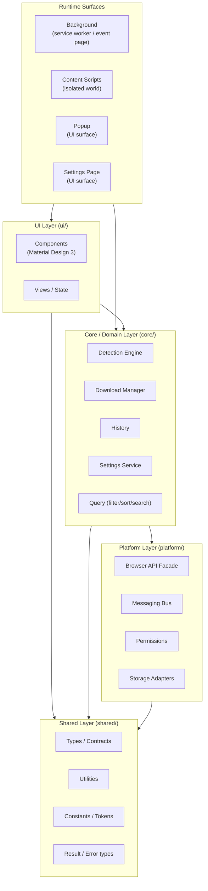
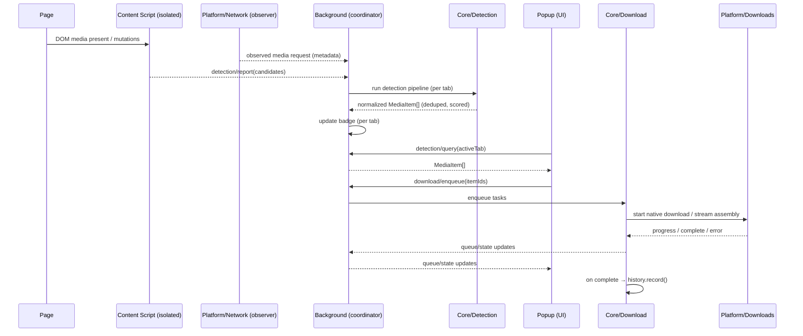
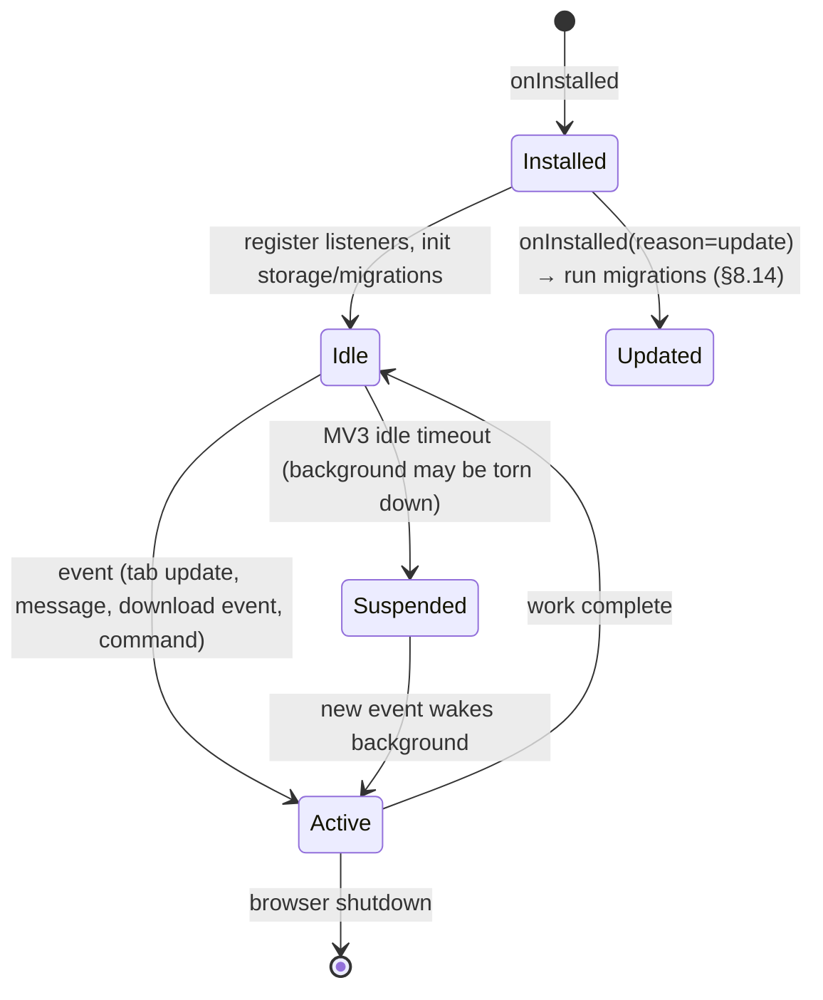
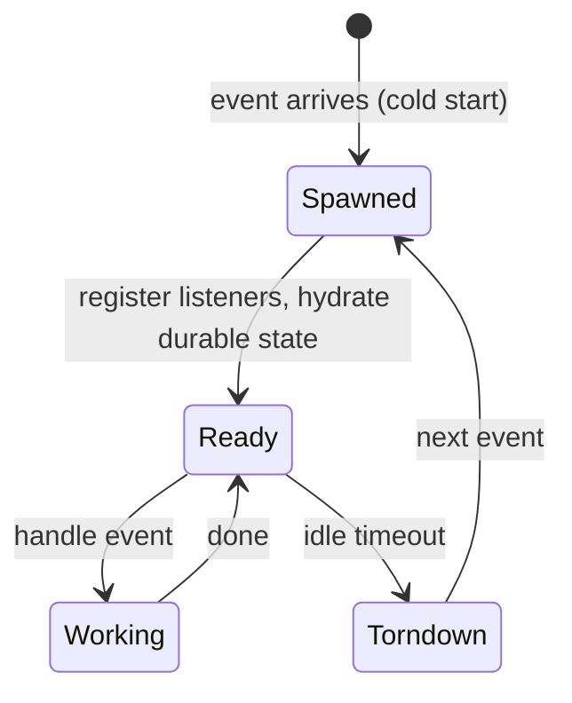
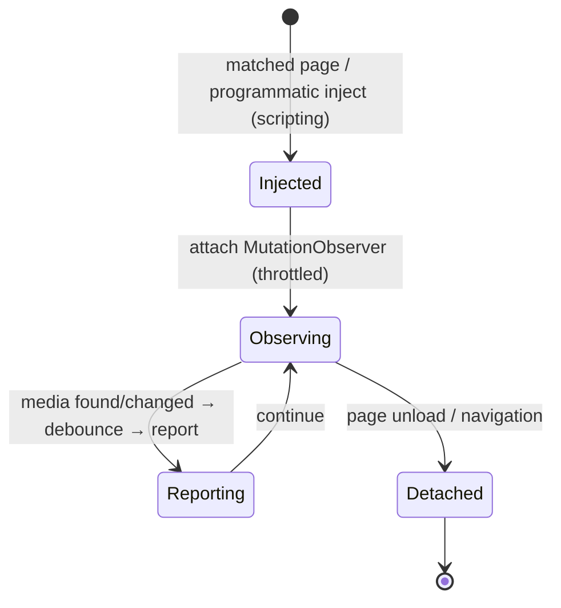
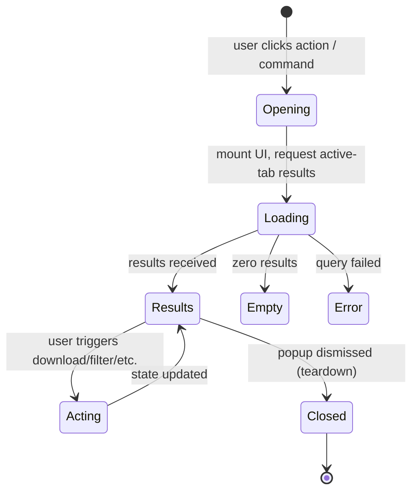
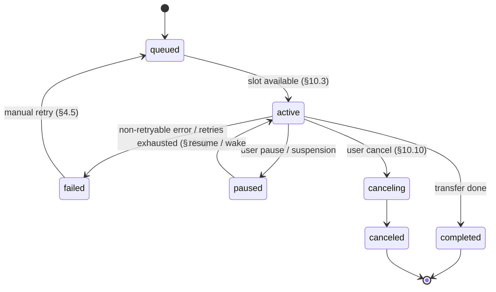
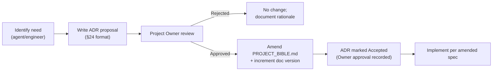

<!--
================================================================================
  AetherDL — PROJECT BIBLE
  The single, permanent source of truth for the AetherDL browser extension.
================================================================================
  THIS DOCUMENT IS AUTHORITATIVE AND STATIC.
  The architecture defined here is FINAL. It must not be redesigned, improved,
  restructured, or replaced without explicit, manual, written approval from the
  Project Owner. Every future contribution — human or AI — MUST conform to this
  document. Where implementation and this document disagree, this document wins
  until the document itself is formally amended.
================================================================================
-->

# AetherDL — Project Bible

> **Fast. Private. Powerful.**
> A modern cross-browser media downloader.

---

## Document Control

| Field | Value |
|---|---|
| **Document Title** | AetherDL — Project Bible |
| **Document Type** | Official Engineering Design Specification (Single Source of Truth) |
| **Product Name** | AetherDL |
| **Tagline** | Fast. Private. Powerful. |
| **Classification** | Internal Engineering Handbook — Authoritative |
| **Status** | Ratified / Active |
| **Version** | 1.0.0 |
| **Stability** | **STATIC** — architecture is frozen; changes require Project Owner approval |
| **Owner** | Project Owner (AetherDL) |
| **Audience** | Engineers, Reviewers, AI Implementation Agents, Maintainers, QA, Security |
| **Supersedes** | None (initial ratified edition) |

### Amendment Policy

This document is **permanent**. It may be amended **only** through the process defined
in [§25 Change Control & Amendment Process](#25-change-control--amendment-process).
No section may be silently edited, reinterpreted, or "improved." An amendment is valid
only when it (a) is proposed as an Architecture Decision Record (ADR), (b) is explicitly
approved by the Project Owner, and (c) increments the document version.

### Conformance Language

The key words **MUST**, **MUST NOT**, **REQUIRED**, **SHALL**, **SHALL NOT**, **SHOULD**,
**SHOULD NOT**, **RECOMMENDED**, **MAY**, and **OPTIONAL** in this document are to be
interpreted as described in **RFC 2119** and **RFC 8174**. When these words appear in
lowercase, they carry their ordinary English meaning and impose no requirement.

> [!IMPORTANT]
> If you are an AI agent reading this document, treat every **MUST** / **MUST NOT** as a
> hard constraint. Read [§21 AI Agent Rules](#21-ai-agent-rules) **before** performing any
> work. Violating a **MUST NOT** is a project-level failure, not a stylistic choice.

---

## Table of Contents

1. [Introduction & Purpose of This Document](#1-introduction--purpose-of-this-document)
2. [Project Goals](#2-project-goals)
3. [Non-Goals](#3-non-goals)
4. [Feature Specification](#4-feature-specification)
5. [Supported Media](#5-supported-media)
6. [Unsupported Content](#6-unsupported-content)
7. [Browser Support](#7-browser-support)
8. [Architecture](#8-architecture)
9. [Detection System](#9-detection-system)
10. [Download System](#10-download-system)
11. [User Interface](#11-user-interface)
12. [Performance](#12-performance)
13. [Security](#13-security)
14. [Privacy](#14-privacy)
15. [Coding Standards](#15-coding-standards)
16. [Testing](#16-testing)
17. [Accessibility](#17-accessibility)
18. [Development Workflow](#18-development-workflow)
19. [Internationalization & Localization](#19-internationalization--localization)
20. [Error Handling & Observability](#20-error-handling--observability)
21. [AI Agent Rules](#21-ai-agent-rules)
22. [Phase Roadmap](#22-phase-roadmap)
23. [Future Roadmap](#23-future-roadmap)
24. [Architecture Decision Records (ADRs)](#24-architecture-decision-records-adrs)
25. [Change Control & Amendment Process](#25-change-control--amendment-process)
26. [Glossary](#26-glossary)
27. [Cross-Reference Index](#27-cross-reference-index)

---

## 1. Introduction & Purpose of This Document

### 1.1 What This Document Is

This is the **Project Bible** for AetherDL. It is the complete, authoritative, and
permanent design specification for the product. It defines *what* AetherDL is, *why*
it exists, *how* it is built, *what constraints* govern it, and *what it will never do*.

It is written to be read by three audiences at once:

1. **Human engineers** who implement, review, and maintain the codebase.
2. **AI implementation agents** that generate code phase-by-phase under supervision.
3. **Maintainers and reviewers** who must judge whether a change conforms to the design.

The document is intentionally exhaustive. It is designed so that a competent engineer —
or a capable AI agent — could implement the **entire** product using only this document
as the source of truth, without needing to invent architecture, guess conventions, or
make undocumented decisions.

### 1.2 What This Document Is Not

- It is **not** a README. A README is a short orientation for newcomers; this is the law.
- It is **not** a tutorial. It does not teach browser extension development from scratch.
- It is **not** a blog post or marketing page.
- It is **not** a changelog. History belongs in Git and in [§24 ADRs](#24-architecture-decision-records-adrs).
- It is **not** the code. It is the specification the code must satisfy.

### 1.3 How to Read This Document

- Read [§2 Project Goals](#2-project-goals) and [§3 Non-Goals](#3-non-goals) first to
  understand intent and boundaries.
- Read [§8 Architecture](#8-architecture) to understand structure before touching any module.
- Read [§21 AI Agent Rules](#21-ai-agent-rules) before generating or modifying code.
- Use [§22 Phase Roadmap](#22-phase-roadmap) to know **what** to build and **when**.
- Cross-references appear as clickable anchors, e.g. "see [§9 Detection System](#9-detection-system)."

### 1.4 The Static Architecture Principle

> [!WARNING]
> **The architecture defined in this document is STATIC and FINAL.**
> Folder structure, module boundaries, dependency rules, the plugin/detector contract,
> the download pipeline, the messaging protocol, and the technology choices are frozen.
> They **MUST NOT** be redesigned, "modernized," refactored for taste, or replaced.
> The only lawful way to change them is [§25 Change Control](#25-change-control--amendment-process).

The rationale is deliberate: AetherDL is intended to be implemented incrementally, in part
by autonomous agents, over a long period. A moving architecture is impossible to implement
correctly under those conditions. Stability of the specification is therefore a **feature**,
not a limitation. Consistency beats cleverness.

### 1.5 Document Conventions

| Convention | Meaning |
|---|---|
| `monospace` | File names, paths, identifiers, types, code, commands, config keys |
| **Bold** | Emphasis, conformance keywords, defined terms on first use |
| `§N` | Cross-reference to section N of this document |
| ADR-NNN | Architecture Decision Record number NNN (see [§24](#24-architecture-decision-records-adrs)) |
| `[!NOTE]` / `[!IMPORTANT]` / `[!WARNING]` / `[!CAUTION]` | GitHub-style callouts by severity |
| Mermaid blocks | Diagrams (flowcharts, sequence, state, component) |

---

## 2. Project Goals

### 2.1 Vision

> **AetherDL is the media downloader people trust.**

AetherDL exists to give users direct, private, effortless control over media they can
already access in their browser. It aims to feel like commercial software: fast to open,
obvious to use, quiet when idle, and correct every time. It respects the user completely —
their attention, their privacy, their machine's resources, and their intelligence.

The long-term vision is a downloader that is *boring in the best way*: it works, it never
phones home, it never surprises you, and it never gets in your way.

### 2.2 Mission

To build a **cross-browser**, **Manifest V3**, **privacy-first** media downloader that:

- Detects downloadable, non-DRM media present on the current page.
- Presents that media clearly, with accurate metadata.
- Downloads it reliably using **native browser APIs** only.
- Does all of this **locally**, with **zero** telemetry, tracking, or cloud dependency.
- Remains maintainable and extensible for years through a strict, static architecture.

### 2.3 Philosophy

AetherDL is built on a small set of non-negotiable beliefs:

1. **Local-first, always.** The user's device is the only computer involved. Nothing about
   the user, their pages, or their downloads ever leaves their machine.
2. **Least privilege.** The extension requests the minimum permissions required and no more.
   Every permission must be justified in this document (see [§13 Security](#13-security)).
3. **Legitimate use only.** AetherDL downloads media the user can already access. It does
   **not** break protection, bypass DRM, or enable piracy (see [§3](#3-non-goals), [§6](#6-unsupported-content)).
4. **Quiet by default.** No ads, no upsells, no nags, no notifications the user did not ask for.
5. **Correctness over features.** A smaller product that is always right beats a larger
   product that is sometimes wrong.
6. **The architecture is a contract.** Structure is stable so implementation can be trusted.

### 2.4 Long-Term Goals

| # | Goal | Description |
|---|---|---|
| L1 | Durable architecture | A structure that survives years of incremental work without redesign. |
| L2 | Cross-browser parity | Identical behavior across all supported Chromium browsers and Firefox. |
| L3 | Trustworthy privacy | A codebase auditable enough that "no telemetry" is verifiable, not merely claimed. |
| L4 | Extensible detection | New media sources added as plugins without touching the core. |
| L5 | Commercial-grade UX | An interface indistinguishable in polish from paid software. |
| L6 | Low maintenance cost | Clear boundaries and tests that make change safe and cheap. |

### 2.5 Short-Term Goals

| # | Goal | Target Phase |
|---|---|---|
| S1 | Ratify this Project Bible | [Phase 0](#221-phase-0--planning--foundation) |
| S2 | Stand up the repository, tooling, and build | [Phase 1](#222-phase-1--repository--tooling) |
| S3 | Cross-browser API abstraction layer | [Phase 2](#223-phase-2--browser-api-abstraction) |
| S4 | Core detection engine + first detectors | [Phase 3](#224-phase-3--detection-engine-core) |
| S5 | Reliable native downloads with a queue | [Phase 5](#226-phase-5--download-manager) |
| S6 | Popup UI in Material Design 3 | [Phase 6](#227-phase-6--popup-ui) |

### 2.6 Success Metrics

Success is measured against **objective, local, privacy-preserving** criteria. AetherDL
**MUST NOT** collect usage data to measure these; they are validated in development, QA, and
manual testing, not by observing users in the field.

| Metric | Target | Measured In |
|---|---|---|
| Popup time-to-interactive | ≤ 150 ms on reference hardware | [§12 Performance](#12-performance) tests |
| Background idle CPU | ~0% when not detecting/downloading | Manual + perf tests |
| Background idle memory | ≤ 25 MB resident when idle | Perf tests |
| Detection latency (typical page) | ≤ 300 ms from request to result | Detection benchmarks |
| Download start latency | ≤ 200 ms from click to browser download | Download benchmarks |
| Crash-free sessions | 100% in test matrix | Regression suite |
| Telemetry endpoints | **0** | Static analysis / network audit |
| External network calls by the extension itself | **0** | Network audit ([§14 Privacy](#14-privacy)) |
| Accessibility | WCAG 2.1 **AA** pass | [§17 Accessibility](#17-accessibility) |
| Unit test coverage (core logic) | ≥ 90% statements/branches | [§16 Testing](#16-testing) |

### 2.7 Quality Standards

- **Production-ready always.** No placeholders, no `TODO`, no stubbed logic shipped.
- **Typed end-to-end.** TypeScript `strict` mode; no `any` except at documented boundaries.
- **Tested.** Every core module has tests; every bug fix adds a regression test.
- **Reviewed.** No change lands without review against this document.
- **Documented.** Public APIs are documented; deviations require an ADR.
- **Deterministic builds.** Same input produces the same artifact.

### 2.8 Product Principles

1. **Obvious over clever.** If the user has to think, the design failed.
2. **Fast is a feature.** Every interaction should feel instant.
3. **Silence is golden.** Do not interrupt unless the user asked to be interrupted.
4. **Respect the page.** Observe lightly; never break the sites the user visits.
5. **Honest state.** The UI always reflects reality — no fake progress, no lying spinners.

### 2.9 Engineering Principles

1. **SOLID**, applied pragmatically (see [§15 Coding Standards](#15-coding-standards)).
2. **Composition over inheritance.**
3. **Dependency inversion** across layer boundaries; core depends on abstractions.
4. **Pure core, impure edges.** Business logic is pure and testable; side effects live at the edges.
5. **One responsibility per module.** If a module needs "and" to describe it, split it.
6. **Fail loud in dev, fail safe in prod.** Errors surface in development; degrade gracefully for users.

### 2.10 Privacy Principles

1. **Collect nothing.** The best way to protect data is to never have it.
2. **Local processing only.** All detection, metadata, and history stay on-device.
3. **No identifiers.** No user IDs, device IDs, install IDs, or fingerprints — ever.
4. **Transparent permissions.** Every permission is justified and minimal.
5. **User-owned data.** History and settings belong to the user; export/erase is trivial.

### 2.11 User Experience Principles

1. **Zero learning curve.** Open the popup; the right thing is already in front of you.
2. **Accessible by default**, not as an afterthought ([§17](#17-accessibility)).
3. **Responsive and resilient** — clear empty, loading, and error states ([§11](#11-user-interface)).
4. **Consistent** — one design system (Material Design 3), applied everywhere.
5. **Forgiving** — cancel, retry, and undo where it matters; never punish a misclick.

---

## 3. Non-Goals

Non-goals are as binding as goals. The following are **permanently out of scope**. They are
**MUST NOT** items. No feature request, phase, or agent may reintroduce them without a
formal amendment ([§25](#25-change-control--amendment-process)) — and several of them
(DRM circumvention, piracy tooling) will **never** be approved under any circumstances.

### 3.1 Definitive Non-Goals

| # | AetherDL will NEVER… | Rationale |
|---|---|---|
| N1 | Bypass, break, or weaken **DRM** | Legally hazardous, ethically wrong, and technically an arms race. Out of scope forever. See [§6](#6-unsupported-content). |
| N2 | Provide **piracy tooling** or facilitate copyright infringement | AetherDL downloads media the user can already access; it is not a piracy tool. |
| N3 | Circumvent **Encrypted Media Extensions (EME)** | EME exists to protect content; defeating it is DRM circumvention (see N1). |
| N4 | Include **analytics** | Privacy-first means measuring nothing about users. |
| N5 | Include **telemetry** | No event streams, no crash pings, no "anonymous usage stats." |
| N6 | Include **tracking** of any kind | No cookies, pixels, fingerprints, or cross-site correlation. |
| N7 | Perform **data collection** | The extension holds only what the user creates locally. |
| N8 | Use **cloud services** or a backend | There is no server. The extension is fully local. |
| N9 | Include an **account system** or login | No identity, no sync accounts, no auth. |
| N10 | Show **advertisements** or upsells | The product is quiet and respectful. |
| N11 | Include **cryptocurrency**, wallets, or mining | Irrelevant and abusive of user resources. |
| N12 | Include **AI features** in the product | No model calls, no cloud inference, no "smart" features that leak data. (AI *agents* may help *build* it; the *product* ships no AI.) |
| N13 | Perform **remote code execution** or load remote scripts | All code ships in the package; nothing is fetched and executed at runtime. See [§13](#13-security). |
| N14 | Request **unnecessary permissions** | Least privilege is enforced; every permission is justified in [§13](#13-security). |
| N15 | Inject scripts into the **page's main world** to defeat protections | Content scripts run in isolated worlds only; no page-context escalation. |
| N16 | Download **DRM-protected** streams (Netflix, Disney+, etc.) | See [§6](#6-unsupported-content). Detected and explicitly refused. |
| N17 | Auto-update logic from a **remote source** | Updates ship only through official extension stores. |
| N18 | Persist data to any **non-local** store | Storage is `browser.storage`/IndexedDB only, on-device. |
| N19 | Add **social features**, sharing, or comments | Out of product scope. |
| N20 | Become a general-purpose **scraper** or automation bot | It downloads media on demand; it does not crawl or automate the web. |

### 3.2 Why Non-Goals Are Permanent

Non-goals protect the product's identity. Feature creep is how privacy-first tools slowly
become surveillance tools, and how legitimate downloaders slowly become piracy tools. By
naming these boundaries and freezing them, AetherDL guarantees that it stays what it claims
to be. Anything on this list is not "not yet" — it is "not ever," unless the Project Owner
formally amends this document.

> [!CAUTION]
> Items **N1, N2, N3, N15, N16** relate to DRM and copyright circumvention. These are
> **hard, permanent refusals**. No amendment process will approve them. They are recorded
> here so there is never ambiguity: AetherDL is a legitimate tool for legitimate use.

---

## 4. Feature Specification

This section is exhaustive by intent. Each feature has a **Purpose**, **Behavior**,
**Constraints**, and (where relevant) **States** and **Cross-references**. Features are
normative: an implementation is correct only if it matches the behavior described here.

### 4.1 Media Detection

**Purpose.** Discover downloadable, non-DRM media associated with the active tab and present
it to the user as a list of candidates.

**Behavior.**
- Detection runs through the plugin-based detection pipeline defined in [§9](#9-detection-system).
- Sources of candidates include: DOM `<video>`, `<audio>`, and `<source>` elements; direct
  media URLs observed via the network layer; `<link>`/`<meta>` hints; and playlist/manifest
  references for **non-DRM** HLS/DASH.
- Each candidate is normalized into a `MediaItem` (see [§9.6](#96-media-metadata-model)).
- Detection is **per-tab** and **scoped** to the tab the user is currently viewing.
- Detection is **incremental**: as new media appears (SPA navigation, lazy loading), the
  candidate set updates and the [badge counter](#48-badge-counter) reflects the new count.

**Constraints.**
- Detection **MUST** be passive and light-touch; it **MUST NOT** degrade page performance
  beyond the budgets in [§12](#12-performance).
- Detection **MUST NOT** attempt to detect or surface DRM-protected media ([§6](#6-unsupported-content)).
- Detection **MUST NOT** execute in the page's main world ([§13](#13-security)).

**States.** `idle` → `scanning` → `results` | `empty` | `error` (see [§11.5](#115-ui-states)).

### 4.2 Media Metadata

**Purpose.** Give the user enough information to choose the right download without opening it.

**Behavior.** For each `MediaItem`, AetherDL extracts and displays, where available:

| Field | Source | Notes |
|---|---|---|
| Title | `<title>`, `aria-label`, `alt`, filename, page heading | Best-effort, sanitized |
| Type | Container/MIME (e.g. `video/mp4`) | See [§5](#5-supported-media) |
| Kind | `video` \| `audio` \| `stream` \| `image-sequence` | Derived |
| Resolution | Video track metadata / manifest | e.g. `1920×1080` when known |
| Duration | Media metadata / manifest | `hh:mm:ss` when known |
| Bitrate/Quality | Manifest variant / heuristics | For quality selection ([§9.8](#98-quality-detection)) |
| File size | `Content-Length` / manifest / estimate | Marked *estimated* when derived |
| Source URL | Resolved absolute URL | Validated ([§13.5](#135-safe-url-validation)) |
| Origin/host | Page origin | For grouping and display |

**Constraints.** Metadata extraction **MUST** be best-effort and **MUST NOT** block the UI;
missing fields are shown as "Unknown," never as fabricated values ([§2.8 Honest state](#28-product-principles)).

### 4.3 Downloads

**Purpose.** Save selected media to the user's device using native browser download facilities.

**Behavior.**
- Downloads are performed **only** through the browser Downloads API (see [§10.8](#108-browser-downloads-api)).
- The user may download a single item, a selection, or all items.
- Each download produces a `DownloadTask` tracked by the [Download Manager](#101-download-manager).
- Filenames are generated deterministically ([§10.7](#107-filename-generation)); collisions
  are handled predictably ([§10.7](#107-filename-generation)).
- Progress, completion, failure, and cancellation are reflected in the UI and (optionally)
  in [notifications](#410-notifications).

**Constraints.** AetherDL **MUST NOT** re-implement HTTP transfer for direct downloads when
the native Downloads API can perform them; it delegates to the browser for reliability,
resumability, and OS integration. Stream assembly (non-DRM HLS/DASH) is the documented
exception (see [§5.5](#55-progressive-streams--adaptive-manifests) and [§10](#10-download-system)).

### 4.4 Download Queue

**Purpose.** Manage many downloads without overwhelming the browser, network, or disk.

**Behavior.**
- All downloads enter a **queue** owned by the Download Manager ([§10.2](#102-queue)).
- Concurrency is bounded by a configurable limit ([§10.3](#103-concurrency); default in [§7 Settings defaults]).
- Queue items have states: `queued` → `active` → (`completed` | `failed` | `canceled` | `paused`).
- The queue is **persisted** so it survives service-worker suspension ([§8.9](#89-background-lifecycle)).
- Order is FIFO by default; the user MAY reorder or prioritize items (see [§11](#11-user-interface)).

**Constraints.** Queue state **MUST** be the single source of truth for download status shown
anywhere in the UI. No component may track download state independently.

### 4.5 Retry Logic

**Purpose.** Recover automatically from transient failures without user intervention.

**Behavior.**
- Failed downloads are retried using **exponential backoff with jitter** ([§10.4](#104-retry-strategy)).
- A maximum retry count is enforced (default configurable in [Settings](#47-settings)).
- Only **retryable** failures are retried (network errors, transient 5xx). Non-retryable
  failures (403/404, DRM refusal, invalid URL) fail fast with a clear reason.
- After exhausting retries, the item enters `failed` with an actionable error ([§20](#20-error-handling--observability)).
- The user MAY manually retry any `failed` item at any time.

**Constraints.** Retries **MUST** respect concurrency limits and **MUST NOT** create
unbounded retry storms. Backoff is mandatory.

### 4.6 Duplicate Detection

**Purpose.** Avoid presenting or downloading the same media twice.

**Behavior.**
- Within a detection cycle, candidates are de-duplicated by a **stable identity key**
  derived from normalized URL + container + salient metadata ([§9.5](#95-duplicate-removal)).
- Against history, AetherDL MAY warn the user that an item appears already downloaded, based
  on the same identity key and the local [History](#411-history) store.
- De-duplication is deterministic and explainable; two runs on the same page yield the same set.

**Constraints.** Duplicate detection **MUST NOT** rely on any network lookup or remote hash
service. It is purely local and heuristic.

### 4.7 Badge Counter

**Purpose.** Show, at a glance, how many downloadable items exist on the current tab.

**Behavior.**
- The toolbar action badge shows the count of detected `MediaItem`s for the **active tab**.
- The badge updates as detection results change (incremental, per-tab).
- `0` results shows **no badge** (empty badge text), not the number zero.
- Badge color follows the theme tokens ([§11.13](#1113-color-tokens)) and remains legible in
  both light and dark browser themes.

**Constraints.** The badge is **per-tab**; switching tabs **MUST** switch the badge to that
tab's count. Badge writes are throttled to avoid flicker ([§12](#12-performance)).

### 4.8 Popup Interface

**Purpose.** The primary surface: view detected media, act on it, and see download status.

**Behavior.** See [§11.1 Popup](#111-popup) for full specification. Summary:
- Lists detected `MediaItem`s as [media cards](#116-media-cards).
- Provides per-item and bulk actions: download, copy link, select, filter, sort, search.
- Shows the active [download queue](#44-download-queue) and progress.
- Provides entry points to [Settings](#47-settings) and [History](#411-history).
- Renders empty/loading/error states ([§11.5](#115-ui-states)).

**Constraints.** The popup **MUST** be interactive within the performance budget ([§2.6](#26-success-metrics)).
It **MUST** be usable entirely by keyboard ([§17](#17-accessibility)).

### 4.9 Settings

**Purpose.** Let the user tune behavior without touching code.

**Behavior.** See [§11.2 Settings Page](#112-settings-page). Settings are persisted locally
([§8 storage](#814-storage-architecture)) and take effect immediately or on next relevant action.

**Settings Catalog (defaults are normative):**

| Setting | Type | Default | Effect |
|---|---|---|---|
| Theme | `system` \| `light` \| `dark` | `system` | UI theme ([§11.14/11.15](#1114-dark-theme)) |
| Max concurrent downloads | integer 1–10 | `3` | Queue concurrency ([§10.3](#103-concurrency)) |
| Max retries | integer 0–10 | `3` | Retry cap ([§10.4](#104-retry-strategy)) |
| Filename template | string | see [§10.7](#107-filename-generation) | Filename generation |
| Download subfolder | string | `""` (browser default) | Relative path within Downloads |
| Notifications | boolean | `true` | Show completion/failure notifications ([§4.10](#410-notifications)) |
| Keep history | boolean | `true` | Enable [History](#411-history) |
| History retention | `forever` \| `30d` \| `90d` \| `session` | `forever` | Auto-prune policy |
| Duplicate warnings | boolean | `true` | Warn on already-downloaded items ([§4.6](#46-duplicate-detection)) |
| Context menu | boolean | `true` | Enable [context menu](#413-context-menu) integration |
| Reduced motion | `system` \| `on` \| `off` | `system` | Respect motion preferences ([§17](#17-accessibility)) |
| Language | locale code | `system` | UI language ([§19](#19-internationalization--localization)) |
| Detection sensitivity | `conservative` \| `balanced` \| `aggressive` | `balanced` | Detector thresholds ([§9](#9-detection-system)) |

**Constraints.** Every setting **MUST** have a sane, privacy-preserving default. Settings
**MUST** validate input and reject invalid values with clear feedback. There is **no**
"send diagnostics" or "share usage data" setting — it does not exist ([§3](#3-non-goals)).

### 4.10 Notifications

**Purpose.** Inform the user of important, user-initiated outcomes.

**Behavior.**
- Uses the browser Notifications API only when the user has enabled notifications.
- Fires on: download completed, download failed (after retries), queue completed.
- Notifications are **actionable** where possible (e.g. "Show in folder," "Retry").
- Notifications are **coalesced** for bulk operations (one summary, not fifty toasts).

**Constraints.** Notifications **MUST** be off-by-choice respected; **MUST NOT** be used for
marketing, tips, nags, or engagement. See [§2.8](#28-product-principles) and [§3](#3-non-goals).

### 4.11 History

**Purpose.** Let the user see and manage what they've downloaded.

**Behavior.**
- When enabled, completed (and optionally failed) downloads are recorded locally.
- Each record stores: title, type, size, source host, timestamp, outcome, local filename.
- History supports [filtering](#412-filtering-sorting--search), [sorting](#412-filtering-sorting--search),
  and [search](#412-filtering-sorting--search).
- The user can delete individual records, clear all, or export history (JSON) locally.
- Retention is governed by the History retention setting ([§4.9](#49-settings)).

**Constraints.** History is **local-only** ([§14](#14-privacy)). It **MUST NOT** store full
page URLs beyond what is needed (host + media URL as chosen by design), and **MUST** be
fully erasable. History **MUST NOT** be transmitted anywhere.

### 4.12 Filtering, Sorting & Search

**Purpose.** Make large result sets and long histories navigable.

**Behavior.**
- **Filtering:** by kind (video/audio/stream), by type (mp4/mp3/…), by host, by state.
- **Sorting:** by title, size, duration, resolution/quality, time added, and status.
- **Search:** case-insensitive substring match over title, host, and type, applied live.
- Filter/sort/search apply to both the detection results view and the history view.

**Constraints.** All operations run **locally** and **synchronously** on in-memory/local data;
they **MUST** remain responsive for reasonable list sizes (see [§12](#12-performance)).

### 4.13 Context Menu

**Purpose.** Offer quick downloading from right-click context.

**Behavior.**
- When enabled, AetherDL adds context-menu entries on media elements and media links, e.g.
  "Download with AetherDL."
- Selecting an entry enqueues the corresponding `MediaItem` into the [queue](#44-download-queue).
- Context-menu entries respect the same DRM refusal rules ([§6](#6-unsupported-content)).

**Constraints.** Context-menu integration **MUST** be optional (toggle in [Settings](#49-settings))
and **MUST** use the `contextMenus` permission only when enabled/available ([§13](#13-security)).

### 4.14 Keyboard Shortcuts

**Purpose.** Power-user speed and accessibility.

**Behavior.**
- A command opens the popup (via the `commands` API).
- Within the popup, documented shortcuts drive navigation and actions ([§17.2](#172-keyboard-navigation)).
- Shortcuts are discoverable (shown in UI and Settings) and, where the browser allows, rebindable.

**Constraints.** Shortcuts **MUST NOT** conflict with common browser shortcuts by default and
**MUST** be fully documented ([§17](#17-accessibility)).

### 4.15 Permission Management

**Purpose.** Give users visibility and control over what AetherDL can do.

**Behavior.**
- The extension declares the **minimum** permissions at install ([§13.3](#133-permission-strategy)).
- Where feasible, elevated capabilities use **optional permissions** requested at point-of-use.
- Settings surfaces current permissions and, where the browser supports it, lets users revoke
  optional permissions.

**Constraints.** AetherDL **MUST NOT** request broad host permissions preemptively. See
[§13.3](#133-permission-strategy) and [§13.7](#137-host-permission-policy).

### 4.16 Error Handling

**Purpose.** Make failures understandable and recoverable.

**Behavior.** See [§20](#20-error-handling--observability). Every user-facing error has a
plain-language message, a cause category, and (where possible) a recovery action.

**Constraints.** Errors **MUST NOT** leak internal stack traces to users, and **MUST NOT** be
reported to any external service ([§14](#14-privacy)).

### 4.17 Caching

**Purpose.** Avoid redundant work and keep the UI instant.

**Behavior.**
- Detection results are cached **per-tab** with a bounded lifetime and invalidated on
  navigation ([§9.9](#99-detection-caching)).
- Metadata lookups are memoized within a detection cycle.
- Caches are **in-memory** and **bounded** ([§12](#12-performance)); nothing is cached to disk
  except what the user explicitly persists (history, settings).

**Constraints.** Caches **MUST** have eviction policies and size bounds; unbounded caches are
forbidden ([§12.5](#125-caching-strategy)).

### 4.18 Performance (as a Feature)

Performance is a first-class feature, fully specified in [§12](#12-performance). Summary
budgets: fast popup, near-zero idle cost, light DOM observation, bounded caches, aggressive
cleanup. Regression against these budgets is a defect.

### 4.19 Storage

**Purpose.** Persist exactly what the user needs, locally and safely.

**Behavior.** See [§8.14 Storage Architecture](#814-storage-architecture). Settings live in
`browser.storage.local` (and `sync` only if explicitly designed and user-opted); history and
queue live in IndexedDB via a repository abstraction.

**Constraints.** Storage is **local-only** ([§14](#14-privacy)); schema is versioned and
migrated ([§8.14](#814-storage-architecture)).

### 4.20 Browser Compatibility

**Purpose.** One codebase, consistent behavior, across all supported browsers.

**Behavior.** See [§7 Browser Support](#7-browser-support) and [§8.2 Browser API Abstraction](#82-browser-api-abstraction-layer).
All browser interaction goes through a single abstraction layer so feature differences are
handled in one place.

**Constraints.** No component outside the abstraction layer may call browser extension APIs
directly. This is a hard architectural rule ([§8.4](#84-dependency-rules)).

### 4.21 Feature Traceability Matrix

| Feature | Primary Module(s) | Spec Section |
|---|---|---|
| Detection | `detection/` | [§9](#9-detection-system) |
| Metadata | `detection/metadata/` | [§4.2](#42-media-metadata), [§9.6](#96-media-metadata-model) |
| Downloads | `download/` | [§10](#10-download-system) |
| Queue | `download/queue/` | [§10.2](#102-queue) |
| Retry | `download/retry/` | [§10.4](#104-retry-strategy) |
| Duplicate detection | `detection/dedupe/` | [§9.5](#95-duplicate-removal) |
| Badge | `background/badge/` | [§4.7](#47-badge-counter) |
| Popup | `ui/popup/` | [§11.1](#111-popup) |
| Settings | `ui/settings/`, `core/settings/` | [§4.9](#49-settings), [§11.2](#112-settings-page) |
| Notifications | `background/notifications/` | [§4.10](#410-notifications) |
| History | `core/history/`, `ui/history/` | [§4.11](#411-history) |
| Filter/Sort/Search | `ui/` + `core/query/` | [§4.12](#412-filtering-sorting--search) |
| Context menu | `background/contextmenu/` | [§4.13](#413-context-menu) |
| Shortcuts | `background/commands/` | [§4.14](#414-keyboard-shortcuts) |
| Permissions | `platform/permissions/` | [§4.15](#415-permission-management) |
| Storage | `core/storage/` | [§8.14](#814-storage-architecture) |
| Browser abstraction | `platform/` | [§8.2](#82-browser-api-abstraction-layer) |

---

## 5. Supported Media

AetherDL supports downloading media the user can already access, in the formats and delivery
methods below. Support means: AetherDL can **detect**, **describe**, and **download** the media
using the mechanisms in [§9](#9-detection-system) and [§10](#10-download-system).

### 5.1 Supported Container/Codec Formats

**Video containers:**

| Format | Typical MIME | Notes |
|---|---|---|
| MP4 | `video/mp4` | Primary, best-supported target |
| WebM | `video/webm` | Fully supported |
| M4V | `video/x-m4v`, `video/mp4` | Treated as MP4-family |
| MOV | `video/quicktime` | Supported as a direct/progressive download |
| AVI | `video/x-msvideo` | Supported as a direct download |
| MKV | `video/x-matroska` | Supported as a direct download |

**Audio containers:**

| Format | Typical MIME | Notes |
|---|---|---|
| MP3 | `audio/mpeg` | Primary audio target |
| AAC | `audio/aac` | Supported |
| M4A | `audio/mp4`, `audio/x-m4a` | Supported |
| FLAC | `audio/flac` | Supported |
| WAV | `audio/wav`, `audio/x-wav` | Supported |
| OGG | `audio/ogg` | Supported (Vorbis/Opus in Ogg) |

### 5.2 Direct URLs

**Definition.** A direct URL points at a complete media file over HTTP(S) (e.g.
`https://host/path/video.mp4`).

**Support.** Fully supported. Direct URLs are the ideal case: detected via DOM/network,
described via headers/metadata, and downloaded via the native Downloads API ([§10.8](#108-browser-downloads-api)).

### 5.3 HTML5 Media

**Definition.** Media referenced by `<video>`, `<audio>`, and their `<source>` children, or
set via the media element's `src`.

**Support.** Fully supported when the resolved source is a downloadable, non-DRM URL. Detection
reads element and source attributes and resolves absolute URLs ([§9](#9-detection-system)).

### 5.4 Blob URLs (Where Technically Feasible)

**Definition.** `blob:` URLs reference in-memory `Blob`/`MediaSource` objects created by the page.

**Support.** **Best-effort, limited.** `blob:` URLs are page-scoped and often back
`MediaSource` streaming that may be DRM-protected or non-reconstructable from outside the page.

- AetherDL **MAY** download a `blob:` resource **only** when it can be lawfully and technically
  resolved without page-context script injection and without DRM circumvention.
- When a `blob:` source is backed by EME/DRM or cannot be resolved within the extension's
  security model, AetherDL **MUST** mark it **Unsupported** and explain why ([§6](#6-unsupported-content)).

> [!NOTE]
> `blob:` support is explicitly *conditional*. The security model ([§13](#13-security)) —
> no main-world injection, no DRM circumvention — takes precedence over convenience. If those
> constraints make a specific `blob:` undownloadable, it is Unsupported by definition.

### 5.5 Progressive Streams & Adaptive Manifests

**Progressive streams.** A single-file stream delivered progressively over HTTP. Supported as a
direct download.

**Non-DRM HLS playlists (`.m3u8`).** Supported. AetherDL can parse a **non-encrypted** HLS
media/master playlist, select a variant ([§9.8](#98-quality-detection)), fetch segments, and
assemble them into a downloadable file within the extension's constraints ([§10](#10-download-system)).

**Non-DRM DASH manifests (`.mpd`).** Supported. AetherDL can parse a **non-encrypted** MPEG-DASH
manifest, select a representation, fetch segments, and assemble them.

**Hard limits (apply to both HLS and DASH):**
- If the manifest declares encryption/DRM (`#EXT-X-KEY` with a real key system, `ContentProtection`
  in DASH, EME/Widevine/PlayReady/FairPlay signaling), AetherDL **MUST** refuse it as
  **Unsupported** ([§6](#6-unsupported-content)). No key acquisition, no decryption — ever.

### 5.6 Limitations of Support

- **Metadata may be incomplete.** Sites vary; unknown fields are shown as "Unknown" ([§4.2](#42-media-metadata)).
- **Size may be estimated.** For streams/manifests without a `Content-Length`, size is estimated
  and labeled as such.
- **Stream assembly is heavier.** HLS/DASH assembly costs more time, memory, and CPU than a direct
  download; it operates within the [performance budgets](#12-performance) and MAY be bounded by
  configurable limits.
- **Some pages actively prevent detection.** AetherDL will not defeat anti-download measures that
  amount to protection circumvention. If a site's mechanism is protection, AetherDL respects it.
- **Feasibility over promises.** Where "technically feasible" is stated (e.g. `blob:`), it means
  exactly that: supported when possible under the security model, Unsupported otherwise.

---

## 6. Unsupported Content

AetherDL **detects and explicitly refuses** the following. Refusal is a feature: the UI clearly
marks such media as Unsupported and states, in plain language, *why*. This section is normative
and permanent (see [§3 Non-Goals](#3-non-goals)).

### 6.1 Categorically Unsupported

| Content / Service | Status | Why |
|---|---|---|
| **Netflix** | Unsupported | DRM-protected (Widevine/PlayReady/FairPlay). Downloading requires DRM circumvention. |
| **Disney+** | Unsupported | DRM-protected streaming. |
| **Prime Video** | Unsupported | DRM-protected streaming. |
| **Spotify** | Unsupported | DRM/encrypted delivery; protected content. |
| **Apple Music** | Unsupported | DRM/FairPlay-protected content. |
| **DRM (any)** | Unsupported | Digital Rights Management is designed to prevent copying; defeating it is out of scope forever ([N1](#31-definitive-non-goals)). |
| **Encrypted Media Extensions (EME)** | Unsupported | The browser API for DRM playback; AetherDL never engages key systems ([N3](#31-definitive-non-goals)). |
| **Protected HLS** (`#EXT-X-KEY` w/ real key system) | Unsupported | Encrypted stream; requires key acquisition/decryption. |
| **Protected DASH** (`ContentProtection`) | Unsupported | Encrypted stream; requires DRM. |
| **Password-protected streams** | Unsupported | AetherDL does not defeat access controls or authentication barriers to content. |
| **Any DRM circumvention** | Unsupported | Permanent, non-negotiable refusal ([§3.2](#32-why-non-goals-are-permanent)). |

### 6.2 Why These Are Unsupported (Detailed)

**Legal.** Circumventing DRM or technological protection measures is unlawful in many
jurisdictions (e.g. anti-circumvention provisions). AetherDL will not expose its users or its
maintainers to that risk, and will not build tools whose primary effect is circumvention.

**Ethical.** DRM-protected catalogs represent licensed content with contractual limits.
AetherDL is a tool for downloading media users can already freely access — not a tool for taking
content that is deliberately protected.

**Technical.** DRM playback depends on secure key exchange and (often) hardware-backed decryption
via EME/CDM. There is no way to "download" such content without engaging and defeating that
protection. AetherDL's security model forbids the very techniques that would be required
(no main-world injection, no key handling, no decryption).

**Product identity.** Refusing protected content is what keeps AetherDL a legitimate, trustworthy
tool. It is a boundary that defines the product ([§3](#3-non-goals)).

### 6.3 Detection & Refusal Behavior

- When detection encounters DRM/EME signaling, encrypted manifests, or a categorically
  unsupported source, it **MUST** classify the item as `unsupported` with a machine-readable
  `reason` and a human-readable explanation.
- Unsupported items **MAY** be shown (greyed out, clearly labeled) or hidden, per design in
  [§11](#11-user-interface); if shown, the download action **MUST** be disabled with an
  explanation on focus/hover ([§17](#17-accessibility)).
- AetherDL **MUST NOT** attempt any workaround, key request, or decryption for unsupported items.

---

## 7. Browser Support

AetherDL is a **single codebase** targeting **Manifest V3**, running across all major Chromium
browsers and Firefox, with behavior parity as a first-class goal ([§2.4 L2](#24-long-term-goals)).

### 7.1 Supported Browsers

| Browser | Engine | Min. Version Policy | Notes |
|---|---|---|---|
| **Google Chrome** | Chromium (Blink) | Latest 2 stable majors | Primary MV3 reference target |
| **Microsoft Edge** | Chromium (Blink) | Latest 2 stable majors | Chrome-compatible MV3 |
| **Brave** | Chromium (Blink) | Latest 2 stable majors | Chrome-compatible; respects Brave shields |
| **Opera** | Chromium (Blink) | Latest 2 stable majors | Chrome-compatible MV3 |
| **Vivaldi** | Chromium (Blink) | Latest 2 stable majors | Chrome-compatible MV3 |
| **Mozilla Firefox** | Gecko | Latest stable + ESR | MV3 with Firefox-specific differences ([§7.4](#74-firefox-compatibility)) |

> "Latest 2 stable majors" means the current stable release and the one before it, plus Firefox
> ESR. Older versions are not a support target.

### 7.2 Compatibility Strategy

1. **One package, per-browser build outputs.** A single source tree produces per-target builds.
   Differences are resolved at build time (manifest generation) and runtime (abstraction layer),
   not by forking code.
2. **Standards first.** Prefer `Promise`-based, standardized WebExtension APIs.
3. **Feature detection, not browser sniffing.** Behavior branches on capability detection where
   possible; explicit target flags are used only where capabilities cannot be detected.
4. **Graceful degradation.** If an optional capability is unavailable on a target, the feature
   degrades cleanly and the UI communicates the limitation ([§11.5](#115-ui-states)).

### 7.3 Browser API Abstraction

All extension-API access is funneled through the **Platform Layer** ([§8.2](#82-browser-api-abstraction-layer)).

- A single `browser`-style, `Promise`-based facade wraps `chrome.*` / `browser.*`.
- The rest of the codebase depends **only** on the Platform Layer's typed interfaces, never on
  `chrome`/`browser` globals directly ([§8.4 Dependency Rules](#84-dependency-rules)).
- Per-target quirks (MV3 background type, downloads behavior, notifications shape, `contextMenus`
  vs `menus`) are handled inside the Platform Layer and nowhere else.

This is the mechanism that makes cross-browser parity maintainable: differences live in exactly
one place.

### 7.4 Firefox Compatibility

Firefox supports MV3 but differs from Chromium in important ways. The Platform Layer accounts for:

| Concern | Chromium (MV3) | Firefox (MV3) | AetherDL Handling |
|---|---|---|---|
| Background context | Service worker (`background.service_worker`) | Event page (`background.scripts`, non-persistent) | Build-time manifest generation selects the correct key; runtime code is written to be lifecycle-agnostic ([§8.9](#89-background-lifecycle)). |
| API namespace | `chrome.*` (callbacks) / partial promises | `browser.*` (promises) | Platform facade normalizes to promise-based `browser`-style API. |
| `contextMenus` | `chrome.contextMenus` | `browser.menus` (+ `contextMenus` alias) | Abstracted behind one interface. |
| Host permissions prompt | At install / optional | More granular user controls | Optional permissions requested at point-of-use ([§13.3](#133-permission-strategy)). |
| CSP defaults | MV3 strict | MV3 strict | Same strict CSP policy ([§13.2](#132-content-security-policy)). |
| Downloads API nuances | `chrome.downloads` | `browser.downloads` | Abstracted; per-target filename/conflict handling normalized ([§10.8](#108-browser-downloads-api)). |

> [!NOTE]
> Firefox behavior parity is a **support requirement**, not an afterthought. Any feature that
> cannot achieve parity on Firefox must document the difference and degrade gracefully; it must
> not silently misbehave.

### 7.5 Manifest V3 Strategy

AetherDL is **MV3-only**. There is no MV2 fallback.

- **Background:** non-persistent (service worker on Chromium, event page on Firefox). All
  background logic **MUST** assume it can be suspended at any time and **MUST** persist state it
  needs to survive ([§8.9](#89-background-lifecycle), [§4.4 persisted queue](#44-download-queue)).
- **No remotely hosted code.** All logic ships in the package ([§13](#13-security), [N13](#31-definitive-non-goals)).
- **Strict CSP.** No inline scripts, no `eval`, no remote scripts ([§13.2](#132-content-security-policy)).
- **`action` API** for the toolbar button and badge; **`scripting`** for programmatic content
  script injection where required (least privilege); **`downloads`**, **`storage`**,
  **`contextMenus`/`menus`**, **`notifications`**, **`commands`** per feature need
  ([§13.3](#133-permission-strategy)).
- **declarativeNetRequest / webRequest:** network **observation** for detection is designed to
  use the least-privileged mechanism available on each target, within the Platform Layer, and only
  to *observe* media requests — never to modify protected content or defeat protection.

### 7.6 Build Targets & Manifest Generation

- Manifests are **generated** per target from a shared source of truth at build time
  ([§8.15 Build & Packaging](#815-build--packaging-architecture)).
- The build produces one distributable per store (Chrome Web Store, Edge Add-ons, Firefox AMO,
  and Chromium-compatible stores for Opera/others).
- Version numbers are synchronized across targets ([§18.7 Versioning](#187-versioning)).

---

## 8. Architecture

> [!WARNING]
> **This architecture is FINAL.** Folder structure, layer boundaries, dependency rules, and the
> communication protocol are frozen ([§1.4](#14-the-static-architecture-principle)). Do not
> restructure folders, introduce new frameworks, replace libraries, or rename modules. Changes
> require [§25 Change Control](#25-change-control--amendment-process).

### 8.1 Architectural Overview

AetherDL is a **layered, plugin-extensible** extension. It separates *what the browser gives us*
(Platform), *what the product decides* (Core/Domain), *what runs where* (Runtime surfaces:
background, content, popup, settings), and *how it looks* (UI).

**Layers (top depends on bottom; bottom never depends on top):**



**Key invariants (all are MUST):**
1. **Nothing** outside `platform/` touches `chrome.*` / `browser.*` directly ([§8.4](#84-dependency-rules)).
2. `core/` is **pure domain logic** and depends only on `platform/` interfaces and `shared/`.
3. `shared/` depends on **nothing** internal (leaf layer).
4. Surfaces (background/content/popup/settings) are **thin**: wiring, lifecycle, and delegation.
5. Detectors are **plugins** conforming to a fixed interface ([§9.2](#92-detector-interface)).

### 8.2 Browser API Abstraction Layer

**Location:** `src/platform/`

**Purpose.** Provide a single, typed, `Promise`-based facade over all WebExtension APIs so the
rest of the codebase is browser-agnostic ([§7.3](#73-browser-api-abstraction)).

**Composition:**

| Module | Responsibility |
|---|---|
| `platform/browser/` | The `browser`-style facade: normalizes `chrome.*`/`browser.*`, promisifies callbacks, hides per-target quirks. |
| `platform/messaging/` | Typed message bus over `runtime`/`tabs` messaging ([§8.5](#85-communication-rules)). |
| `platform/downloads/` | Thin wrapper over the Downloads API ([§10.8](#108-browser-downloads-api)). |
| `platform/storage/` | Adapters for `storage.local`/`storage.sync` and IndexedDB ([§8.14](#814-storage-architecture)). |
| `platform/permissions/` | Optional-permission request/query/revoke ([§4.15](#415-permission-management)). |
| `platform/network/` | Least-privilege network observation for detection ([§7.5](#75-manifest-v3-strategy)). |
| `platform/notifications/` | Notifications API wrapper ([§4.10](#410-notifications)). |
| `platform/menus/` | `contextMenus`/`menus` abstraction ([§4.13](#413-context-menu)). |
| `platform/commands/` | Keyboard command registration ([§4.14](#414-keyboard-shortcuts)). |
| `platform/tabs/` | Tab/activeTab queries used by detection and badge ([§4.7](#47-badge-counter)). |

**Restriction.** The Platform Layer **MUST NOT** contain product/business logic. It adapts;
it does not decide. Decisions live in `core/`.

### 8.3 Folder Structure (FINAL)

> [!IMPORTANT]
> This tree is the canonical layout. Files may be added *within* these folders following the
> conventions in [§15](#15-coding-standards), but folders **MUST NOT** be renamed, moved, merged,
> or removed, and new **top-level** folders **MUST NOT** be introduced, without an ADR.

```text
AetherDL/
├── PROJECT_BIBLE.md              # THIS document — the source of truth
├── README.md                     # Short public orientation (points here)
├── LICENSE
├── CHANGELOG.md
├── package.json
├── tsconfig.json
├── tsconfig.base.json
├── .editorconfig
├── .eslintrc.cjs
├── .prettierrc
├── vitest.config.ts
├── playwright.config.ts
├── build/                        # Build tooling & per-target manifest generation
│   ├── manifest/                 # Manifest source + per-target generators (§7.6)
│   ├── vite/                     # Build config (bundler)
│   └── scripts/                  # Packaging, zip, validation scripts (§8.15)
├── public/                       # Static assets copied verbatim
│   ├── icons/                    # Extension icons (all required sizes)
│   └── _locales/                 # i18n message catalogs (§19)
├── src/
│   ├── shared/                   # LEAF layer — no internal deps (§8.16)
│   │   ├── types/                # Cross-cutting TS types & contracts
│   │   ├── result/               # Result<T,E> / error taxonomy (§20)
│   │   ├── constants/            # App-wide constants
│   │   ├── tokens/               # Design tokens mirror (§11.13) [non-visual source]
│   │   ├── utils/                # Pure utilities (no side effects)
│   │   └── logging/              # Dev-only logger abstraction (§20.6)
│   ├── platform/                 # Browser API abstraction (§8.2) — ONLY layer touching chrome/browser
│   │   ├── browser/
│   │   ├── messaging/
│   │   ├── downloads/
│   │   ├── storage/
│   │   ├── permissions/
│   │   ├── network/
│   │   ├── notifications/
│   │   ├── menus/
│   │   ├── commands/
│   │   └── tabs/
│   ├── core/                     # Domain layer (§8.13) — pure logic, platform via interfaces
│   │   ├── detection/            # Detection engine (§9)
│   │   │   ├── manager/          # DetectorManager (§9.1)
│   │   │   ├── pipeline/         # Detection pipeline (§9.3)
│   │   │   ├── detectors/        # Detector plugins (§9.2) — extensibility point
│   │   │   ├── dedupe/           # Duplicate removal (§9.5)
│   │   │   ├── scoring/          # Media scoring (§9.7)
│   │   │   ├── quality/          # Quality detection (§9.8)
│   │   │   ├── metadata/         # Metadata extraction (§4.2, §9.6)
│   │   │   └── cache/            # Detection caching (§9.9)
│   │   ├── download/             # Download system (§10)
│   │   │   ├── manager/          # DownloadManager (§10.1)
│   │   │   ├── queue/            # Queue (§10.2)
│   │   │   ├── concurrency/      # Concurrency control (§10.3)
│   │   │   ├── retry/            # Retry strategy (§10.4)
│   │   │   ├── filename/         # Filename generation & collisions (§10.7)
│   │   │   ├── stream/           # Non-DRM HLS/DASH assembly (§10.6)
│   │   │   └── progress/         # Progress tracking (§10.5)
│   │   ├── history/              # History store & policy (§4.11)
│   │   ├── settings/             # Settings service & schema (§4.9)
│   │   └── query/                # Filter/sort/search engine (§4.12)
│   ├── ui/                       # UI layer (§11) — Material Design 3
│   │   ├── design-system/        # Tokens, primitives, theming (§11.9–§11.15)
│   │   ├── components/           # Reusable components (cards, buttons, etc.)
│   │   ├── popup/                # Popup surface app (§11.1)
│   │   ├── settings/             # Settings surface app (§11.2)
│   │   ├── history/              # History view (§4.11)
│   │   └── state/               # UI state management (§8.7)
│   └── runtime/                  # Runtime surface entry points (thin) (§8.8–§8.12)
│       ├── background/           # Background entry & wiring (§8.9)
│       │   ├── index.ts
│       │   ├── badge/            # Badge counter (§4.7)
│       │   ├── notifications/    # Notification orchestration (§4.10)
│       │   ├── contextmenu/      # Context menu wiring (§4.13)
│       │   └── commands/         # Command handlers (§4.14)
│       ├── content/              # Content script entry (§8.10) — isolated world only
│       │   └── index.ts
│       ├── popup/                # Popup HTML/entry (mounts ui/popup)
│       │   ├── index.html
│       │   └── index.ts
│       └── settings/             # Settings HTML/entry (mounts ui/settings)
│           ├── index.html
│           └── index.ts
├── tests/                        # (§16) unit/integration/e2e/perf/a11y
│   ├── unit/
│   ├── integration/
│   ├── e2e/
│   ├── performance/
│   └── accessibility/
└── docs/                         # Supplementary docs (never supersede this Bible)
    └── adr/                      # Architecture Decision Records (§24)
```

### 8.4 Dependency Rules

Dependencies flow **downward only**. The following table is a hard contract enforced by
lint rules ([§15.9](#159-enforced-boundaries)) and review.

| Layer | MAY depend on | MUST NOT depend on |
|---|---|---|
| `shared/` | (nothing internal) | anything internal |
| `platform/` | `shared/` | `core/`, `ui/`, `runtime/` |
| `core/` | `platform/` (via interfaces), `shared/` | `ui/`, `runtime/` |
| `ui/` | `core/`, `shared/` | `platform/` directly, `runtime/` |
| `runtime/` | `core/`, `ui/`, `platform/`, `shared/` | (n/a — top layer; must stay thin) |

**Additional hard rules:**
1. **Only `platform/` may reference `chrome`/`browser` globals.** Any other reference is a defect.
2. **`ui/` must not call `platform/` directly.** UI talks to `core/` services; if UI needs a
   browser capability, it goes through a `core/` service that owns that capability.
3. **`core/` depends on platform *interfaces*, not implementations** — dependency inversion
   ([§2.9](#29-engineering-principles)). Implementations are injected at composition roots
   (the `runtime/` entry points).
4. **No circular dependencies.** The layer graph is a DAG.
5. **Detectors depend only on the detector contract and `shared/`** ([§9.2](#92-detector-interface)),
   never on each other.

### 8.5 Communication Rules

Runtime surfaces are isolated processes/contexts. They communicate **only** through the typed
messaging bus in `platform/messaging/`.

**Rules (all MUST):**
1. All cross-context communication uses **typed messages** with a discriminated-union
   `MessageType`. Ad-hoc `postMessage` with untyped payloads is forbidden.
2. Every message has a defined **request** and **response** contract in `shared/types/`.
3. Messages are **validated** at the boundary; malformed messages are rejected, not trusted
   ([§13](#13-security)).
4. Content scripts and the page **never** share the same world; content scripts run in the
   **isolated world** only ([§13.6](#136-content-script-isolation)).
5. The background is the **coordinator** for downloads, badge, notifications, menus, and
   commands. The popup requests actions; the background performs them and reports state.
6. Large/streamed data is **not** passed through messages as monolithic blobs where avoidable;
   references (IDs, URLs) are passed and data is handled where it lives.

**Canonical message families:**

| Family | Direction | Purpose |
|---|---|---|
| `detection/*` | content → background, background → popup | Report/query detected media |
| `download/*` | popup → background | Enqueue, cancel, pause, resume, retry |
| `queue/*` | background → popup | Queue state & progress updates |
| `settings/*` | popup/settings ↔ background/core | Read/update settings |
| `history/*` | popup/history ↔ core | Query/mutate history |
| `badge/*` | background internal | Per-tab badge updates |

### 8.6 Data Flow

**End-to-end (detection → download):**



**Principles:**
- Detection results are **owned by the background** per tab and are the source of truth the popup
  reads ([§4.7](#47-badge-counter), [§9.9](#99-detection-caching)).
- Download/queue state is **owned by the Download Manager** ([§4.4](#44-download-queue)).
- The popup is a **view**: it renders state and issues intents; it does not own domain state.

### 8.7 State Flow

State is partitioned by ownership. Each piece of state has exactly **one owner**.

| State | Owner | Persistence | Consumers |
|---|---|---|---|
| Per-tab detection results | Background (`runtime/background`) via `core/detection/cache` | In-memory, per-tab, invalidated on nav | Popup, badge |
| Download queue & task state | `core/download/manager` | IndexedDB (survives suspension) | Popup, notifications, history |
| Settings | `core/settings` | `storage.local` | All surfaces |
| History | `core/history` | IndexedDB | History view, dedupe warnings |
| UI view state (filters, selection) | `ui/state` (per surface) | Ephemeral (in-memory) | That surface only |

**Rules (MUST):**
- Domain state changes flow through the owning `core/` service; UI never mutates domain state directly.
- UI state is local to a surface and never persisted to disk.
- On service-worker suspension, in-memory state that must survive is either persisted or
  reconstructable ([§8.9](#89-background-lifecycle)).

### 8.8 Extension Lifecycle



- **Install:** initialize storage schema, seed default settings, register menus/commands.
- **Update:** run storage migrations; never destroy user data; reconcile settings schema.
- **Suspend/wake:** background is ephemeral; all handlers are idempotent and state is durable.

### 8.9 Background Lifecycle

**Surface:** `src/runtime/background/` (service worker on Chromium, event page on Firefox).

**Responsibilities:** coordinate detection results per tab; own the badge; own the download
manager lifecycle; handle notifications, context menus, commands; broker messages.

**Constraints (MUST):**
- Assume the background can be **suspended at any moment**. Never hold critical state only in memory.
- All event listeners are registered **synchronously at top level** so they survive re-spawn.
- Long-running work (downloads, stream assembly) must be **resumable** from persisted state.
- On wake, the background **reconstructs** necessary state from IndexedDB/`storage`.



### 8.10 Content Script Lifecycle

**Surface:** `src/runtime/content/` (isolated world only).

**Responsibilities:** observe the DOM for media elements/mutations; extract lightweight
candidate signals; report them to the background via messaging. **No** UI, **no** page-world
injection, **no** heavy processing.



**Constraints (MUST):** throttle/debounce observation to respect [performance budgets](#12-performance);
disconnect observers on unload; never mutate the page beyond what is strictly necessary
(ideally nothing); never run in the main world ([§13.6](#136-content-script-isolation)).

### 8.11 Popup Lifecycle

**Surface:** `src/runtime/popup/` mounting `src/ui/popup/`.



**Constraints (MUST):** reach interactive within budget ([§2.6](#26-success-metrics)); the popup is
**stateless across opens** except via durable domain state (queue/history/settings); tear down
listeners on close to avoid leaks.

### 8.12 Detection & Download Lifecycles

- **Detection lifecycle** is specified in [§9.3 Detection Pipeline](#93-detection-pipeline) and
  [§9.9 Caching](#99-detection-caching).
- **Download lifecycle** is specified in [§10](#10-download-system), including queue states
  ([§10.2](#102-queue)), retry ([§10.4](#104-retry-strategy)), and cancellation ([§10 cancellation]).

### 8.13 Module Specification Standard

**Every module** (a folder under `core/`, `platform/`, `ui/`, `runtime/`) **MUST** be documented
and implemented against this five-part contract:

1. **Purpose** — one sentence: why the module exists.
2. **Responsibilities** — the bounded set of things it does.
3. **Restrictions** — what it must never do; forbidden dependencies.
4. **Dependencies** — which layers/modules it may use.
5. **Public API** — the exported surface (types/functions/classes) other modules may consume.

Anything not in the Public API is **internal** and **MUST NOT** be imported across module
boundaries. This is the module encapsulation rule.

**Illustrative module specs** (abbreviated; full specs live beside each module as doc comments):

<details><summary><b>Module: <code>core/detection/manager</code> (DetectorManager)</b></summary>

- **Purpose:** Orchestrate registered detectors to produce a normalized media set for a tab.
- **Responsibilities:** register detectors; run the pipeline; apply priority, dedupe, scoring;
  emit results; manage the per-tab detection cache.
- **Restrictions:** no direct browser API calls (uses `platform/` interfaces); no UI; no
  network I/O except via `platform/network`/`platform/browser`.
- **Dependencies:** `core/detection/*`, `platform/*` (interfaces), `shared/*`.
- **Public API:** `DetectorManager`, `registerDetector(d: Detector)`, `detect(ctx): Promise<MediaItem[]>`,
  `invalidate(tabId)`. (See [§9.1](#91-detector-manager).)
</details>

<details><summary><b>Module: <code>core/download/manager</code> (DownloadManager)</b></summary>

- **Purpose:** Own the lifecycle of all downloads.
- **Responsibilities:** enqueue/cancel/pause/resume/retry; enforce concurrency; drive progress;
  persist queue; record history on completion.
- **Restrictions:** transfers happen via `platform/downloads` (native API) or the documented
  stream assembler ([§10.6](#106-stream-assembly)); no re-implementing HTTP for direct files;
  no UI.
- **Dependencies:** `core/download/*`, `core/history`, `platform/downloads`, `platform/storage`, `shared/*`.
- **Public API:** `DownloadManager`, `enqueue(items)`, `cancel(id)`, `pause(id)`, `resume(id)`,
  `retry(id)`, `subscribe(listener)`. (See [§10.1](#101-download-manager).)
</details>

<details><summary><b>Module: <code>platform/messaging</code> (Messaging Bus)</b></summary>

- **Purpose:** Typed, validated cross-context communication.
- **Responsibilities:** send/receive typed messages; validate payloads; route to handlers.
- **Restrictions:** no domain logic; no persistence; no UI.
- **Dependencies:** `platform/browser`, `shared/types`.
- **Public API:** `sendMessage<T>(msg)`, `onMessage<T>(type, handler)`, `MessageType` union. (See [§8.5](#85-communication-rules).)
</details>

### 8.14 Storage Architecture

**Location:** `core/storage` (repositories) over `platform/storage` (adapters).

| Store | Backend | Contents | Rationale |
|---|---|---|---|
| Settings | `browser.storage.local` | User settings ([§4.9](#49-settings)) | Small, key-value, fast, synchronous-ish access |
| Queue | IndexedDB | Persisted download tasks & state | Survives suspension; structured; larger |
| History | IndexedDB | Download history records ([§4.11](#411-history)) | Potentially large; queryable |
| Detection cache | In-memory | Per-tab results ([§9.9](#99-detection-caching)) | Ephemeral, invalidated on nav |

**Rules (MUST):**
- All persistence goes through **repository interfaces** in `core/storage`; no surface touches
  IndexedDB or `storage` directly (they use `platform/storage` adapters, wrapped by `core`).
- Schemas are **versioned**; migrations run on install/update ([§8.8](#88-extension-lifecycle))
  and **never** silently drop user data.
- `storage.sync` is used **only** if a specific setting is explicitly designed for sync and the
  user opts in; by default settings are local ([§14 Privacy](#14-privacy)).
- All stored data is **local**; nothing is transmitted ([§3](#3-non-goals), [§14](#14-privacy)).

### 8.15 Build & Packaging Architecture

- **Bundler:** Vite (see [§15](#15-coding-standards) for stack rationale / ADR-002).
- **Language:** TypeScript, `strict` ([§15.1](#151-language--typing)).
- **Manifest generation:** per-target manifests are generated from a single source in
  `build/manifest/` ([§7.6](#76-build-targets--manifest-generation)).
- **Outputs:** one packaged artifact per store target ([§7.1](#71-supported-browsers)).
- **Determinism:** builds are reproducible; no network access at build time beyond dependency
  install; no code is fetched at runtime ([§13](#13-security)).
- **Validation:** packaging scripts validate manifest correctness, CSP, permissions, and bundle
  size budgets ([§12](#12-performance)) before producing an artifact.

### 8.16 The Shared Layer

**Location:** `src/shared/` — the leaf layer.

- **Types/contracts:** `MediaItem`, `DownloadTask`, message types, settings schema, error taxonomy.
- **Result & errors:** a `Result<T, E>` type and the canonical error taxonomy ([§20](#20-error-handling--observability)).
- **Utils:** pure, side-effect-free helpers (URL normalization, formatting, byte/size, time).
- **Constants & tokens:** app constants and the non-visual mirror of design tokens ([§11.13](#1113-color-tokens)).
- **Restriction:** `shared/` **MUST** have **zero** internal dependencies and **no** side effects
  at import time. It is safe to import from anywhere.

---

## 9. Detection System

The detection system is a **plugin architecture**. New media sources are added as **detectors**
that conform to a fixed interface, registered with the **DetectorManager**, and run through a
fixed **pipeline**. The core never changes when a detector is added — this is the primary
extensibility mechanism of AetherDL ([§2.4 L4](#24-long-term-goals)).

### 9.1 Detector Manager

**Location:** `core/detection/manager`.

**Purpose.** Orchestrate detection for a tab: run detectors, merge results, apply priority,
de-duplicate, score, cache, and emit a normalized `MediaItem[]`.

**Responsibilities:**
- Maintain the registry of detectors (registered at composition time in `runtime/background`).
- Execute the [pipeline](#93-detection-pipeline) for a given `DetectionContext`.
- Apply the [priority system](#94-priority-system), [dedupe](#95-duplicate-removal), and
  [scoring](#97-media-scoring).
- Own the [detection cache](#99-detection-caching) and invalidate it on navigation.
- Enforce DRM refusal ([§6](#6-unsupported-content)) — unsupported items are classified, never downloaded.

**Public API:**

```ts
interface DetectorManager {
  registerDetector(detector: Detector): void;
  detect(ctx: DetectionContext): Promise<MediaItem[]>;
  invalidate(tabId: number): void;
}
```

**Restrictions:** no direct browser API calls; no UI; no download logic.

### 9.2 Detector Interface

**Location:** `core/detection/detectors/` (each detector is a plugin folder/file).

Every detector **MUST** implement this contract exactly. The contract is **static** ([§8.4](#84-dependency-rules)).

```ts
/** A pluggable media detector. Detectors are pure with respect to their inputs
 *  and MUST NOT touch browser globals or perform DRM circumvention. */
interface Detector {
  /** Stable unique id, kebab-case, e.g. "html5-video". */
  readonly id: string;
  /** Human-readable name for diagnostics/UI (localized separately). */
  readonly name: string;
  /** Higher runs earlier and wins priority ties (see §9.4). */
  readonly priority: number;
  /** Fast, cheap predicate: should this detector run for this context? */
  canDetect(ctx: DetectionContext): boolean;
  /** Produce raw candidates. MUST be side-effect free and bounded. */
  detect(ctx: DetectionContext): Promise<RawCandidate[]>;
}
```

**Built-in detectors (initial set; each is a plugin, added without changing the core):**

| Detector `id` | Source | Phase |
|---|---|---|
| `html5-video` | `<video>`/`<source>` elements & attrs | [Phase 3](#224-phase-3--detection-engine-core) |
| `html5-audio` | `<audio>`/`<source>` elements & attrs | [Phase 3](#224-phase-3--detection-engine-core) |
| `direct-url` | Direct media URLs from network observation | [Phase 3](#224-phase-3--detection-engine-core) |
| `link-meta` | `<link>`/`<meta>`/OpenGraph media hints | [Phase 4](#225-phase-4--advanced-detection) |
| `hls-manifest` | Non-DRM `.m3u8` playlists | [Phase 4](#225-phase-4--advanced-detection) |
| `dash-manifest` | Non-DRM `.mpd` manifests | [Phase 4](#225-phase-4--advanced-detection) |
| `blob-media` | `blob:` sources (best-effort, [§5.4](#54-blob-urls-where-technically-feasible)) | [Phase 4](#225-phase-4--advanced-detection) |

**Restriction:** detectors depend only on the detector contract types and `shared/`. Detectors
**MUST NOT** import each other, call browser globals, or attempt DRM circumvention.

### 9.3 Detection Pipeline

**Location:** `core/detection/pipeline`.

The pipeline is a fixed sequence of stages. It is deterministic: same context → same result.

```mermaid
flowchart LR
    A["Collect Context<br/>(DOM signals + network<br/>observations, per tab)"] --> B["Select Detectors<br/>(canDetect filter)"]
    B --> C["Run Detectors<br/>(bounded, parallel)"]
    C --> D["Normalize<br/>→ RawCandidate[]"]
    D --> E["Classify<br/>(supported / unsupported/DRM §6)"]
    E --> F["Extract Metadata<br/>(§9.6)"]
    F --> G["Score & Quality<br/>(§9.7, §9.8)"]
    G --> H["Deduplicate<br/>(§9.5)"]
    H --> I["Priority Merge<br/>(§9.4)"]
    I --> J["Cache & Emit<br/>MediaItem[] (§9.9)"]
```



**Stage rules (MUST):**
- Each stage is **pure** given its input plus injected platform interfaces.
- The **Classify** stage removes/flags DRM/protected content before any further work ([§6.3](#63-detection--refusal-behavior)).
- The pipeline is **bounded**: total detection work must fit the [performance budget](#12-performance);
  detectors that exceed a per-detector time budget are cut and logged (dev-only).

### 9.4 Priority System

- Each detector has a numeric `priority`. When multiple detectors produce candidates that resolve
  to the **same identity** ([§9.5](#95-duplicate-removal)), the candidate from the **higher-priority**
  detector wins, and richer metadata from lower-priority candidates is **merged in** (never lost
  if it adds information).
- Priority also determines **display order tiebreaks** before user sorting is applied ([§4.12](#412-filtering-sorting--search)).
- Direct, unambiguous sources (e.g. `direct-url`, `html5-video`) rank above heuristic hints
  (e.g. `link-meta`).

### 9.5 Duplicate Removal

**Location:** `core/detection/dedupe`.

- A **stable identity key** is computed per candidate from: normalized absolute URL (canonicalized
  per [§13.5](#135-safe-url-validation)) + container/type + salient discriminators (e.g. resolution
  for distinct variants).
- Candidates with equal identity keys are merged into a single `MediaItem` (priority decides the
  base; metadata is unioned).
- De-duplication is **deterministic** and **local** ([§4.6](#46-duplicate-detection)); no network
  hashing.

### 9.6 Media Metadata Model

The normalized output type. This shape is a **contract** in `shared/types`.

```ts
type MediaKind = 'video' | 'audio' | 'stream' | 'image-sequence';
type SupportStatus = 'supported' | 'unsupported';

interface MediaItem {
  id: string;                 // stable identity key (§9.5)
  kind: MediaKind;
  status: SupportStatus;      // 'unsupported' ⇒ DRM/protected/etc. (§6)
  unsupportedReason?: string; // machine + human readable when status = 'unsupported'
  title: string;             // best-effort, sanitized (§4.2)
  url: string;               // validated absolute URL (§13.5)
  originHost: string;
  container?: string;         // e.g. 'mp4', 'webm', 'mp3'
  mimeType?: string;
  width?: number;
  height?: number;
  durationSec?: number;
  bitrateKbps?: number;
  quality?: QualityLabel;     // (§9.8)
  sizeBytes?: number;         // exact or estimated
  sizeEstimated?: boolean;
  variants?: MediaVariant[];  // for adaptive manifests (§5.5)
  detectedBy: string;         // detector id (§9.2)
  score: number;              // (§9.7)
  discoveredAt: number;       // epoch ms (background clock)
}
```

- Every field except `id`, `kind`, `status`, `title`, `url`, `originHost`, `detectedBy`, `score`,
  `discoveredAt` is optional and shown as "Unknown" when absent ([§2.8 Honest state](#28-product-principles)).

### 9.7 Media Scoring

**Location:** `core/detection/scoring`.

- Each `MediaItem` gets a **score** used for default ordering and to surface the most likely
  "primary" media first (e.g. the main video on a page above incidental clips).
- Scoring is a transparent, deterministic function of signals: kind, resolution/quality, size,
  in-viewport prominence hints (from the content script), detector priority, and presence of
  rich metadata.
- Scoring **MUST NOT** use any remote data and **MUST** be explainable (each contributing factor
  documented alongside the implementation).

### 9.8 Quality Detection

**Location:** `core/detection/quality`.

- For adaptive manifests ([§5.5](#55-progressive-streams--adaptive-manifests)), variants are parsed
  and labeled with a `QualityLabel` (e.g. `2160p`, `1080p`, `720p`, `audio-only`, plus bitrate).
- For direct/HTML5 media, quality is derived from track metadata when available.
- The UI lets the user choose a variant/quality before download where multiple exist ([§11.6](#116-media-cards)).

```ts
type QualityLabel = '2160p' | '1440p' | '1080p' | '720p' | '480p' | '360p'
                  | 'audio-only' | 'unknown';

interface MediaVariant {
  quality: QualityLabel;
  width?: number; height?: number;
  bitrateKbps?: number;
  url: string;                 // variant playlist / representation
  sizeBytes?: number; sizeEstimated?: boolean;
}
```

### 9.9 Detection Caching

**Location:** `core/detection/cache`.

- Results are cached **per tab**, **in memory**, with:
  - **Invalidation** on navigation/URL change and on explicit refresh.
  - A **bounded size** (max tabs tracked; LRU eviction) and a **max age** ([§12.5](#125-caching-strategy)).
- The cache is the source the popup and badge read; it is **never** persisted to disk
  ([§14 Privacy](#14-privacy)).

### 9.10 Detection Performance & Memory Management

- Content-script observation is **throttled/debounced**; observers disconnect on unload
  ([§8.10](#810-content-script-lifecycle)).
- Detectors run under **per-detector time budgets**; the pipeline is bounded ([§9.3](#93-detection-pipeline)).
- Candidate sets are bounded; pathological pages (thousands of media nodes) are capped with a
  clearly logged (dev-only) limit — never silently truncated in a way that misleads the user
  ([§12](#12-performance)).
- All caches are bounded and evicted; no unbounded growth ([§12.5](#125-caching-strategy)).

---

## 10. Download System

The download system owns everything from "user wants this" to "file is on disk, recorded in
history." It prefers the **native browser Downloads API** for reliability and OS integration,
with a documented exception for **non-DRM** stream assembly ([§10.6](#106-stream-assembly)).

### 10.1 Download Manager

**Location:** `core/download/manager`. Owned/run by the background ([§8.9](#89-background-lifecycle)).

**Purpose.** The single authority over all downloads and their state.

**Responsibilities:**
- Accept enqueue intents (from popup, context menu, commands).
- Maintain the [queue](#102-queue) and enforce [concurrency](#103-concurrency).
- Drive each task: filename generation → transfer (native or assembly) → progress → completion.
- Apply [retry](#104-retry-strategy) on retryable failures.
- Support [cancellation](#1010-cancellation), pause, and resume.
- Persist queue state so it survives suspension ([§8.14](#814-storage-architecture)).
- Record completed downloads in [History](#411-history).
- Refuse unsupported/DRM items ([§6](#6-unsupported-content)).

**Public API:**

```ts
interface DownloadManager {
  enqueue(items: MediaItem[], opts?: EnqueueOptions): Promise<DownloadTask[]>;
  cancel(taskId: string): Promise<void>;
  pause(taskId: string): Promise<void>;
  resume(taskId: string): Promise<void>;
  retry(taskId: string): Promise<void>;
  getQueue(): Promise<DownloadTask[]>;
  subscribe(listener: (state: QueueState) => void): Unsubscribe;
}
```

**Restrictions:** no UI; transfers via `platform/downloads` or the stream assembler only; no
custom HTTP transfer for direct files.

### 10.2 Queue

**Location:** `core/download/queue`.

- The queue holds `DownloadTask`s and is the **single source of truth** for download state
  ([§4.4](#44-download-queue)).
- **Persisted** to IndexedDB; reconstructed on background wake ([§8.9](#89-background-lifecycle)).
- FIFO by default; user MAY reorder/prioritize ([§11.1](#111-popup)).

**Task state machine:**



```ts
type TaskState = 'queued' | 'active' | 'paused' | 'canceling'
               | 'canceled' | 'completed' | 'failed';

interface DownloadTask {
  id: string;
  item: MediaItem;
  state: TaskState;
  filename: string;            // generated (§10.7)
  bytesReceived?: number;
  bytesTotal?: number;         // may be estimated
  progress?: number;           // 0..1
  attempt: number;             // retry attempts so far
  nativeDownloadId?: number;   // browser Downloads API id, when applicable
  error?: AppError;            // (§20) present when failed
  createdAt: number; updatedAt: number;
}
```

### 10.3 Concurrency

**Location:** `core/download/concurrency`.

- A bounded pool limits simultaneous active downloads (Setting: *Max concurrent downloads*,
  default **3**, range 1–10; [§4.9](#49-settings)).
- When a slot frees, the next `queued` task in priority/FIFO order becomes `active`.
- Concurrency applies uniformly to native downloads and stream assemblies; assembly may count as
  a heavier unit (bounded further to protect [performance budgets](#12-performance)).

### 10.4 Retry Strategy

**Location:** `core/download/retry`.

- **Exponential backoff with jitter.** Delay ≈ `base * 2^attempt` capped at a max, plus random
  jitter to avoid synchronized retries.
- **Max attempts:** Setting *Max retries*, default **3**, range 0–10 ([§4.9](#49-settings)).
- **Retryable vs non-retryable** ([§20.3](#203-error-categories)):
  - Retryable: transient network errors, timeouts, transient 5xx.
  - Non-retryable: 4xx (esp. 401/403/404), DRM refusal, invalid URL, disk/permission errors.
- After exhausting retries → `failed` with an actionable `AppError` ([§20](#20-error-handling--observability)).
- Manual retry resets the attempt counter policy per design and re-enqueues the task.

### 10.5 Progress

**Location:** `core/download/progress`.

- For native downloads, progress derives from Downloads API events (`bytesReceived`/`totalBytes`).
- For stream assembly, progress derives from segments completed / total (or bytes when known).
- Progress updates are **throttled** before hitting the UI to avoid excessive re-render/message
  traffic ([§12](#12-performance)).
- Progress shown to the user is **honest**: unknown totals show indeterminate progress, never a
  fabricated percentage ([§2.8](#28-product-principles)).

### 10.6 Stream Assembly

**Location:** `core/download/stream`.

For **non-DRM** HLS/DASH ([§5.5](#55-progressive-streams--adaptive-manifests)):
- Parse the manifest, select the variant/quality ([§9.8](#98-quality-detection)).
- Fetch segments (bounded concurrency), verify continuity, and assemble into a single output file
  within the extension's constraints and [performance budgets](#12-performance).
- Assembly is **resumable** where feasible and **cancelable** ([§10.10](#1010-cancellation)).

**Hard limits (MUST):**
- If encryption/DRM is present at any point (`#EXT-X-KEY` real key system, DASH `ContentProtection`,
  EME), assembly **MUST** abort and the item is reclassified **unsupported** ([§6](#6-unsupported-content)).
- No key acquisition, no decryption, ever. This is a permanent boundary ([§3.2](#32-why-non-goals-are-permanent)).

### 10.7 Filename Generation

**Location:** `core/download/filename`.

- Filenames are generated deterministically from a **template** (Setting, [§4.9](#49-settings)),
  with tokens such as `{title}`, `{host}`, `{ext}`, `{quality}`, `{date}`, `{index}`.
- **Default template:** `{title}.{ext}` (sanitized), placed in the optional *Download subfolder*.
- Sanitization removes/replaces filesystem-illegal characters, trims length to OS-safe limits,
  and preserves the correct extension for the container/MIME.
- **Collision handling:** delegate to the browser's conflict action where possible
  (`uniquify` by default) so files never silently overwrite; the chosen policy is normalized
  across targets in `platform/downloads` ([§10.8](#108-browser-downloads-api)).

### 10.8 Browser Downloads API

**Location:** `platform/downloads` (wrapper) used by `core/download`.

- All native downloads go through `downloads.download(...)` (Chromium/Firefox), abstracted so the
  rest of the code is target-agnostic ([§7.3](#73-browser-api-abstraction)).
- The wrapper normalizes: `filename`, `conflictAction`, `saveAs` behavior, and event mapping
  (`onChanged`/state) into the manager's [progress](#105-progress) and [state](#102-queue) model.
- The wrapper exposes cancel/pause/resume mapped to the native API where supported; where a
  target lacks a capability, the manager degrades gracefully ([§7.2](#72-compatibility-strategy)).

### 10.9 Concurrency vs. Streams (Resource Discipline)

- Native downloads are cheap to the extension (the browser does the work); stream assembly is
  expensive (the extension fetches/holds segments).
- Therefore assembly concurrency is bounded **independently and more tightly** than native
  concurrency, and assembly memory is capped ([§12](#12-performance)); excess segments are
  streamed to storage rather than held in memory where feasible.

### 10.10 Cancellation

- Cancellation transitions a task `active`/`queued` → `canceling` → `canceled`.
- For native downloads, cancellation calls the Downloads API cancel and cleans partial files per
  target behavior.
- For assemblies, cancellation stops segment fetches promptly and releases resources.
- Cancellation is **prompt** and **idempotent**; canceling an already-finished task is a no-op.

---

## 11. User Interface

The UI implements **Material Design 3 (Material You)**: modern, minimal, professional, responsive,
and accessible. All UI lives in `src/ui/`; runtime surfaces mount it ([§8.3](#83-folder-structure-final)).
Accessibility requirements in [§17](#17-accessibility) are part of the UI spec, not separate.

### 11.1 Popup

**Surface:** `ui/popup` (mounted by `runtime/popup`).

**Layout (top → bottom):**

```text
┌───────────────────────────────────────────────┐
│  AetherDL            [search]  [filter] [⚙]     │  ← App bar: brand, search, filter, settings
├───────────────────────────────────────────────┤
│  [ Sort ▾ ]  [ Kind: All ▾ ]     3 items        │  ← Toolbar: sort, filters, count
├───────────────────────────────────────────────┤
│  ┌───────────────────────────────────────────┐ │
│  │ ▶ Media Card (thumb, title, meta, actions) │ │  ← Media card list (§11.6)
│  │ ▶ Media Card ...                            │ │
│  └───────────────────────────────────────────┘ │
├───────────────────────────────────────────────┤
│  Queue: 1 active · 2 queued        [Download ⤓] │  ← Queue summary + bulk action
└───────────────────────────────────────────────┘
```

**Behavior:** lists detected `MediaItem`s ([§4.1](#41-media-detection)); per-item and bulk actions
(download, copy link, select, choose quality); live search/filter/sort ([§4.12](#412-filtering-sorting--search));
shows the download queue with progress ([§4.4](#44-download-queue)); links to Settings and History.

**States:** loading, results, empty, error ([§11.5](#115-ui-states)). Fully keyboard operable
([§17.2](#172-keyboard-navigation)); reaches interactive within budget ([§2.6](#26-success-metrics)).

### 11.2 Settings Page

**Surface:** `ui/settings` (mounted by `runtime/settings`, opened in a full tab/options page).

**Sections:** Appearance (theme, reduced motion, language), Downloads (concurrency, retries,
filename template, subfolder, conflict policy), Detection (sensitivity), Notifications, History
(enable, retention, export, clear), Permissions ([§4.15](#415-permission-management)), About.

Each setting maps to the [Settings Catalog](#49-settings), validates input, and provides inline
help. Changes persist immediately ([§8.14](#814-storage-architecture)) and reflect across surfaces.

### 11.3 History View

**Surface:** `ui/history` (reachable from popup and settings).

Lists local history records ([§4.11](#411-history)) with filter/sort/search, per-record actions
(open folder where supported, delete, re-download), and bulk clear/export. Local-only ([§14](#14-privacy)).

### 11.4 Empty, Loading & Error States (Overview)

Every view **MUST** define all applicable states; a view with only a "happy path" is incomplete.
See [§11.5](#115-ui-states) for the normative catalog.

### 11.5 UI States

| State | When | Presentation (MUST) |
|---|---|---|
| **Loading** | Data in flight (e.g. querying detection results) | Skeleton/placeholder or MD3 progress indicator; no layout jump; announced to AT ([§17](#17-accessibility)). |
| **Empty** | No detectable media / empty history | Friendly illustration + one-line explanation + a hint (e.g. "Play or open media, then reopen AetherDL"). Never a blank screen. |
| **Results** | Data present | The list/content, virtualized if large ([§12](#12-performance)). |
| **Error** | Query/action failed | Plain-language message ([§20](#20-error-handling--observability)), cause category, and a recovery action (Retry). No stack traces. |
| **Unsupported item** | DRM/protected media ([§6](#6-unsupported-content)) | Card shown greyed/labeled "Unsupported," download disabled, reason on focus/hover. |
| **Partial/Degraded** | A capability is unavailable on this browser | Clear note; feature degrades, does not silently fail ([§7.2](#72-compatibility-strategy)). |

### 11.6 Media Cards

The core UI unit. Each card shows:

- **Thumbnail/kind icon** (video/audio/stream), with a graceful fallback when no thumbnail.
- **Title** (truncated, full on focus/hover/tooltip).
- **Metadata line**: type · resolution/quality · duration · size (with "estimated" marker) · host.
- **Quality selector** when multiple variants exist ([§9.8](#98-quality-detection)).
- **Actions**: primary **Download**, secondary **Copy link**, overflow (details, add to queue).
- **Selection** affordance for bulk actions.
- **State reflection**: if queued/active, the card shows inline progress synced to the queue.

Cards are keyboard-focusable, have accessible names/roles, and meet contrast requirements
([§17](#17-accessibility)).

### 11.7 Buttons

- MD3 button variants: **Filled** (primary action, e.g. Download), **Tonal**/**Outlined**
  (secondary), **Text** (tertiary), **Icon** (compact actions).
- Every button has an accessible label, a visible focus indicator, and appropriate min hit-target
  size ([§17.6](#176-target-sizes--pointer)).
- Disabled buttons (e.g. unsupported download) communicate *why* (tooltip/aria-description).

### 11.8 Typography

- MD3 **type scale** (Display, Headline, Title, Body, Label roles) applied via design-system
  tokens ([§11.13](#1113-color-tokens)).
- A single, legible, system-friendly font stack; no remote fonts ([§13](#13-security), [§14](#14-privacy)).
- Line length, line height, and sizes chosen for readability at popup dimensions.

### 11.9 Spacing

- An **8dp grid** (with 4dp sub-steps) governs all spacing; spacing tokens are defined in the
  design system and used everywhere — no ad-hoc magic numbers.

### 11.10 Icons

- A single, consistent icon set (MD-style), shipped locally as inline SVG (no remote requests).
- Icons paired with text or given accessible labels; decorative icons are `aria-hidden`.

### 11.11 Animations

- Purposeful, subtle MD3 motion (state transitions, elevation changes, list enter/exit).
- **Respect reduced motion** ([§17.7](#177-reduced-motion)): when reduced motion is on
  (system or setting), non-essential animation is disabled.
- Animations never block interaction and never exceed short, MD3-appropriate durations.

### 11.12 Elevation

- MD3 elevation/tonal surfaces convey hierarchy (app bar, cards, dialogs, menus).
- Elevation uses tokens; light and dark themes each define correct surface tints ([§11.14](#1114-dark-theme)).

### 11.13 Color Tokens

- A tokenized MD3 color system: primary, secondary, tertiary, error, surface, on-* roles, plus
  state layers. Tokens are the **only** way color is used in the UI — no hard-coded hex outside
  the token definitions.
- Tokens have a non-visual mirror in `shared/tokens` where logic needs them (e.g. badge color).
- All color pairings meet WCAG AA contrast ([§17.4](#174-contrast)).

### 11.14 Dark Theme

- A complete dark theme using MD3 dark surface tints and adjusted state layers.
- Meets AA contrast in dark mode ([§17.4](#174-contrast)); elevation communicated via tonal
  surface color, not shadow alone.

### 11.15 Light Theme

- A complete light theme, the counterpart to dark.
- **Theme selection:** `system` (default), `light`, or `dark` (Setting, [§4.9](#49-settings));
  `system` follows the OS/browser preference live.

### 11.16 Responsiveness

- The popup adapts to browsers' popup sizing constraints; the settings/history pages are
  responsive down to small windows.
- Layout uses flexbox/grid with relative units; content never causes horizontal overflow of the
  surface; long content scrolls within bounded regions.

### 11.17 Design System Ownership

- `ui/design-system` owns tokens, theming, and UI primitives; all components consume it.
- No component defines its own colors, spacing, or type scale outside the design system. This
  keeps the product visually one system ([§2.11](#211-user-experience-principles)).

---

## 12. Performance

Performance is a **feature and a contract**. Regressing a budget below is a defect that blocks
release ([§2.6](#26-success-metrics)). All budgets are validated by [performance tests](#164-performance-tests)
and manual checks on reference hardware; none are measured by observing real users ([§14](#14-privacy)).

### 12.1 Performance Budgets

| Budget | Target | Notes |
|---|---|---|
| Popup time-to-interactive | ≤ 150 ms | Cold popup open on reference hardware |
| Popup bundle size (gz) | ≤ 200 KB | UI code path; enforced at build ([§8.15](#815-build--packaging-architecture)) |
| Background bundle size (gz) | ≤ 150 KB | Keep cold start fast |
| Content script size (gz) | ≤ 40 KB | Injected on pages; must be tiny |
| Idle background CPU | ~0% | No timers/polling when idle ([§12.7](#127-garbage-collection--cleanup)) |
| Idle background memory | ≤ 25 MB | Resident when idle |
| Detection latency (typical) | ≤ 300 ms | Request → results ([§9.3](#93-detection-pipeline)) |
| Download start latency | ≤ 200 ms | Click → native download begins |
| UI frame budget | 60 fps (≤ 16 ms/frame) | No jank during scroll/animation |

### 12.2 Startup Time

- Background registers listeners **synchronously at top level** and defers heavy work until needed
  ([§8.9](#89-background-lifecycle)); cold start does the minimum.
- Popup mounts a minimal shell first, then hydrates results; it never blocks on non-critical work.
- Code-splitting keeps each surface's initial payload minimal.

### 12.3 Memory Usage

- Caches are **bounded** and evicted ([§12.5](#125-caching-strategy)); no unbounded structures.
- Stream assembly caps in-memory segment buffering ([§10.9](#109-concurrency-vs-streams-resource-discipline)).
- Listeners, observers, timers, and object URLs are released on teardown ([§12.7](#127-garbage-collection--cleanup)).

### 12.4 CPU Usage & DOM Observation Strategy

- Content-script `MutationObserver` is **scoped, throttled, and debounced**; it observes only what
  is needed and disconnects on unload ([§8.10](#810-content-script-lifecycle)).
- No busy-waiting, no polling loops. Work is event-driven.
- Heavy parsing (manifests) is bounded and yields to keep the surface responsive.

### 12.5 Caching Strategy

| Cache | Scope | Bound | Eviction | Invalidation |
|---|---|---|---|---|
| Detection results | Per tab | Max N tabs | LRU | On navigation/refresh ([§9.9](#99-detection-caching)) |
| Metadata memoization | Per detection cycle | Cycle-lifetime | Cleared at cycle end | Automatic |
| UI list rendering | Per surface | Virtualized window | Windowing | On data change |

All caches are **in-memory** and bounded; **none** persist to disk except user-owned data
(settings/history) ([§14](#14-privacy)).

### 12.6 Network Interception (for Detection)

- Network **observation** uses the least-privileged mechanism per target ([§7.5](#75-manifest-v3-strategy)),
  strictly to *observe* media requests for detection.
- AetherDL **MUST NOT** modify protected content, defeat protection, or alter requests to bypass
  access controls ([§3](#3-non-goals), [§6](#6-unsupported-content)).
- Observation is scoped to reduce overhead and respects [performance budgets](#121-performance-budgets).

### 12.7 Garbage Collection & Cleanup

- Every surface tears down listeners/observers/timers on unload/close.
- Object URLs (`URL.createObjectURL`) are revoked after use.
- Subscriptions return unsubscribe handles and are always released.
- The background holds no references that prevent idle suspension ([§8.9](#89-background-lifecycle)).

### 12.8 Resource Cleanup Checklist (normative)

A change touching a surface **MUST** verify: observers disconnected, timers cleared, listeners
removed, object URLs revoked, large buffers released, subscriptions unsubscribed. Reviewers
check this ([§18.5](#185-code-reviews)).

### 12.9 Performance Regression Policy

- Budgets are enforced in CI where measurable (bundle sizes) and in the [performance test suite](#164-performance-tests).
- A change that regresses a budget **MUST NOT** be merged without either fixing the regression or
  an ADR amending the budget ([§25](#25-change-control--amendment-process)).

---

## 13. Security

AetherDL follows **Principle of Least Privilege** and a strict, MV3-native security posture.
Every security decision below is deliberate and permanent unless amended ([§25](#25-change-control--amendment-process)).

### 13.1 Principle of Least Privilege

- Request the **minimum** permissions to function; nothing "just in case" ([§4.15](#415-permission-management)).
- Prefer **optional permissions** requested at point-of-use over broad install-time grants
  ([§13.3](#133-permission-strategy)).
- Prefer `activeTab` + user gesture over broad host permissions where it suffices ([§13.7](#137-host-permission-policy)).

### 13.2 Content Security Policy

- Strict MV3 CSP: **no** inline scripts, **no** `eval`/`new Function`, **no** remote scripts or
  styles, **no** remote fonts. All code and assets ship in the package.
- `object-src 'none'`, `script-src 'self'` (MV3 default posture), no `unsafe-inline`,
  no `unsafe-eval`.
- Any violation of CSP is a build/review failure.

### 13.3 Permission Strategy

**Baseline (install-time) permissions — minimal:**

| Permission | Why | Alternative considered |
|---|---|---|
| `storage` | Settings, queue, history (local) ([§8.14](#814-storage-architecture)) | None viable |
| `downloads` | Native downloads ([§10.8](#108-browser-downloads-api)) | Core function; required |
| `activeTab` | Act on the tab the user is viewing, on gesture | Broad host perms (rejected) |
| `scripting` | Programmatic content-script injection (least privilege) | Static-only injection (insufficient) |

**Optional / on-demand permissions (requested at point-of-use where supported):**

| Permission | Feature | Requested when |
|---|---|---|
| `contextMenus`/`menus` | Context menu ([§4.13](#413-context-menu)) | User enables the feature |
| `notifications` | Completion/failure alerts ([§4.10](#410-notifications)) | User enables notifications |
| Host permissions (specific origins) | Deeper detection on a site the user chooses | User explicitly grants for that site |

> [!IMPORTANT]
> AetherDL **MUST NOT** request `<all_urls>` or broad host permissions at install. Broad access,
> if ever needed, is requested **per user action, per origin**, and can be revoked ([§4.15](#415-permission-management)).

### 13.4 No Remote Code / No eval / No Inline Scripts

- All executable code is bundled and reviewed; **nothing** is fetched and executed at runtime
  ([N13](#31-definitive-non-goals)).
- No `eval`, `new Function`, `setTimeout(string)`, inline event handlers, or inline `<script>`.
- No dynamic `import()` of remote URLs.

### 13.5 Safe URL Validation

- All URLs are validated and canonicalized before use (detection, filename, downloads).
- Only `http:`/`https:` (and, conditionally, feasible `blob:` per [§5.4](#54-blob-urls-where-technically-feasible))
  are eligible; `javascript:`, `data:` (for execution), `file:` and others are rejected for
  download/navigation contexts.
- Canonicalization is used for identity/dedup ([§9.5](#95-duplicate-removal)); validation guards
  against injection and SSRF-style misuse.

### 13.6 Content Script Isolation

- Content scripts run **only** in the **isolated world**; they **never** inject into the page's
  main world ([N15](#31-definitive-non-goals)).
- Content scripts do the minimum (observe + report); they hold no secrets and trust no page data
  implicitly — all messages are validated at the background boundary ([§8.5](#85-communication-rules)).

### 13.7 Host Permission Policy

- Default: `activeTab` + user gesture. No standing host permissions.
- Optional, per-origin host permissions only when a user explicitly opts a site in, and revocable.
- The extension functions for its core use cases without broad host access.

### 13.8 Input & Message Trust Boundaries

- Treat page content, DOM data, network-observed URLs, and cross-context messages as **untrusted**.
- Validate/normalize at boundaries; never `innerHTML` untrusted strings; render via safe DOM APIs
  or a framework's escaped bindings.
- Filenames derived from page data are sanitized ([§10.7](#107-filename-generation)).

### 13.9 Dependency & Supply-Chain Security

- Minimal, vetted dependencies (see [§15 stack](#152-technology-stack--rationale)); each addition
  requires justification and review ([§21](#21-ai-agent-rules): no swapping/adding libraries without approval).
- Lockfiles pinned; builds reproducible ([§8.15](#815-build--packaging-architecture)); no
  post-install scripts fetching remote code.

### 13.10 Security Review Gate

- Every release passes a security review checklist: permissions unchanged/justified, CSP intact,
  no remote code, no new host permissions, URL validation in place, message validation in place,
  no DRM-circumvention code paths ([§6](#6-unsupported-content)). See [§18.9 Release](#189-release-strategy).

---

## 14. Privacy

AetherDL is **privacy-first by architecture**, not by policy promise. The strongest guarantee is
structural: there is no code path that sends user data anywhere, because there is no server and no
network egress from the extension itself.

### 14.1 Privacy Guarantees (all MUST hold)

1. **No analytics.** ([N4](#31-definitive-non-goals))
2. **No telemetry.** ([N5](#31-definitive-non-goals))
3. **No tracking.** ([N6](#31-definitive-non-goals))
4. **No data collection.** ([N7](#31-definitive-non-goals))
5. **No cloud / no backend.** ([N8](#31-definitive-non-goals))
6. **No accounts / no identifiers.** ([N9](#31-definitive-non-goals), [§2.10](#210-privacy-principles))
7. **Everything processed locally.** Detection, metadata, scoring, history — all on-device.

### 14.2 Data Inventory (what exists, and where)

| Data | Location | Leaves device? | User control |
|---|---|---|---|
| Settings | `storage.local` | **No** | Edit/reset ([§4.9](#49-settings)) |
| Download queue | IndexedDB | **No** | Cancel/clear |
| History | IndexedDB | **No** | Filter/delete/clear/export locally ([§4.11](#411-history)) |
| Detection results | In-memory (per tab) | **No** | Ephemeral; gone on nav/close |
| Logs (dev only) | Console (dev builds) | **No** | Not present in prod ([§20.6](#206-logging)) |

There is **no** user identifier, install ID, device ID, or fingerprint anywhere in this table —
by design.

### 14.3 No External Network Calls by the Extension

- The **extension's own code** makes **zero** network calls to first- or third-party servers.
- Network activity is limited to: (a) the **user-initiated downloads** the browser performs, and
  (b) least-privilege **observation** of the page's existing media requests for detection
  ([§12.6](#126-network-interception-for-detection)). Neither transmits user data anywhere.
- This is verifiable via a network audit ([§2.6](#26-success-metrics)) and enforced by the
  no-remote-code rule ([§13.4](#134-no-remote-code--no-eval--no-inline-scripts)).

### 14.4 Data Ownership & Erasure

- All local data belongs to the user. History and settings can be **exported** (local JSON) and
  **erased** completely from Settings ([§11.2](#112-settings-page)).
- Uninstalling the extension removes its local data per browser behavior.

### 14.5 Transparency

- Permissions are minimal and justified ([§13.3](#133-permission-strategy)); the About/Settings
  screen states plainly what AetherDL does and does not do.
- The codebase is structured so "no telemetry" is **auditable**, not merely asserted ([§2.4 L3](#24-long-term-goals)).

---

## 15. Coding Standards

These standards are mandatory. Consistent code is reviewable code; reviewable code is safe code.

### 15.1 Language & Typing

- **TypeScript**, `strict: true`, with `noImplicitAny`, `strictNullChecks`, `noUncheckedIndexedAccess`,
  `exactOptionalPropertyTypes`, `noImplicitOverride`.
- **No `any`** except at explicitly documented external boundaries, and even then narrowed
  immediately via validation. `unknown` is preferred over `any` at boundaries.
- Prefer `readonly`, discriminated unions, and exhaustive `switch` (with `never` checks).
- Public module APIs are fully typed; no implicit exported types.

### 15.2 Technology Stack & Rationale

The stack is **frozen** (see ADR-002). Do not add, replace, or swap frameworks/libraries without
approval ([§21](#21-ai-agent-rules)).

| Concern | Choice | Rationale |
|---|---|---|
| Language | TypeScript (strict) | Safety, tooling, self-documenting contracts |
| Build/bundler | Vite | Fast, MV3-friendly, per-target builds ([§8.15](#815-build--packaging-architecture)) |
| Testing (unit/integration) | Vitest | Fast, TS-native, jsdom support ([§16](#16-testing)) |
| E2E/browser tests | Playwright | Cross-browser automation ([§16.3](#163-browser-tests)) |
| Lint | ESLint (+ import boundaries) | Enforces [dependency rules](#84-dependency-rules) |
| Format | Prettier | Zero-debate formatting |
| UI | Framework choice fixed per ADR-003 | One UI approach for all surfaces ([§11](#11-user-interface)) |

> [!NOTE]
> The specific UI framework is fixed in **ADR-003** ([§24](#24-architecture-decision-records-adrs)).
> Whatever it is, it applies uniformly and is not to be mixed with alternatives. The architecture
> is framework-count-minimal by design ([§3](#3-non-goals): no new frameworks).

### 15.3 Naming Conventions

| Kind | Convention | Example |
|---|---|---|
| Files/folders | kebab-case | `detector-manager.ts` |
| Types/interfaces/classes | PascalCase | `DownloadManager`, `MediaItem` |
| Functions/variables | camelCase | `enqueueTask`, `activeTabId` |
| Constants | UPPER_SNAKE_CASE | `MAX_CONCURRENT_DEFAULT` |
| Detector ids / message types | kebab-case string literals | `"html5-video"`, `"download/enqueue"` |
| Booleans | `is`/`has`/`should` prefix | `isRetryable`, `hasVariants` |

- No abbreviations that hurt clarity; names read like the surrounding code ([§ house style]).
- One primary export per file where practical; barrel files only at module public-API boundaries.

### 15.4 Folder Conventions

- Folders map to modules ([§8.13](#813-module-specification-standard)); each module exposes a public
  API surface and keeps internals private.
- Tests mirror source structure under `tests/` ([§16](#16-testing)).
- No cross-module imports of internals; import only from a module's public API.

### 15.5 Comments & Documentation

- Comments explain **why**, not **what** the code already says.
- Public APIs have doc comments (purpose, params, returns, errors). Modules carry the five-part
  spec ([§8.13](#813-module-specification-standard)) as a header doc comment.
- **No** commented-out code, **no** `TODO`/`FIXME` in shipped code ([§21](#21-ai-agent-rules)).
- Match the surrounding file's comment density and idiom.

### 15.6 Error Handling (Code-Level)

- Use the `Result<T, E>` type and the error taxonomy in `shared/result` for expected failures;
  reserve exceptions for truly exceptional/programmer errors ([§20](#20-error-handling--observability)).
- Never swallow errors silently; either handle, wrap with context, or propagate.
- No throwing plain strings; throw typed `AppError`s ([§20.2](#202-error-taxonomy)).

### 15.7 SOLID, Composition, Dependency Inversion

- **SRP:** one reason to change per module ([§2.9](#29-engineering-principles)).
- **OCP:** detection is open to new detectors, closed to core change ([§9](#9-detection-system)).
- **LSP/ISP:** small, focused interfaces; consumers depend on narrow contracts.
- **DIP:** `core/` depends on platform **interfaces**; implementations injected at composition
  roots (`runtime/*`) ([§8.4](#84-dependency-rules)).
- **Composition over inheritance:** prefer functions/objects/composition; deep inheritance is
  disallowed.

### 15.8 Purity & Side Effects

- Domain logic is **pure** and testable; side effects (I/O, browser APIs, storage) live at the
  edges (`platform/`, `runtime/`) and are injected.
- No side effects at module import time ([§8.16](#816-the-shared-layer)).

### 15.9 Enforced Boundaries

- ESLint import rules enforce the [dependency rules](#84-dependency-rules): `ui/` cannot import
  `platform/`; only `platform/` may reference `chrome`/`browser`; no cross-module internal imports;
  no cycles.
- CI fails on boundary violations, type errors, lint errors, or formatting drift.

### 15.10 Definition of "Production-Ready" Code

Code is production-ready only if: typed (no stray `any`), tested ([§16](#16-testing)), documented
where public, lint/format clean, within [performance budgets](#12-performance), accessible where UI
([§17](#17-accessibility)), free of placeholders/TODOs, and conformant to this document.

---

## 16. Testing

Testing is mandatory and layered. No feature is "done" without the tests its [Definition of Done](#22-phase-roadmap)
requires. Tests never call external networks or services ([§14](#14-privacy)).

### 16.1 Unit Tests

- **Tool:** Vitest. **Scope:** pure domain logic in `core/` and `shared/` — detection pipeline,
  dedupe, scoring, quality parsing, retry/backoff, filename generation, query engine.
- **Coverage target:** ≥ **90%** statements/branches for core logic ([§2.6](#26-success-metrics)).
- Deterministic; no timing flakiness (inject clocks/randomness for backoff/jitter, [§10.4](#104-retry-strategy)).

### 16.2 Integration Tests

- Exercise module collaborations with **platform interfaces mocked**: e.g. DownloadManager +
  Queue + Retry against a fake `platform/downloads`; DetectorManager + pipeline + cache.
- Validate messaging contracts ([§8.5](#85-communication-rules)) end-to-end within a simulated
  runtime.

### 16.3 Browser Tests

- **Tool:** Playwright, driving actual extension builds across supported engines where feasible
  (Chromium + Firefox at minimum) ([§7.1](#71-supported-browsers)).
- Validate: popup opens and renders states, detection surfaces on fixture pages, a download
  completes via the native API, settings persist, badge updates per tab.
- Use **local fixture pages** with **non-DRM** sample media only; never test against real
  protected services ([§6](#6-unsupported-content)).

### 16.4 Performance Tests

- Assert [performance budgets](#121-performance-budgets): popup TTI, detection latency, bundle
  sizes (build-time), idle memory sampling where measurable.
- Regressions fail the build/gate ([§12.9](#129-performance-regression-policy)).

### 16.5 Regression Tests

- Every bug fix **MUST** add a test reproducing the bug ([§2.7](#27-quality-standards)).
- The regression suite grows monotonically; tests are not deleted to "make it pass."

### 16.6 Accessibility Tests

- Automated a11y checks (e.g. axe) on popup/settings/history plus manual keyboard and
  screen-reader passes ([§17](#17-accessibility)).
- AA contrast verified against tokens ([§17.4](#174-contrast)).

### 16.7 Manual Test Matrix

- A documented manual pass per release across the browser matrix ([§7.1](#71-supported-browsers)):
  install, detect, download (direct + non-DRM stream), queue behaviors, retry, cancel, settings,
  history, theme switch, reduced motion, keyboard-only, context menu, notifications.

### 16.8 Test Conventions

- Tests mirror `src/` structure under `tests/` ([§15.4](#154-folder-conventions)).
- Arrange-Act-Assert; one behavior per test; descriptive names.
- No network, no real timers (fake timers), no reliance on machine locale/timezone.

---

## 17. Accessibility

AetherDL targets **WCAG 2.1 Level AA**. Accessibility is part of the UI spec ([§11](#11-user-interface)),
not an add-on. A UI change that fails these requirements is incomplete.

### 17.1 Standard & Scope

- **WCAG 2.1 AA** across popup, settings, and history surfaces.
- Semantics via correct roles/landmarks; ARIA used only to supplement, never to paper over bad markup.

### 17.2 Keyboard Navigation

- **Every** interactive element is reachable and operable by keyboard alone ([§4.14](#414-keyboard-shortcuts)).
- Logical tab order; no keyboard traps; `Esc` closes menus/dialogs; `Enter`/`Space` activate.
- Documented in-popup shortcuts for common actions (focus search, download focused item, select all).

### 17.3 Focus Management

- Visible, high-contrast focus indicators on all focusable elements ([§11.7](#117-buttons)).
- Focus moves predictably on open/close of popup, menus, and dialogs; focus returns to the trigger
  on close.
- Dynamic content updates move/announce focus appropriately (e.g. results loaded).

### 17.4 Contrast

- Text and meaningful UI meet **AA** contrast (≥ 4.5:1 normal text, ≥ 3:1 large text/UI components)
  in **both** light and dark themes ([§11.14](#1114-dark-theme), [§11.15](#1115-light-theme)).
- Contrast is enforced against design tokens ([§11.13](#1113-color-tokens)) and checked in tests
  ([§16.6](#166-accessibility-tests)).

### 17.5 Screen Readers (Assistive Technology)

- All controls have accessible names; icons-only buttons have labels ([§11.10](#1110-icons)).
- State changes (loading → results, download progress/complete/failed) are announced via live
  regions, without spamming.
- Media cards expose kind, title, and key metadata to AT ([§11.6](#116-media-cards)).

### 17.6 Target Sizes & Pointer

- Interactive targets meet a comfortable minimum hit size; spacing prevents mis-taps ([§11.9](#119-spacing)).
- All pointer actions have keyboard equivalents ([§17.2](#172-keyboard-navigation)).

### 17.7 Reduced Motion

- Respect `prefers-reduced-motion` and the *Reduced motion* setting ([§4.9](#49-settings)); disable
  non-essential animation ([§11.11](#1111-animations)).

### 17.8 Language & Localization Accessibility

- Correct `lang` attributes; UI strings localizable ([§19](#19-internationalization--localization));
  layout tolerant of longer translated strings and (future) RTL ([§19.4](#194-rtl--layout)).

---

## 18. Development Workflow

### 18.1 Git Workflow

- **Trunk-based with short-lived branches.** `main` is always releasable.
- Work happens on feature branches cut from `main`, merged via reviewed pull requests.
- No direct commits to `main`; history is kept clean (squash-merge preferred).

### 18.2 Branch Naming

`<type>/<short-kebab-summary>` where `<type>` ∈ `feat`, `fix`, `docs`, `refactor`, `test`, `perf`,
`chore`, `build`. Examples: `feat/hls-detector`, `fix/queue-resume-on-wake`.

### 18.3 Commit Convention

- **Conventional Commits**: `type(scope): summary` (≤ 50-char subject), body explains **why** when
  non-obvious, footer for breaking changes/refs.
- Types match branch types ([§18.2](#182-branch-naming)); scope is a module/area (e.g. `detection`, `download`, `ui`).
- Example: `feat(detection): add non-DRM HLS manifest detector`.

### 18.4 Pull Requests

- Small, focused, one concern per PR; linked to the phase/task it advances ([§22](#22-phase-roadmap)).
- PR description states: what, why, how tested, and conformance to this document (which sections).
- CI must pass (types, lint, format, unit/integration, bundle-size budgets) before review.

### 18.5 Code Reviews

- At least one reviewer; review checks conformance to this Bible, the [dependency rules](#84-dependency-rules),
  test presence, [cleanup checklist](#128-resource-cleanup-checklist-normative), a11y, and security.
- Reviewers **MUST** block changes that alter the static architecture without an ADR ([§25](#25-change-control--amendment-process)).

### 18.6 Release Strategy

- Releases are cut from `main`, versioned ([§18.7](#187-versioning)), pass the [security gate](#1310-security-review-gate)
  and [manual matrix](#167-manual-test-matrix), and are packaged per target ([§8.15](#815-build--packaging-architecture)).
- Distribution is **only** via official stores (Chrome Web Store, Edge Add-ons, Firefox AMO, and
  Chromium-compatible stores) — never self-hosted remote updates ([N17](#31-definitive-non-goals)).

### 18.7 Versioning

- **Semantic Versioning** (`MAJOR.MINOR.PATCH`), synchronized across all target builds ([§7.6](#76-build-targets--manifest-generation)).
- `CHANGELOG.md` follows Keep-a-Changelog; every release documents changes.
- This Project Bible has its **own** version ([Document Control](#document-control)), independent of
  the product version, incremented only via [amendment](#25-change-control--amendment-process).

### 18.8 CI/CD

- CI runs on every PR: typecheck, lint, format check, unit + integration tests, bundle-size budgets,
  a11y checks; browser/perf tests on a schedule or pre-release.
- CD builds per-target artifacts for release; store submission is a gated manual step.

### 18.9 Definition of Done (Global)

A unit of work is Done when: it conforms to this document; is fully typed; has passing tests meeting
coverage; is documented; passes lint/format; meets performance and a11y budgets; introduces no new
permissions/host access/dependencies without approval; and has been reviewed. Phase-specific DoD is
in [§22](#22-phase-roadmap).

---

## 19. Internationalization & Localization

### 19.1 Approach

- All user-facing strings live in **message catalogs** under `public/_locales/<locale>/messages.json`
  (WebExtension i18n) and are accessed via a typed wrapper in `platform/browser` / `shared`.
- **No hard-coded UI strings** in components; every string has a message key.

### 19.2 Default & Fallback

- Default locale: English (`en`). Missing translations fall back to `en`.
- UI language follows the *Language* setting (`system` by default, [§4.9](#49-settings)).

### 19.3 Formatting

- Dates, numbers, sizes, and durations are formatted with `Intl` APIs, locale-aware, using the
  active locale; no manual locale-specific string building.

### 19.4 RTL & Layout

- Layout is logical-property based (start/end, not left/right) so RTL is achievable; RTL is a
  supported *future* enablement ([§23](#23-future-roadmap)) but the codebase is written not to
  preclude it.
- Components tolerate longer translated strings without breaking ([§17.8](#178-language--localization-accessibility)).

### 19.5 Constraints

- Localization is local; no translation service calls at runtime ([§14](#14-privacy)).

---

## 20. Error Handling & Observability

Errors are handled uniformly, surfaced honestly, and **never** reported to any external service
([§14](#14-privacy)). "Observability" here means **local, developer-facing** diagnostics only.

### 20.1 Philosophy

- **Fail loud in development, fail safe in production** ([§2.9](#29-engineering-principles)).
- Users see plain-language, actionable errors; developers see rich detail in dev builds only.

### 20.2 Error Taxonomy

Defined in `shared/result`. A single `AppError` shape with a discriminated `category`:

```ts
type ErrorCategory =
  | 'network'        // transient connectivity/timeouts (retryable)
  | 'http'           // HTTP status errors (4xx non-retryable, 5xx may retry)
  | 'drm'            // protected/unsupported content (never retry) (§6)
  | 'validation'     // invalid URL/input (§13.5)
  | 'storage'        // persistence failures (§8.14)
  | 'permission'     // missing/denied permission (§13.3)
  | 'capability'     // feature unavailable on this browser (§7.2)
  | 'internal';      // programmer error / unexpected

interface AppError {
  category: ErrorCategory;
  code: string;             // stable machine code, e.g. 'http-403'
  messageKey: string;       // i18n key for user-facing text (§19)
  retryable: boolean;       // drives retry policy (§10.4)
  cause?: unknown;          // original error (dev diagnostics only)
  context?: Record<string, unknown>; // safe, non-PII context
}
```

### 20.3 Error Categories → Behavior

| Category | Retryable | User-facing recovery |
|---|---|---|
| `network` | Yes | Auto-retry ([§10.4](#104-retry-strategy)) then "Retry" |
| `http` 5xx | Yes | Auto-retry then "Retry" |
| `http` 4xx | No | Explain (e.g. "Not available / forbidden") |
| `drm` | No | "Unsupported — protected content" ([§6](#6-unsupported-content)) |
| `validation` | No | "Invalid media link" |
| `storage` | Sometimes | "Couldn't save — try again"; guard data integrity |
| `permission` | No (until granted) | Prompt to grant the needed permission ([§4.15](#415-permission-management)) |
| `capability` | No | "Not supported in this browser" ([§7.4](#74-firefox-compatibility)) |
| `internal` | No | Generic apology + "Retry"; details in dev logs only |

### 20.4 Result Type

- Expected failures are returned as `Result<T, AppError>`; callers handle both arms explicitly
  ([§15.6](#156-error-handling-code-level)).
- Exceptions are reserved for programmer errors and are caught at surface boundaries and converted
  to `internal` `AppError`s.

### 20.5 User-Facing Error Presentation

- Plain language, localized ([§19](#19-internationalization--localization)); a cause hint and a
  recovery action; **no** stack traces or internal codes shown to users (codes may appear in dev).
- Errors reflected in the [error UI state](#115-ui-states) and, when relevant, on the failing
  [task/card](#116-media-cards).

### 20.6 Logging

- A dev-only logger abstraction (`shared/logging`) writes to the console in **development builds**.
- **Production builds strip logs** (or reduce to nothing user-identifying); logs **never** leave the
  device ([§14.2](#142-data-inventory-what-exists-and-where)).
- No PII, no page content, no URLs beyond what's necessary for a dev to debug locally.

### 20.7 Crash Resilience

- Background handlers are defensive and idempotent ([§8.9](#89-background-lifecycle)); a failure in
  one task never corrupts the queue or takes down the background.
- Storage writes are transactional/guarded so a crash mid-write cannot corrupt user data
  ([§8.14](#814-storage-architecture)).

---

## 21. AI Agent Rules

> [!IMPORTANT]
> This section is a **permanent rule set** binding on every AI agent (and human) that contributes
> to AetherDL. It has the same authority as the architecture. Read it before doing any work.

### 21.1 The Prime Directives

1. **Never modify the architecture.** Folder structure, layers, [dependency rules](#84-dependency-rules),
   the [detector contract](#92-detector-interface), the [download pipeline](#10-download-system),
   the [messaging protocol](#85-communication-rules), and the [tech stack](#152-technology-stack--rationale)
   are STATIC ([§1.4](#14-the-static-architecture-principle)). Do not redesign, "improve," or restructure them.
2. **Never add features without approval.** Only build what the [Phase Roadmap](#22-phase-roadmap)
   or the Project Owner authorizes. New features require approval ([§25](#25-change-control--amendment-process)).
3. **Never remove modules.** Do not delete or merge modules defined in [§8.3](#83-folder-structure-final).
4. **Never change dependencies.** Do not add, remove, replace, or upgrade libraries/frameworks
   without an ADR and Owner approval ([§13.9](#139-dependency--supply-chain-security)).
5. **Never rename folders or modules.** Names are part of the contract ([§8.3](#83-folder-structure-final)).
6. **Never skip tests.** Every unit of work ships with the tests its DoD requires ([§16](#16-testing)).
7. **Never skip documentation.** Public APIs and module specs are documented ([§8.13](#813-module-specification-standard), [§15.5](#155-comments--documentation)).
8. **Complete one phase at a time.** Do not jump ahead in the [roadmap](#22-phase-roadmap).
9. **Wait for approval after every phase.** Stop at each phase boundary; do not begin the next
   phase until the Project Owner approves the completed one.
10. **Never generate placeholder code.** No stubs shipped as if complete.
11. **Never generate TODOs / FIXMEs** in shipped code ([§15.5](#155-comments--documentation)).
12. **Always produce production-ready implementations** ([§15.10](#1510-definition-of-production-ready-code)).

### 21.2 Hard Prohibitions (MUST NOT)

- **No DRM circumvention, ever.** No key handling, decryption, EME engagement, or protected-stream
  downloading ([§6](#6-unsupported-content), [§3.2](#32-why-non-goals-are-permanent)). This is not
  approvable.
- **No telemetry, analytics, tracking, or data collection** ([§14](#14-privacy), [§3](#3-non-goals)).
- **No remote code, no `eval`, no inline scripts, no main-world injection** ([§13](#13-security)).
- **No new permissions or host permissions** without justification + Owner approval ([§13.3](#133-permission-strategy)).
- **No direct `chrome`/`browser` calls outside `platform/`** ([§8.4](#84-dependency-rules)).
- **No cross-layer or cross-module boundary violations** ([§8.4](#84-dependency-rules), [§15.9](#159-enforced-boundaries)).
- **No `any`** beyond documented, validated boundaries ([§15.1](#151-language--typing)).

### 21.3 Required Practices (MUST)

- Read the relevant Bible sections before implementing; cite them in the PR ([§18.4](#184-pull-requests)).
- Follow [naming](#153-naming-conventions), [folder](#154-folder-conventions), and [error-handling](#156-error-handling-code-level) conventions exactly.
- Keep surfaces thin; put logic in `core/`; put browser access in `platform/` ([§8.1](#81-architectural-overview)).
- Add tests (unit + the layer the DoD requires) and a regression test for any bug fixed ([§16.5](#165-regression-tests)).
- Respect [performance](#12-performance) and [accessibility](#17-accessibility) budgets.
- Honor the [resource cleanup checklist](#128-resource-cleanup-checklist-normative).
- Leave the codebase conformant to this document; if the code and the document disagree, the
  document wins ([§1.4](#14-the-static-architecture-principle)).

### 21.4 When You Think the Architecture Should Change

You may be right. That does not authorize you to change it. Instead:

1. **Stop.** Do not implement the change.
2. **Write an ADR proposal** ([§24](#24-architecture-decision-records-adrs)) describing the problem,
   options, and recommendation.
3. **Escalate to the Project Owner** for approval ([§25](#25-change-control--amendment-process)).
4. **Proceed only after written approval** and after this document is amended and re-versioned.

### 21.5 Phase Discipline

- Deliver exactly the current phase's [Deliverables](#22-phase-roadmap); meet its [Acceptance Criteria](#22-phase-roadmap)
  and [Definition of Done](#189-definition-of-done-global).
- Present the completed phase for review; **wait**. Do not silently continue.
- If a phase reveals a needed deviation, use [§21.4](#214-when-you-think-the-architecture-should-change).

### 21.6 Output Quality Rules

- Production-ready or nothing: no half-features, no "we can finish this later."
- Match surrounding code style; write code that reads like the code around it.
- Prefer clarity over cleverness ([§2.8](#28-product-principles)).
- Every claim of "done" is backed by passing tests and conformance to this document.

---

## 22. Phase Roadmap

Development proceeds strictly phase-by-phase. Each phase has **Objectives**, **Deliverables**,
**Acceptance Criteria**, and a **Definition of Done (DoD)**. **After every phase, work stops for
Project Owner approval** ([§21.1](#211-the-prime-directives)).

```mermaid
flowchart LR
    P0["Phase 0<br/>Planning"] --> P1["Phase 1<br/>Repository"]
    P1 --> P2["Phase 2<br/>Browser APIs"]
    P2 --> P3["Phase 3<br/>Detection Engine"]
    P3 --> P4["Phase 4<br/>Advanced Detection"]
    P4 --> P5["Phase 5<br/>Download Manager"]
    P5 --> P6["Phase 6<br/>Popup UI"]
    P6 --> P7["Phase 7<br/>Settings"]
    P7 --> P8["Phase 8<br/>Optimization"]
    P8 --> P9["Phase 9<br/>Testing"]
    P9 --> P10["Phase 10<br/>Release"]
```



### 22.1 Phase 0 — Planning & Foundation

- **Objectives:** Ratify this Project Bible as the single source of truth; align on scope, non-goals,
  architecture, and roadmap.
- **Deliverables:** Ratified `PROJECT_BIBLE.md` (this document); initial `docs/adr/` seeded with
  ADR-001..003; agreed [success metrics](#26-success-metrics) and [budgets](#121-performance-budgets).
- **Acceptance Criteria:** Owner approves the Bible; non-goals and static architecture explicitly accepted.
- **Definition of Done:** Document versioned and marked Ratified/Active; no open architectural questions.

### 22.2 Phase 1 — Repository & Tooling

- **Objectives:** Stand up the repo skeleton and tooling matching [§8.3](#83-folder-structure-final).
- **Deliverables:** Folder structure created (empty modules with spec doc headers); TypeScript
  `strict` config; ESLint (with [boundary rules](#159-enforced-boundaries)), Prettier, Vitest,
  Playwright configured; Vite build with per-target [manifest generation](#76-build-targets--manifest-generation)
  producing an installable empty extension on all targets; CI pipeline ([§18.8](#188-cicd)).
- **Acceptance Criteria:** `main` builds installable (no-op) extensions for Chrome and Firefox;
  lint/format/typecheck/CI green; boundary lint rules active.
- **DoD:** Repo conforms to [§8.3](#83-folder-structure-final); [§18](#18-development-workflow) workflow operational.

### 22.3 Phase 2 — Browser API Abstraction

- **Objectives:** Implement the [Platform Layer](#82-browser-api-abstraction-layer).
- **Deliverables:** `platform/browser` facade (promisified, per-target quirks handled);
  `platform/messaging` typed bus ([§8.5](#85-communication-rules)); `platform/storage` adapters
  ([§8.14](#814-storage-architecture)); `platform/permissions`, `platform/tabs`, `platform/downloads`,
  `platform/notifications`, `platform/menus`, `platform/commands`, `platform/network` interfaces +
  implementations; unit/integration tests with mocks.
- **Acceptance Criteria:** No code outside `platform/` references `chrome`/`browser` ([§8.4](#84-dependency-rules));
  messaging round-trips typed messages on Chromium + Firefox; storage read/write/migrate works.
- **DoD:** Platform interfaces stable and tested ≥ 90%; boundary lint passes; parity verified on targets.

### 22.4 Phase 3 — Detection Engine (Core)

- **Objectives:** Implement the [DetectorManager](#91-detector-manager), [pipeline](#93-detection-pipeline),
  [dedupe](#95-duplicate-removal), [scoring](#97-media-scoring), [metadata](#96-media-metadata-model),
  [cache](#99-detection-caching), and the first detectors (`html5-video`, `html5-audio`, `direct-url`).
- **Deliverables:** Working per-tab detection surfacing `MediaItem[]`; content script observer
  ([§8.10](#810-content-script-lifecycle)); [badge counter](#47-badge-counter); DRM classification
  stub that refuses protected content ([§6.3](#63-detection--refusal-behavior)); tests.
- **Acceptance Criteria:** On fixture pages, HTML5 and direct-URL media are detected, deduped, and
  scored deterministically within [detection latency budget](#121-performance-budgets); badge reflects
  per-tab counts; unsupported/DRM signals classified, never surfaced as downloadable.
- **DoD:** Core detection tested ≥ 90%; budgets met; pipeline deterministic.

### 22.5 Phase 4 — Advanced Detection

- **Objectives:** Add `link-meta`, `hls-manifest`, `dash-manifest`, `blob-media` detectors and
  [quality/variant](#98-quality-detection) parsing for **non-DRM** streams.
- **Deliverables:** Non-DRM HLS/DASH manifest parsing with variant extraction; `blob:` best-effort
  handling within the [security model](#54-blob-urls-where-technically-feasible); robust DRM refusal
  ([§6](#6-unsupported-content)); tests with non-DRM fixtures.
- **Acceptance Criteria:** Non-DRM manifests parse to variants; **any** DRM/encryption signal is
  refused as unsupported; no key handling/decryption code exists anywhere.
- **DoD:** Advanced detectors tested; DRM refusal verified by tests; budgets met.

### 22.6 Phase 5 — Download Manager

- **Objectives:** Implement the [Download System](#10-download-system): manager, queue, concurrency,
  retry, progress, filename generation, cancellation, and non-DRM [stream assembly](#106-stream-assembly).
- **Deliverables:** Persisted [queue](#102-queue) surviving suspension; native downloads via
  [Downloads API](#108-browser-downloads-api); [retry with backoff](#104-retry-strategy);
  [cancellation](#1010-cancellation)/pause/resume; [history recording](#411-history) on completion; tests.
- **Acceptance Criteria:** Direct downloads and non-DRM stream assembly complete reliably; queue
  reconstructs after background teardown; retries/backoff behave per spec; cancellation is prompt;
  [download start latency budget](#121-performance-budgets) met.
- **DoD:** Download core tested ≥ 90% (with mocked platform); integration tests green on targets.

### 22.7 Phase 6 — Popup UI

- **Objectives:** Build the [Popup](#111-popup) in [Material Design 3](#11-user-interface).
- **Deliverables:** Design system ([tokens/themes](#1113-color-tokens)); [media cards](#116-media-cards);
  [all UI states](#115-ui-states); search/filter/sort ([§4.12](#412-filtering-sorting--search));
  queue display with live progress; [dark/light themes](#1114-dark-theme); full [keyboard operability](#172-keyboard-navigation).
- **Acceptance Criteria:** Popup reaches [interactive within budget](#121-performance-budgets);
  passes [a11y checks](#166-accessibility-tests) (AA); all states render; theming works incl. `system`.
- **DoD:** Popup e2e tested; a11y AA verified; performance budget met.

### 22.8 Phase 7 — Settings

- **Objectives:** Build the [Settings page](#112-settings-page), [History view](#113-history-view),
  [context menu](#413-context-menu), [notifications](#410-notifications), and [commands](#414-keyboard-shortcuts).
- **Deliverables:** Full [settings catalog](#49-settings) persisted and applied live; history
  browse/search/export/clear; optional permissions requested at point-of-use ([§13.3](#133-permission-strategy));
  i18n scaffolding + `en` catalog ([§19](#19-internationalization--localization)); tests.
- **Acceptance Criteria:** All settings function with valid defaults and validation; optional features
  gate behind their permissions; history is local-only and fully erasable ([§14](#14-privacy)).
- **DoD:** Settings/history tested; permission flows verified on targets; a11y AA.

### 22.9 Phase 8 — Optimization

- **Objectives:** Meet all [performance budgets](#121-performance-budgets) and finalize resource discipline.
- **Deliverables:** Bundle-size reductions/code-splitting; DOM-observation tuning; cache bounds/eviction
  verified; memory/CPU profiling; [cleanup checklist](#128-resource-cleanup-checklist-normative) pass.
- **Acceptance Criteria:** Every budget in [§12.1](#121-performance-budgets) met on reference hardware;
  no leaks across open/close cycles; idle background ~0% CPU.
- **DoD:** [Performance tests](#164-performance-tests) green; budgets enforced in CI where measurable.

### 22.10 Phase 9 — Testing

- **Objectives:** Achieve full test coverage and quality gates across the [test matrix](#16-testing).
- **Deliverables:** Unit ≥ 90% core; integration for all module collaborations; [browser e2e](#163-browser-tests)
  on Chromium + Firefox; [performance](#164-performance-tests), [regression](#165-regression-tests),
  and [a11y](#166-accessibility-tests) suites; documented [manual matrix](#167-manual-test-matrix) executed.
- **Acceptance Criteria:** All suites green; coverage targets met; manual matrix passes on all
  supported browsers; [security gate](#1310-security-review-gate) passes.
- **DoD:** Quality gates enforced in CI; zero known defects against this spec.

### 22.11 Phase 10 — Release

- **Objectives:** Ship to stores with per-target packages.
- **Deliverables:** [Versioned](#187-versioning) release; per-target [packaged artifacts](#815-build--packaging-architecture);
  store listings/assets; `CHANGELOG.md`; final [security](#1310-security-review-gate) + [privacy audit](#143-no-external-network-calls-by-the-extension).
- **Acceptance Criteria:** Packages validate for Chrome Web Store, Edge Add-ons, Firefox AMO, and
  Chromium-compatible stores; zero telemetry/network egress confirmed; permissions minimal & justified.
- **DoD:** Release approved by Owner; artifacts submitted via official stores only ([N17](#31-definitive-non-goals)).

### 22.12 Phase Gate Summary

| Phase | Gate (must pass to proceed) |
|---|---|
| 0 | Bible ratified by Owner |
| 1 | Installable no-op builds on all targets; CI green |
| 2 | Platform layer complete; no direct `chrome`/`browser` elsewhere |
| 3 | Deterministic core detection; badge; DRM refusal |
| 4 | Non-DRM stream detection; DRM refusal proven |
| 5 | Reliable downloads + persisted queue + retry/cancel |
| 6 | MD3 popup; AA a11y; TTI budget |
| 7 | Settings/history/menus/notifications; local-only data |
| 8 | All performance budgets met |
| 9 | Full test matrix green; security gate pass |
| 10 | Store-ready packages; privacy audit clean |

---

## 23. Future Roadmap

> [!NOTE]
> Everything in this section is **NOT a current feature** and **NOT authorized**. These are
> *possibilities* recorded for context only. None may be implemented without following
> [§25 Change Control](#25-change-control--amendment-process). They must remain clearly separated
> from the committed [Phase Roadmap](#22-phase-roadmap). Nothing here overrides the [Non-Goals](#3-non-goals):
> **no** future item involves DRM circumvention, telemetry, cloud, accounts, or tracking — those
> are permanently excluded regardless of any future work.

### 23.1 Candidate Future Capabilities (not committed)

| Idea | Description | Constraints it would still obey |
|---|---|---|
| Full RTL support | Complete right-to-left layouts | Already non-precluded ([§19.4](#194-rtl--layout)); local-only |
| More locales | Additional translated catalogs | Local-only ([§14](#14-privacy)) |
| Additional non-DRM detectors | New plugin detectors for more legitimate sources | Detector contract unchanged ([§9.2](#92-detector-interface)); no DRM |
| Batch/session downloads | Download all detected media across selected tabs | Least privilege; user-initiated |
| Advanced filename templating | More tokens/rules for filenames | Deterministic, local ([§10.7](#107-filename-generation)) |
| Optional encrypted local vault for history | User-set passphrase to encrypt local history | Local-only; no cloud/keys leave device |
| Keyboard shortcut customization UI | Richer rebinding within browser limits | Local; no new permissions beyond `commands` |
| Import/export settings | Local JSON portability of settings | Local-only ([§14.4](#144-data-ownership--erasure)) |
| Accessibility enhancements | Beyond AA where feasible (AAA targets) | Additive to [§17](#17-accessibility) |

### 23.2 Explicitly Never (reaffirmed)

The [Non-Goals](#3-non-goals) remain permanent and are **not** future candidates: DRM circumvention,
piracy tooling, EME defeat, analytics, telemetry, tracking, data collection, cloud/backend, accounts,
ads, crypto, in-product AI, remote code, unnecessary permissions ([§3.1](#31-definitive-non-goals)).

---

## 24. Architecture Decision Records (ADRs)

ADRs record significant, binding decisions. They live in `docs/adr/` and are referenced from this
Bible. New ADRs are how the static architecture is *lawfully* extended or amended ([§25](#25-change-control--amendment-process)).

**ADR format (every ADR MUST use it):**

```text
# ADR-NNN: <Title>
Status: Proposed | Accepted | Superseded by ADR-XXX
Date: <YYYY-MM-DD>
Context: <the problem and forces>
Decision: <what was decided>
Consequences: <positive/negative outcomes, trade-offs>
Owner Approval: <required for Accepted>
```

**Seed ADRs (Accepted at ratification):**

### ADR-001: Manifest V3, Cross-Browser, Single Codebase

- **Status:** Accepted.
- **Context:** AetherDL must run on Chromium browsers and Firefox with parity, future-proof against
  MV2 deprecation ([§7](#7-browser-support)).
- **Decision:** MV3-only; one codebase; per-target manifest generation; all browser access behind
  the [Platform Layer](#82-browser-api-abstraction-layer).
- **Consequences:** Ephemeral background requires durable state ([§8.9](#89-background-lifecycle));
  differences isolated to one layer; no MV2 fallback.

### ADR-002: TypeScript + Vite + Vitest + Playwright, Minimal Dependencies

- **Status:** Accepted.
- **Context:** Need safety, fast builds, MV3-friendly bundling, and testability with a small,
  auditable dependency set ([§13.9](#139-dependency--supply-chain-security)).
- **Decision:** TypeScript `strict`, Vite build, Vitest unit/integration, Playwright e2e, ESLint +
  Prettier; dependencies minimized and vetted; stack frozen ([§15.2](#152-technology-stack--rationale)).
- **Consequences:** No swapping frameworks/build tools without a new ADR; smaller attack/audit surface.

### ADR-003: Single UI Approach with a Tokenized Material Design 3 System

- **Status:** Accepted.
- **Context:** All surfaces must look and behave as one system, accessibly, in light/dark
  ([§11](#11-user-interface), [§17](#17-accessibility)).
- **Decision:** One UI framework (fixed at ratification) used across all surfaces, driven by a
  tokenized MD3 design system in `ui/design-system`; no mixing of UI paradigms.
- **Consequences:** Visual consistency and shared components; no ad-hoc UI libraries per surface.

### ADR-004: Plugin-Based Detection

- **Status:** Accepted.
- **Context:** Media sources evolve; the core must not churn when sources are added ([§2.4 L4](#24-long-term-goals)).
- **Decision:** Fixed [Detector interface](#92-detector-interface) + [DetectorManager](#91-detector-manager);
  new sources are plugins, added without core changes.
- **Consequences:** Open for extension, closed for modification ([§15.7](#157-solid-composition-dependency-inversion)).

### ADR-005: Native Downloads First; Bounded Non-DRM Stream Assembly

- **Status:** Accepted.
- **Context:** Reliability and OS integration vs. the need to fetch segmented non-DRM streams
  ([§10](#10-download-system)).
- **Decision:** Use the native [Downloads API](#108-browser-downloads-api) for direct files; assemble
  **only non-DRM** HLS/DASH within [bounded resources](#109-concurrency-vs-streams-resource-discipline);
  never handle keys/decryption.
- **Consequences:** Best reliability for the common case; strict, permanent DRM boundary ([§6](#6-unsupported-content)).

### ADR-006: Local-Only, Zero-Egress Privacy Architecture

- **Status:** Accepted.
- **Context:** Privacy-first is a core identity ([§14](#14-privacy)).
- **Decision:** No backend, no telemetry, no external calls by the extension's own code; all data
  local and user-owned; "no telemetry" made auditable by structure.
- **Consequences:** Success metrics measured in dev/QA, never by observing users ([§2.6](#26-success-metrics)).

---

## 25. Change Control & Amendment Process

This document and the architecture it defines are **static**. The **only** lawful way to change
either is this process.

### 25.1 What Requires an Amendment

Any change to: folder structure/module names ([§8.3](#83-folder-structure-final)); layer/dependency
rules ([§8.4](#84-dependency-rules)); the [detector contract](#92-detector-interface); the
[download pipeline](#10-download-system) or [messaging protocol](#85-communication-rules); the
[tech stack/dependencies](#152-technology-stack--rationale); permissions/security posture ([§13](#13-security));
[non-goals](#3-non-goals); [performance budgets](#121-performance-budgets); or any **MUST** in this document.

### 25.2 The Process



1. **Propose** via an ADR ([§24](#24-architecture-decision-records-adrs)).
2. **Review & approve** by the Project Owner (written approval, recorded in the ADR).
3. **Amend** this document to reflect the decision and **increment its version** ([Document Control](#document-control)).
4. **Implement** only after the amendment is merged.

### 25.3 Non-Amendable Items

The following are **permanent** and will not be amended under any circumstances:
DRM circumvention, piracy tooling, EME defeat ([§3.2](#32-why-non-goals-are-permanent), [§6](#6-unsupported-content)),
and the privacy guarantees of no telemetry/tracking/data-collection/cloud ([§14.1](#141-privacy-guarantees-all-must-hold)).

### 25.4 Precedence

If implementation, comments, other docs, or an agent's judgment conflict with this document, **this
document wins** until formally amended ([§1.4](#14-the-static-architecture-principle)).

---

## 26. Glossary

| Term | Definition |
|---|---|
| **AetherDL** | This product: a cross-browser, privacy-first media downloader. |
| **MV3** | Manifest V3, the current WebExtension manifest/runtime model ([§7.5](#75-manifest-v3-strategy)). |
| **Platform Layer** | `src/platform/`; the only layer allowed to touch `chrome`/`browser` ([§8.2](#82-browser-api-abstraction-layer)). |
| **Core/Domain Layer** | `src/core/`; pure business logic ([§8.13](#813-module-specification-standard)). |
| **Surface** | A runtime context: background, content script, popup, or settings page ([§8.8](#88-extension-lifecycle)). |
| **Detector** | A plugin implementing the [Detector interface](#92-detector-interface). |
| **DetectorManager** | Orchestrator of detection ([§9.1](#91-detector-manager)). |
| **MediaItem** | The normalized model of a detected media resource ([§9.6](#96-media-metadata-model)). |
| **DownloadTask** | A queued/active/finished download and its state ([§10.2](#102-queue)). |
| **DownloadManager** | The single authority over downloads ([§10.1](#101-download-manager)). |
| **HLS** | HTTP Live Streaming (`.m3u8`); supported only when non-DRM ([§5.5](#55-progressive-streams--adaptive-manifests)). |
| **DASH** | Dynamic Adaptive Streaming over HTTP (`.mpd`); supported only when non-DRM ([§5.5](#55-progressive-streams--adaptive-manifests)). |
| **DRM** | Digital Rights Management; permanently unsupported ([§6](#6-unsupported-content)). |
| **EME** | Encrypted Media Extensions; never engaged ([§3.1 N3](#31-definitive-non-goals)). |
| **Isolated world** | The sandbox where content scripts run, separate from the page ([§13.6](#136-content-script-isolation)). |
| **ADR** | Architecture Decision Record ([§24](#24-architecture-decision-records-adrs)). |
| **DoD** | Definition of Done ([§18.9](#189-definition-of-done-global)). |
| **Budget** | A hard performance limit ([§12.1](#121-performance-budgets)). |
| **Result<T,E>** | The typed success/failure return used for expected errors ([§20.4](#204-result-type)). |
| **AppError** | The canonical error object ([§20.2](#202-error-taxonomy)). |

---

## 27. Cross-Reference Index

Quick jump map from concern to authoritative section(s).

| Concern | Section(s) |
|---|---|
| Vision / goals / metrics | [§2](#2-project-goals) |
| What we will never do | [§3](#3-non-goals), [§25.3](#253-non-amendable-items) |
| Feature list | [§4](#4-feature-specification), [§4.21](#421-feature-traceability-matrix) |
| Supported formats | [§5](#5-supported-media) |
| DRM / unsupported | [§6](#6-unsupported-content) |
| Browsers / MV3 / Firefox | [§7](#7-browser-support) |
| Architecture / folders / layers | [§8](#8-architecture) |
| Dependency rules | [§8.4](#84-dependency-rules), [§15.9](#159-enforced-boundaries) |
| Messaging | [§8.5](#85-communication-rules) |
| Lifecycles | [§8.8](#88-extension-lifecycle)–[§8.12](#812-detection--download-lifecycles) |
| Storage | [§8.14](#814-storage-architecture) |
| Detection | [§9](#9-detection-system) |
| Downloads | [§10](#10-download-system) |
| UI / MD3 / themes | [§11](#11-user-interface) |
| Performance | [§12](#12-performance) |
| Security | [§13](#13-security) |
| Privacy | [§14](#14-privacy) |
| Coding standards | [§15](#15-coding-standards) |
| Testing | [§16](#16-testing) |
| Accessibility | [§17](#17-accessibility) |
| Workflow / git / releases | [§18](#18-development-workflow) |
| i18n | [§19](#19-internationalization--localization) |
| Errors / logging | [§20](#20-error-handling--observability) |
| AI agent rules | [§21](#21-ai-agent-rules) |
| Roadmap (committed) | [§22](#22-phase-roadmap) |
| Future (not committed) | [§23](#23-future-roadmap) |
| Decisions (ADRs) | [§24](#24-architecture-decision-records-adrs) |
| Change control | [§25](#25-change-control--amendment-process) |

---

<div align="center">

**End of PROJECT_BIBLE.md**

*AetherDL — Fast. Private. Powerful.*

This document is the single, permanent source of truth. The architecture is static.
Changes require Project Owner approval via [§25 Change Control](#25-change-control--amendment-process).

</div>


