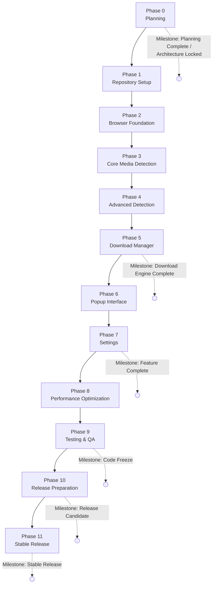
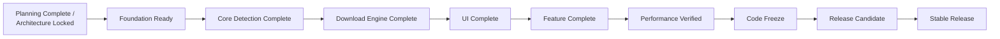
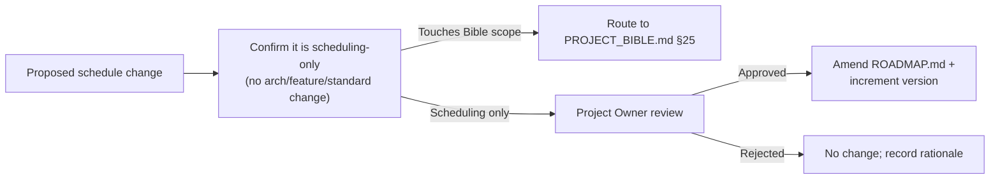

<!--
================================================================================
  AetherDL — ROADMAP
  Master project execution and planning document.
================================================================================
  This document defines WHAT will be built, WHEN, and HOW progress is measured.
  It controls SCHEDULING only. It does not define architecture (PROJECT_BIBLE.md)
  or agent behavior (AGENT_RULES.md). Where scheduling and specification meet,
  PROJECT_BIBLE.md is the source of truth and always prevails.
================================================================================
-->

# AetherDL — Roadmap

> **Fast. Private. Powerful.**
> Master execution and planning document.

---

## Document Control

| Field | Value |
|---|---|
| **Document Title** | AetherDL — Roadmap |
| **Document Type** | Project Execution Plan (Scheduling Authority) |
| **Status** | Ratified / Active |
| **Version** | 1.0.0 |
| **Owner** | Project Owner (AetherDL) / Technical Program Management |
| **Authority** | Controls scheduling only; subordinate to [PROJECT_BIBLE.md](PROJECT_BIBLE.md) |
| **Primary References** | [PROJECT_BIBLE.md](PROJECT_BIBLE.md), [AGENT_RULES.md](AGENT_RULES.md) |

### Version

`1.0.0`. Versioned independently of the product, the Bible, and the Agent Rules. Amended per
[Change Management](#13-change-management).

### Status

**Ratified / Active.**

### Owner

The Project Owner holds final authority over schedule, phase approval, and milestone sign-off.
Technical Program Management maintains this document.

### Authority

This document is the authority on **scheduling**: phase order, deliverable sequencing, milestones,
release lifecycle, and progress measurement. It is **subordinate** to [PROJECT_BIBLE.md](PROJECT_BIBLE.md)
on all matters of architecture, features, standards, security, and privacy.

### Scope

In scope: milestones, phases, deliverables, dependencies, acceptance criteria, Definition of Done,
release strategy, versioning, progress tracking, risk, change management, success criteria, and
informational future roadmap. Out of scope: architecture, coding standards, agent behavior,
implementation detail, and code — those belong to the referenced documents.

### Relationship to PROJECT_BIBLE.md

> [!IMPORTANT]
> [PROJECT_BIBLE.md](PROJECT_BIBLE.md) is the single source of truth. This roadmap **references** the
> Bible for the substance of every deliverable and acceptance criterion; it does **not** restate,
> reinterpret, or redefine them. Phase deliverables here map to the Bible's phase roadmap
> ([PROJECT_BIBLE.md §22](PROJECT_BIBLE.md#22-phase-roadmap)). Where this document and the Bible
> differ on substance, **the Bible wins**.

### Relationship to AGENT_RULES.md

[AGENT_RULES.md](AGENT_RULES.md) governs how AI agents behave while executing this roadmap —
one-phase-at-a-time discipline, stop-for-approval, escalation. This roadmap defines *what* each
phase delivers; the Agent Rules define *how* an agent works through it. This document does not
restate agent behavior; see [AGENT_RULES.md §16 Phase Workflow](AGENT_RULES.md#16-phase-workflow).

### Phase Numbering Reconciliation

> [!NOTE]
> This roadmap decomposes the Bible's single **Phase 10 — Release** ([PROJECT_BIBLE.md §22.11](PROJECT_BIBLE.md#2211-phase-10--release))
> into two execution phases for scheduling clarity: **Phase 10 — Release Preparation** and
> **Phase 11 — Stable Release**. This is a *scheduling decomposition only*; it introduces no new
> scope and no architectural change. Bible Phases 0–9 map one-to-one to Roadmap Phases 0–9.

### Normative Language

The key words **MUST**, **MUST NOT**, **REQUIRED**, **SHALL**, **SHOULD**, **MAY**, and **OPTIONAL**
follow **RFC 2119** / **RFC 8174**.

---

## Table of Contents

1. [Project Overview](#1-project-overview)
2. [Development Philosophy](#2-development-philosophy)
3. [Phase Dependency Graph](#3-phase-dependency-graph)
4. [Complete Phase Roadmap](#4-complete-phase-roadmap)
5. [Milestones](#5-milestones)
6. [Release Strategy](#6-release-strategy)
7. [Versioning Strategy](#7-versioning-strategy)
8. [Progress Tracking](#8-progress-tracking)
9. [Risk Management](#9-risk-management)
10. [Change Management](#10-change-management)
11. [Success Criteria](#11-success-criteria)
12. [Future Roadmap](#12-future-roadmap)
13. [Appendices](#13-appendices)

---

## 1. Project Overview

### 1.1 Project Summary

AetherDL is a cross-browser, Manifest V3, privacy-first media downloader. Its purpose, scope,
architecture, and constraints are defined in [PROJECT_BIBLE.md](PROJECT_BIBLE.md). This roadmap
plans the delivery of that product from planning through stable release.

### 1.2 Purpose of This Roadmap

This roadmap exists to make delivery predictable and verifiable. It sequences work into phases,
binds each phase to concrete deliverables and acceptance criteria, defines the gates that must be
passed to advance, and specifies how progress and readiness are measured. It is the coordination
layer between the *specification* (the Bible) and the *execution discipline* (the Agent Rules).

### 1.3 Definition of Project Success

The project is successful when **all** phases are complete against their acceptance criteria and
Definition of Done, and the [Success Criteria](#11-success-criteria) are satisfied: a stable 1.0.0
release that meets the Bible's requirements for functionality, performance, security, privacy,
accessibility, and cross-browser compatibility, approved by the Project Owner.

### 1.4 Release Philosophy

- **Ship when ready, not when scheduled.** Readiness is measured against acceptance criteria, never
  against elapsed time ([§8](#8-progress-tracking)).
- **Small, verifiable increments.** Each phase produces a demonstrable, production-ready increment.
- **Gate every advance.** No phase begins until its prerequisites are complete and approved
  ([§3](#3-phase-dependency-graph), [AGENT_RULES.md §16](AGENT_RULES.md#16-phase-workflow)).
- **Quality is the release date.** A phase that fails its Definition of Done is not done.

---

## 2. Development Philosophy

The execution philosophy below governs *how the plan is run*. It complements — and never overrides —
the engineering principles in [PROJECT_BIBLE.md §2.9](PROJECT_BIBLE.md#29-engineering-principles).

| # | Principle | Meaning in execution |
|---|---|---|
| 1 | **Incremental development** | Value is delivered in phased increments, each independently verifiable. |
| 2 | **One phase at a time** | Exactly one phase is active; focus is not split ([AGENT_RULES.md §16](AGENT_RULES.md#16-phase-workflow)). |
| 3 | **No phase skipping** | Phases execute in dependency order; prerequisites are mandatory ([§3](#3-phase-dependency-graph)). |
| 4 | **Quality before speed** | Correctness and completeness precede velocity; no shortcut ships. |
| 5 | **Production-ready deliverables only** | No placeholders, stubs, or partial features advance a phase ([§4 DoD](#4-complete-phase-roadmap)). |
| 6 | **Documentation-first development** | The Bible precedes and governs implementation; docs stay synchronized ([AGENT_RULES.md §8](AGENT_RULES.md#8-documentation-rules)). |
| 7 | **Testing-first mindset** | Acceptance is proven by tests; every phase carries its test obligations ([PROJECT_BIBLE.md §16](PROJECT_BIBLE.md#16-testing)). |
| 8 | **Static architecture** | The architecture is frozen; the roadmap schedules work *within* it, never *against* it ([PROJECT_BIBLE.md §1.4](PROJECT_BIBLE.md#14-the-static-architecture-principle)). |
| 9 | **Controlled change management** | Scope and schedule change only through defined process ([§10](#10-change-management)). |

---

## 3. Phase Dependency Graph

Later phases **MUST NOT** begin until every prerequisite phase is complete and approved. The graph
is strictly ordered; there are no parallel phase starts.

> [!IMPORTANT]
> An arrow means "must complete and be approved before." Completion is defined by a phase's
> [Exit Criteria](#4-complete-phase-roadmap) and Definition of Done, not by elapsed effort.

---

## 4. Complete Phase Roadmap

Each phase specifies Purpose, Objectives, Scope (Included / Excluded), Dependencies, Deliverables,
Acceptance Criteria, Definition of Done, Potential Risks, Exit Criteria, Estimated Complexity, and
Priority. Deliverable substance is defined by the Bible; this roadmap references it rather than
restating it.

**Estimated Complexity** scale: `Low` · `Medium` · `High` · `Very High`.
**Priority** scale: `P0` (blocking, must-have) · `P1` (high) · `P2` (normal).

---

### Phase 0 — Planning

- **Phase Purpose.** Establish the governing documents and lock the plan before any code.
- **Objectives.** Ratify the Bible, Agent Rules, and this Roadmap; confirm scope, non-goals, and
  static architecture.
- **Scope — Included.** Ratification of [PROJECT_BIBLE.md](PROJECT_BIBLE.md), [AGENT_RULES.md](AGENT_RULES.md),
  [ROADMAP.md](ROADMAP.md); seeding ADRs ([PROJECT_BIBLE.md §24](PROJECT_BIBLE.md#24-architecture-decision-records-adrs)); agreeing budgets and success metrics.
- **Scope — Excluded.** Any implementation, tooling, or repository code.
- **Dependencies.** None.
- **Deliverables.** Ratified governing documents; seeded ADRs; agreed [success metrics](PROJECT_BIBLE.md#26-success-metrics) and [performance budgets](PROJECT_BIBLE.md#121-performance-budgets).
- **Acceptance Criteria.** Owner approves all three documents; non-goals and static architecture explicitly accepted ([PROJECT_BIBLE.md §22.1](PROJECT_BIBLE.md#221-phase-0--planning--foundation)).
- **Definition of Done.** Documents versioned and marked Ratified/Active; no open architectural questions.
- **Potential Risks.** Ambiguity in scope or non-goals; unresolved open questions carried into build.
- **Exit Criteria.** Owner sign-off recorded; milestones *Planning Complete* and *Architecture Locked* achieved.
- **Estimated Complexity.** Low.
- **Priority.** P0.

---

### Phase 1 — Repository Setup

- **Phase Purpose.** Stand up the repository skeleton and tooling that all later work depends on.
- **Objectives.** Create the frozen folder structure and a working, installable no-op build across targets, with CI.
- **Scope — Included.** Folder structure ([PROJECT_BIBLE.md §8.3](PROJECT_BIBLE.md#83-folder-structure-final)); TypeScript/ESLint/Prettier/test tooling; build with per-target manifest generation; CI pipeline ([PROJECT_BIBLE.md §18.8](PROJECT_BIBLE.md#188-cicd)).
- **Scope — Excluded.** Any product feature logic (detection, download, UI).
- **Dependencies.** Phase 0.
- **Deliverables.** Repo skeleton with module spec headers; strict TS config; lint (with boundary rules) + format + test runners configured; installable empty extension per target ([PROJECT_BIBLE.md §22.2](PROJECT_BIBLE.md#222-phase-1--repository--tooling)).
- **Acceptance Criteria.** `main` builds installable no-op extensions for Chrome and Firefox; lint/format/typecheck/CI green; boundary lint active.
- **Definition of Done.** Repo conforms to [PROJECT_BIBLE.md §8.3](PROJECT_BIBLE.md#83-folder-structure-final); workflow operational ([PROJECT_BIBLE.md §18](PROJECT_BIBLE.md#18-development-workflow)).
- **Potential Risks.** Toolchain/MV3 build friction; per-target manifest generation gaps.
- **Exit Criteria.** Green CI on an installable no-op build for all required targets.
- **Estimated Complexity.** Medium.
- **Priority.** P0.

---

### Phase 2 — Browser Foundation

- **Phase Purpose.** Deliver the browser API abstraction that isolates all cross-browser differences.
- **Objectives.** Implement the Platform Layer so no other layer touches browser globals.
- **Scope — Included.** The Platform Layer modules ([PROJECT_BIBLE.md §8.2](PROJECT_BIBLE.md#82-browser-api-abstraction-layer)): browser facade, messaging, storage, permissions, tabs, downloads, notifications, menus, commands, network.
- **Scope — Excluded.** Detection, download orchestration, and UI logic (later phases).
- **Dependencies.** Phase 1.
- **Deliverables.** Promisified browser facade; typed messaging bus; storage adapters; permission/tab/download/notification/menu/command/network interfaces with implementations and tests ([PROJECT_BIBLE.md §22.3](PROJECT_BIBLE.md#223-phase-2--browser-api-abstraction)).
- **Acceptance Criteria.** No code outside `platform/` references `chrome`/`browser`; typed messages round-trip on Chromium + Firefox; storage read/write/migrate works.
- **Definition of Done.** Platform interfaces stable and tested to target coverage; boundary lint passes; parity verified.
- **Potential Risks.** Chromium/Firefox API divergence; background lifecycle differences; MV3 event-page vs service-worker nuances.
- **Exit Criteria.** Cross-target messaging and storage demonstrated green; boundary rule enforced in CI.
- **Estimated Complexity.** High.
- **Priority.** P0.

---

### Phase 3 — Core Media Detection

- **Phase Purpose.** Deliver deterministic per-tab detection of the core media types.
- **Objectives.** Implement the detection engine and first detectors; surface results and the badge.
- **Scope — Included.** DetectorManager, pipeline, dedupe, scoring, metadata, cache; detectors `html5-video`, `html5-audio`, `direct-url`; content-script observer; badge counter; DRM classification/refusal ([PROJECT_BIBLE.md §9](PROJECT_BIBLE.md#9-detection-system), [§22.4](PROJECT_BIBLE.md#224-phase-3--detection-engine-core)).
- **Scope — Excluded.** Manifest/stream detection and `blob:` (Phase 4); downloads (Phase 5); full UI (Phase 6).
- **Dependencies.** Phase 2.
- **Deliverables.** Working per-tab detection yielding normalized, deduped, scored `MediaItem[]`; per-tab badge; DRM refusal path; tests.
- **Acceptance Criteria.** On fixtures, HTML5 and direct-URL media are detected, deduped, and scored deterministically within the [detection latency budget](PROJECT_BIBLE.md#121-performance-budgets); badge reflects per-tab counts; protected signals classified and never surfaced as downloadable.
- **Definition of Done.** Core detection tested to target coverage; budgets met; pipeline deterministic.
- **Potential Risks.** Detection performance on heavy pages; false positives/negatives; SPA navigation handling.
- **Exit Criteria.** Deterministic detection demonstrated on the fixture set within budget.
- **Estimated Complexity.** High.
- **Priority.** P0.

---

### Phase 4 — Advanced Detection

- **Phase Purpose.** Extend detection to non-DRM streaming and additional sources.
- **Objectives.** Add manifest/hint/blob detectors and quality/variant parsing; harden DRM refusal.
- **Scope — Included.** Detectors `link-meta`, `hls-manifest`, `dash-manifest`, `blob-media`; non-DRM HLS/DASH variant parsing; quality detection ([PROJECT_BIBLE.md §9.8](PROJECT_BIBLE.md#98-quality-detection), [§22.5](PROJECT_BIBLE.md#225-phase-4--advanced-detection)).
- **Scope — Excluded.** Stream *assembly/download* (Phase 5); any DRM handling (permanently excluded, [PROJECT_BIBLE.md §6](PROJECT_BIBLE.md#6-unsupported-content)).
- **Dependencies.** Phase 3.
- **Deliverables.** Non-DRM manifest parsing with variants; best-effort `blob:` handling within the security model ([PROJECT_BIBLE.md §5.4](PROJECT_BIBLE.md#54-blob-urls-where-technically-feasible)); robust DRM refusal; non-DRM fixture tests.
- **Acceptance Criteria.** Non-DRM manifests parse to variants; any DRM/encryption signal is refused as unsupported; no key-handling or decryption code exists anywhere.
- **Definition of Done.** Advanced detectors tested; DRM refusal proven by tests; budgets met.
- **Potential Risks.** Manifest variety/edge cases; misclassifying protected vs unprotected; `blob:` feasibility limits.
- **Exit Criteria.** Non-DRM variant detection demonstrated; DRM-refusal tests green.
- **Estimated Complexity.** Very High.
- **Priority.** P1.

---

### Phase 5 — Download Manager

- **Phase Purpose.** Deliver reliable downloads with a durable queue.
- **Objectives.** Implement the download system end-to-end for direct files and non-DRM stream assembly.
- **Scope — Included.** Download manager, queue, concurrency, retry, progress, filename generation, cancellation/pause/resume, non-DRM stream assembly, history recording ([PROJECT_BIBLE.md §10](PROJECT_BIBLE.md#10-download-system), [§22.6](PROJECT_BIBLE.md#226-phase-5--download-manager)).
- **Scope — Excluded.** Popup/settings UI (Phases 6–7); optimization tuning (Phase 8).
- **Dependencies.** Phase 4.
- **Deliverables.** Persisted queue surviving suspension; native downloads; retry with backoff; cancellation/pause/resume; history on completion; tests.
- **Acceptance Criteria.** Direct downloads and non-DRM assembly complete reliably; queue reconstructs after background teardown; retry/backoff per spec; cancellation prompt; [download-start latency budget](PROJECT_BIBLE.md#121-performance-budgets) met.
- **Definition of Done.** Download core tested to target coverage (platform mocked); integration tests green on targets.
- **Potential Risks.** Background suspension mid-download; per-target Downloads API differences; assembly resource pressure.
- **Exit Criteria.** Reliable direct + non-DRM downloads with a persisted, resumable queue demonstrated.
- **Estimated Complexity.** Very High.
- **Priority.** P0.

---

### Phase 6 — Popup Interface

- **Phase Purpose.** Deliver the primary user surface in Material Design 3.
- **Objectives.** Build the popup: results, actions, queue view, all states, theming, full keyboard operability.
- **Scope — Included.** Design system/tokens/themes; media cards; all UI states; search/filter/sort; live queue/progress display; dark/light/system theming; accessibility ([PROJECT_BIBLE.md §11](PROJECT_BIBLE.md#11-user-interface), [§22.7](PROJECT_BIBLE.md#227-phase-6--popup-ui)).
- **Scope — Excluded.** Settings page, history view, context menu, notifications, commands (Phase 7).
- **Dependencies.** Phase 5.
- **Deliverables.** MD3 popup consuming detection results and queue state; complete state coverage; themes; keyboard support; e2e/a11y tests.
- **Acceptance Criteria.** Popup reaches [time-to-interactive budget](PROJECT_BIBLE.md#121-performance-budgets); passes AA a11y checks ([PROJECT_BIBLE.md §17](PROJECT_BIBLE.md#17-accessibility)); all states render; theming works including `system`.
- **Definition of Done.** Popup e2e tested; AA verified; performance budget met.
- **Potential Risks.** Popup performance budget; a11y gaps; theme/contrast in dark mode.
- **Exit Criteria.** MD3 popup demonstrated within TTI budget and AA-compliant.
- **Estimated Complexity.** High.
- **Priority.** P0.

---

### Phase 7 — Settings

- **Phase Purpose.** Deliver configuration, history, and the remaining user-facing integrations.
- **Objectives.** Build settings, history view, context menu, notifications, commands, and i18n scaffolding.
- **Scope — Included.** Full settings catalog persisted/applied live; history browse/search/export/clear; optional-permission flows; context menu; notifications; commands; i18n + `en` catalog ([PROJECT_BIBLE.md §22.8](PROJECT_BIBLE.md#228-phase-7--settings)).
- **Scope — Excluded.** Performance tuning (Phase 8); additional locales (future, [§12](#12-future-roadmap)).
- **Dependencies.** Phase 6.
- **Deliverables.** Settings page; history view; context menu/notifications/commands gated behind their permissions; i18n scaffolding; tests.
- **Acceptance Criteria.** All settings function with valid defaults and validation; optional features gate behind permissions; history is local-only and fully erasable ([PROJECT_BIBLE.md §14](PROJECT_BIBLE.md#14-privacy)).
- **Definition of Done.** Settings/history tested; permission flows verified on targets; AA a11y.
- **Potential Risks.** Optional-permission UX differences (esp. Firefox); settings validation edge cases.
- **Exit Criteria.** All user-facing features functional and gated; milestone *Feature Complete* achieved.
- **Estimated Complexity.** High.
- **Priority.** P1.

---

### Phase 8 — Performance Optimization

- **Phase Purpose.** Meet every performance budget and finalize resource discipline.
- **Objectives.** Bring startup, memory, CPU, bundle sizes, and latencies within budget; eliminate leaks.
- **Scope — Included.** Bundle/code-split reductions; DOM-observation tuning; cache bound/eviction verification; memory/CPU profiling; resource-cleanup verification ([PROJECT_BIBLE.md §12](PROJECT_BIBLE.md#12-performance), [§22.9](PROJECT_BIBLE.md#229-phase-8--optimization)).
- **Scope — Excluded.** New features or behavior changes (frozen from Phase 7 forward except fixes).
- **Dependencies.** Phase 7.
- **Deliverables.** Optimizations meeting budgets; profiling evidence; cleanup-checklist pass.
- **Acceptance Criteria.** Every budget in [PROJECT_BIBLE.md §12.1](PROJECT_BIBLE.md#121-performance-budgets) met on reference hardware; no leaks across open/close cycles; idle background ~0% CPU.
- **Definition of Done.** Performance tests green; budgets enforced in CI where measurable.
- **Potential Risks.** Performance regressions; optimization introducing behavior change or regressions.
- **Exit Criteria.** All performance budgets demonstrably met and enforced.
- **Estimated Complexity.** Medium.
- **Priority.** P1.

---

### Phase 9 — Testing & Quality Assurance

- **Phase Purpose.** Achieve full quality coverage and freeze the code.
- **Objectives.** Complete the full test matrix, pass all gates, and execute the manual matrix and security gate.
- **Scope — Included.** Unit/integration/browser-e2e/performance/regression/accessibility suites; documented manual matrix; security review gate ([PROJECT_BIBLE.md §16](PROJECT_BIBLE.md#16-testing), [§22.10](PROJECT_BIBLE.md#2210-phase-9--testing), [§13.10](PROJECT_BIBLE.md#1310-security-review-gate)).
- **Scope — Excluded.** New scope; store submission (Phase 10–11).
- **Dependencies.** Phase 8.
- **Deliverables.** Complete green test matrix; executed manual matrix; passed security gate; zero known defects against spec.
- **Acceptance Criteria.** All suites green; coverage targets met; manual matrix passes on all supported browsers; security gate passes.
- **Definition of Done.** Quality gates enforced in CI; no known defects against the Bible.
- **Potential Risks.** Testing delays; flaky cross-browser e2e; late-surfacing defects forcing rework.
- **Exit Criteria.** Full matrix green and manual pass complete; milestone *Code Freeze* achieved.
- **Estimated Complexity.** High.
- **Priority.** P0.

---

### Phase 10 — Release Preparation

- **Phase Purpose.** Produce store-ready, audited release candidates.
- **Objectives.** Version, package per target, prepare listings, and complete final security/privacy audits.
- **Scope — Included.** Versioned release build; per-target packaged artifacts; store listings/assets; `CHANGELOG.md`; final security + privacy audits ([PROJECT_BIBLE.md §22.11](PROJECT_BIBLE.md#2211-phase-10--release), [§14.3](PROJECT_BIBLE.md#143-no-external-network-calls-by-the-extension)).
- **Scope — Excluded.** Public store publication (Phase 11).
- **Dependencies.** Phase 9.
- **Deliverables.** Release-candidate artifacts per target; validated store packages; changelog; audit results confirming zero telemetry/egress and minimal justified permissions.
- **Acceptance Criteria.** Packages validate for Chrome Web Store, Edge Add-ons, Firefox AMO, and Chromium-compatible stores; zero network egress confirmed; permissions minimal and justified.
- **Definition of Done.** Release candidate approved by Owner; audits clean; artifacts ready for submission.
- **Potential Risks.** Store validation/policy rejections; last-minute permission or manifest issues.
- **Exit Criteria.** Approved release candidate; milestone *Release Candidate* achieved.
- **Estimated Complexity.** Medium.
- **Priority.** P0.

---

### Phase 11 — Stable Release

- **Phase Purpose.** Publish the stable 1.0.0 release and enter maintenance.
- **Objectives.** Submit to official stores, confirm availability, and establish maintenance posture.
- **Scope — Included.** Store submission/publication via official channels only; release tagging; post-release verification; transition to maintenance ([PROJECT_BIBLE.md §18.6](PROJECT_BIBLE.md#186-release-strategy), [N17](PROJECT_BIBLE.md#31-definitive-non-goals)).
- **Scope — Excluded.** New feature work (governed by future roadmap and change control).
- **Dependencies.** Phase 10.
- **Deliverables.** Published 1.0.0 on all target stores; tagged release; verified installs; maintenance plan active.
- **Acceptance Criteria.** 1.0.0 available and installable on all supported browsers via official stores; post-release smoke verification passes; all [Success Criteria](#11-success-criteria) satisfied.
- **Definition of Done.** Owner declares stable release; distribution via official stores only; project enters maintenance.
- **Potential Risks.** Store review latency; post-release defects requiring a patch release.
- **Exit Criteria.** Stable release live and verified; milestone *Stable Release* achieved.
- **Estimated Complexity.** Low.
- **Priority.** P0.

---

## 5. Milestones

Milestones are project-level checkpoints spanning one or more phases. A milestone is achieved only
when its criteria are met and the Project Owner confirms it.

| Milestone | Achieved after | Criteria for achievement |
|---|---|---|
| **Planning Complete** | Phase 0 | Governing documents ratified; scope and non-goals accepted. |
| **Architecture Locked** | Phase 0 | Static architecture and stack ratified in the Bible/ADRs; no open architectural questions ([PROJECT_BIBLE.md §8](PROJECT_BIBLE.md#8-architecture)). |
| **Foundation Ready** | Phase 2 | Installable no-op builds on all targets; Platform Layer complete; boundary rule enforced. |
| **Core Detection Complete** | Phase 3 | Deterministic per-tab detection of core media within budget; badge live; DRM refusal in place. |
| **Download Engine Complete** | Phase 5 | Reliable direct + non-DRM downloads with a durable, resumable queue; retry and cancellation working. |
| **UI Complete** | Phase 6 | MD3 popup within TTI budget; AA-compliant; all states and theming functional. |
| **Feature Complete** | Phase 7 | All Bible-specified features implemented and gated; no scope remaining for 1.0.0. |
| **Performance Verified** | Phase 8 | All performance budgets met and enforced; no leaks. |
| **Code Freeze** | Phase 9 | Full test matrix green; manual matrix and security gate passed; only release-blocking fixes permitted thereafter. |
| **Release Candidate** | Phase 10 | Store-ready, audited artifacts approved by Owner; zero-egress/privacy confirmed. |
| **Stable Release** | Phase 11 | 1.0.0 published on all target stores and verified; all success criteria satisfied. |

---

## 6. Release Strategy

The release lifecycle defines the maturity stages the product moves through. Stages gate on the
phases and milestones above.

| Stage | Purpose | Entry condition |
|---|---|---|
| **Planning** | Establish governing documents and plan. | Project start. |
| **Development** | Build the product phase by phase. | Planning Complete (Phase 0). |
| **Alpha** | Internal validation of an increment that is functional but incomplete; behavior may still change within spec. | Core Detection + Download Engine complete (through Phase 5). |
| **Beta** | Feature-complete validation with real fixture workflows across the browser matrix; stabilization only. | Feature Complete (Phase 7). |
| **Release Candidate** | Ship-ready build undergoing final QA, audits, and store validation; no changes except release-blocking fixes. | Code Freeze (Phase 9) → Release Preparation (Phase 10). |
| **Stable** | Public 1.0.0 released via official stores. | Stable Release (Phase 11). |
| **Maintenance** | Defect fixes and patch releases; no new scope without change control. | Post-1.0.0. |
| **Future Versions** | Post-1.0 evolution, governed by [Future Roadmap](#12-future-roadmap) and change control. | Approved future scope only. |

> [!NOTE]
> Alpha and Beta are **internal validation stages**. AetherDL performs no field data collection at
> any stage ([PROJECT_BIBLE.md §14](PROJECT_BIBLE.md#14-privacy)); validation uses local fixtures and
> the manual test matrix ([PROJECT_BIBLE.md §16.7](PROJECT_BIBLE.md#167-manual-test-matrix)).

---

## 7. Versioning Strategy

AetherDL follows **Semantic Versioning** ([PROJECT_BIBLE.md §18.7](PROJECT_BIBLE.md#187-versioning)),
synchronized across all target builds. Pre-1.0 versions signal increasing maturity; 1.0.0 marks the
first stable public release.

| Version | Expected state | Corresponds to |
|---|---|---|
| `0.1.0` | Foundation: repo + Platform Layer usable. | Phases 1–2 |
| `0.2.0` | Core detection functional. | Phase 3 |
| `0.3.0` | Advanced (non-DRM stream) detection functional. | Phase 4 |
| `0.5.0` | Download engine + durable queue functional (Alpha). | Phase 5 |
| `0.8.0` | Popup UI complete (Beta-track). | Phase 6 |
| `0.9.0` | Feature complete (settings/history/menus/notifications). | Phase 7 |
| `0.9.x` | Performance verified; stabilization; Release Candidates. | Phases 8–10 |
| `1.0.0` | Stable public release. | Phase 11 |
| `>1.0` | Post-1.0 evolution under change control ([§10](#10-change-management)). | Future |

**Version expectations:**
- Pre-1.0 (`0.x`) versions **MAY** contain incomplete feature sets but **MUST** be production-ready
  for the scope they claim (no placeholders; [§2](#2-development-philosophy)).
- `PATCH` for fixes, `MINOR` for backward-compatible additions, `MAJOR` for breaking changes —
  breaking changes post-1.0 require change control ([§10](#10-change-management)).
- The Roadmap, Bible, and Agent Rules carry **their own** document versions, independent of the
  product version.

---

## 8. Progress Tracking

> [!IMPORTANT]
> **Progress is measured by completed acceptance criteria, not by estimated effort or time spent.**
> A phase reported as "90% coded" is **0% complete** until its acceptance criteria and Definition of
> Done are satisfied.

### 8.1 Measurement Dimensions

| Dimension | How measured | Source of truth |
|---|---|---|
| **Phase completion** | Ratio of phases passing Exit Criteria to total phases. | [§4](#4-complete-phase-roadmap) |
| **Milestone completion** | Milestones achieved and Owner-confirmed. | [§5](#5-milestones) |
| **Deliverable completion** | Deliverables produced and accepted per phase. | [§4](#4-complete-phase-roadmap) |
| **Acceptance completion** | Acceptance criteria satisfied per phase. | [§4](#4-complete-phase-roadmap) |
| **Documentation completion** | Docs updated and synchronized. | [AGENT_RULES.md §8](AGENT_RULES.md#8-documentation-rules) |
| **Testing completion** | Required suites green; coverage targets met. | [PROJECT_BIBLE.md §16](PROJECT_BIBLE.md#16-testing) |
| **Definition of Done completion** | All DoD conditions satisfied. | [PROJECT_BIBLE.md §18.9](PROJECT_BIBLE.md#189-definition-of-done-global) |

### 8.2 Percentage-Complete Rule

A phase's percent-complete is `(satisfied acceptance criteria) / (total acceptance criteria)` for
that phase. Overall project progress is the proportion of phases whose Exit Criteria are fully met.
Partial credit for unfinished acceptance criteria is **not** counted. This eliminates
effort-estimate optimism and ties reported progress to verifiable outcomes.

### 8.3 Reporting Cadence

Progress is reported at each phase boundary when an agent presents completed work for approval
([AGENT_RULES.md §16](AGENT_RULES.md#16-phase-workflow)). Each report states satisfied acceptance
criteria, test/gate status, and milestone impact.

---

## 9. Risk Management

The register tracks execution and delivery risks. Ratings: Impact `Low/Medium/High`, Likelihood
`Low/Medium/High`. Owners are roles, not individuals.

| ID | Risk | Impact | Likelihood | Mitigation | Owner |
|---|---|---|---|---|---|
| R1 | **Browser API differences** cause behavior divergence | High | High | Confine all differences to the Platform Layer ([PROJECT_BIBLE.md §8.2](PROJECT_BIBLE.md#82-browser-api-abstraction-layer)); parity tests in Phase 2/9. | Browser Architect |
| R2 | **Firefox compatibility** gaps (event page, `menus`, permissions) | High | Medium | Address Firefox differences in the abstraction layer ([PROJECT_BIBLE.md §7.4](PROJECT_BIBLE.md#74-firefox-compatibility)); Firefox in the e2e matrix. | Browser Architect |
| R3 | **Manifest/platform changes** by browser vendors | High | Medium | MV3-only design ([PROJECT_BIBLE.md §7.5](PROJECT_BIBLE.md#75-manifest-v3-strategy)); generated manifests; monitor store policies. | Release Manager |
| R4 | **Permission limitations** block a feature on a target | Medium | Medium | Optional permissions at point-of-use ([PROJECT_BIBLE.md §13.3](PROJECT_BIBLE.md#133-permission-strategy)); graceful degradation; escalate ([AGENT_RULES.md §15](AGENT_RULES.md#15-escalation-policy)). | Security Engineer |
| R5 | **Performance regressions** breach budgets | High | Medium | Budgets enforced in CI where measurable; Phase 8 gate ([PROJECT_BIBLE.md §12.9](PROJECT_BIBLE.md#129-performance-regression-policy)). | Performance Owner |
| R6 | **Security regressions** (CSP, permissions, unsafe code) | High | Low | Security review gate each release ([PROJECT_BIBLE.md §13.10](PROJECT_BIBLE.md#1310-security-review-gate)); hard prohibitions ([AGENT_RULES.md §11](AGENT_RULES.md#11-security-rules)). | Security Engineer |
| R7 | **Privacy regression** (accidental egress/telemetry) | High | Low | Zero-egress architecture; network audit ([PROJECT_BIBLE.md §14.3](PROJECT_BIBLE.md#143-no-external-network-calls-by-the-extension)); non-amendable guarantees. | Security Engineer |
| R8 | **Dependency issues** (supply chain, breakage) | Medium | Medium | Minimal, pinned dependencies; approval-gated changes ([PROJECT_BIBLE.md §13.9](PROJECT_BIBLE.md#139-dependency--supply-chain-security), [AGENT_RULES.md §6](AGENT_RULES.md#6-dependency-rules)). | Principal Architect |
| R9 | **Testing delays** push Code Freeze | Medium | Medium | Testing-first mindset; per-phase test obligations; regression tests on every fix ([PROJECT_BIBLE.md §16](PROJECT_BIBLE.md#16-testing)). | Engineering Manager |
| R10 | **Store validation/policy rejection** at release | Medium | Medium | Early manifest/CSP/permission validation in packaging ([PROJECT_BIBLE.md §8.15](PROJECT_BIBLE.md#815-build--packaging-architecture)); Phase 10 audits. | Release Manager |
| R11 | **Scope creep / feature creep** | High | Medium | Static scope; change control ([§10](#10-change-management)); feature prohibitions ([AGENT_RULES.md §4](AGENT_RULES.md#4-feature-rules)). | Project Owner / TPM |
| R12 | **Non-DRM stream complexity** (Phase 4/5) exceeds estimate | Medium | High | Bound assembly resources; escalate feasibility limits; keep DRM permanently out of scope ([PROJECT_BIBLE.md §6](PROJECT_BIBLE.md#6-unsupported-content)). | Principal Architect |

---

## 10. Change Management

Roadmap change is controlled and scoped. This document controls *scheduling*; it cannot authorize
architectural, feature, or behavioral change.

| Document | Controls | Change process |
|---|---|---|
| **[ROADMAP.md](ROADMAP.md)** | Scheduling: phase order, sequencing, milestones, release lifecycle. | This section ([§10](#10-change-management)). |
| **[PROJECT_BIBLE.md](PROJECT_BIBLE.md)** | Architecture, features, standards, security, privacy. | [PROJECT_BIBLE.md §25](PROJECT_BIBLE.md#25-change-control--amendment-process). |
| **[AGENT_RULES.md](AGENT_RULES.md)** | AI agent behavior. | [PROJECT_BIBLE.md §25](PROJECT_BIBLE.md#25-change-control--amendment-process) (per [AGENT_RULES.md §19.3](AGENT_RULES.md#193-amendment)). |

### 10.1 Rules of Change

1. **Roadmap changes do NOT authorize architectural changes.** Re-sequencing, re-scoping a phase's
   *schedule*, or adjusting milestones **MUST NOT** alter architecture, features, or standards. Those
   require Bible change control ([PROJECT_BIBLE.md §25](PROJECT_BIBLE.md#25-change-control--amendment-process)).
2. **Scope is fixed by the Bible.** The roadmap schedules Bible-defined scope; it cannot add, remove,
   or redefine scope. New scope enters only via a Bible amendment, then is scheduled here.
3. **Owner approval required.** Any change to phase order, milestone criteria, or release lifecycle
   requires Project Owner approval and a version increment of this document.
4. **Escalation precedes change.** Conditions that appear to require re-planning are escalated first
   ([AGENT_RULES.md §15](AGENT_RULES.md#15-escalation-policy)); agents do not re-plan autonomously.

### 10.2 Change Procedure

---

## 11. Success Criteria

The project is complete and successful when **all** of the following hold and the Project Owner
approves the stable release.

| # | Success criterion | Verified by |
|---|---|---|
| SC1 | **All phases complete** (0–11) | [§4](#4-complete-phase-roadmap) Exit Criteria |
| SC2 | **Acceptance criteria satisfied** for every phase | [§8](#8-progress-tracking) |
| SC3 | **Definition of Done satisfied** for every phase | [PROJECT_BIBLE.md §18.9](PROJECT_BIBLE.md#189-definition-of-done-global) |
| SC4 | **Documentation complete and synchronized** | [AGENT_RULES.md §8](AGENT_RULES.md#8-documentation-rules) |
| SC5 | **Testing complete** — full matrix green, coverage met | [PROJECT_BIBLE.md §16](PROJECT_BIBLE.md#16-testing) |
| SC6 | **Performance targets achieved** | [PROJECT_BIBLE.md §12.1](PROJECT_BIBLE.md#121-performance-budgets) |
| SC7 | **Security requirements satisfied** | [PROJECT_BIBLE.md §13](PROJECT_BIBLE.md#13-security) |
| SC8 | **Privacy requirements satisfied** (zero egress) | [PROJECT_BIBLE.md §14](PROJECT_BIBLE.md#14-privacy) |
| SC9 | **Cross-browser compatibility achieved** across all targets | [PROJECT_BIBLE.md §7](PROJECT_BIBLE.md#7-browser-support) |
| SC10 | **Release approved** and published via official stores | [§6](#6-release-strategy), [§11 Phase](#phase-11--stable-release) |

---

## 12. Future Roadmap

> [!NOTE]
> **Everything in this section is informational only.** Future items are **NOT approved work**, are
> **NOT scheduled**, and **MUST NOT** influence current implementation. They may enter the plan only
> after approval via change control ([§10](#10-change-management), [PROJECT_BIBLE.md §25](PROJECT_BIBLE.md#25-change-control--amendment-process)),
> and they never override the [Non-Goals](PROJECT_BIBLE.md#3-non-goals).

Future *possibilities* are catalogued in [PROJECT_BIBLE.md §23 Future Roadmap](PROJECT_BIBLE.md#23-future-roadmap)
(e.g. full RTL support, additional locales, more non-DRM detectors, batch/session downloads,
settings import/export). This roadmap does not schedule any of them for 1.0.0.

| Candidate (informational) | Would be scheduled as | Precondition |
|---|---|---|
| Additional locales / full RTL | Post-1.0 minor releases | Bible amendment + Owner approval |
| Additional non-DRM detectors | Post-1.0 minor releases | Plugin contract unchanged ([PROJECT_BIBLE.md §9.2](PROJECT_BIBLE.md#92-detector-interface)) |
| Batch/session downloads | Post-1.0 minor release | Bible amendment + Owner approval |
| Settings import/export | Post-1.0 minor release | Local-only guarantee preserved ([PROJECT_BIBLE.md §14](PROJECT_BIBLE.md#14-privacy)) |

Permanently excluded items (DRM circumvention, telemetry, cloud, accounts, tracking) are **never**
future candidates ([PROJECT_BIBLE.md §3.1](PROJECT_BIBLE.md#31-definitive-non-goals), [§25.3](PROJECT_BIBLE.md#253-non-amendable-items)).

---

## 13. Appendices

### 13.A Glossary

| Term | Definition |
|---|---|
| **Phase** | A gated unit of execution with defined deliverables and exit criteria ([§4](#4-complete-phase-roadmap)). |
| **Milestone** | A project-level checkpoint spanning one or more phases ([§5](#5-milestones)). |
| **Deliverable** | A concrete artifact a phase must produce. |
| **Acceptance Criteria** | Verifiable conditions that confirm a deliverable/phase is correct. |
| **Definition of Done (DoD)** | The completeness bar a phase must meet ([PROJECT_BIBLE.md §18.9](PROJECT_BIBLE.md#189-definition-of-done-global)). |
| **Exit Criteria** | Conditions that must hold to close a phase and advance. |
| **Gate** | A mandatory checkpoint blocking advancement until conditions are met. |
| **Code Freeze** | The point after which only release-blocking fixes are permitted ([§5](#5-milestones)). |
| **Release Candidate (RC)** | A ship-ready build pending final validation and approval. |

### 13.B Abbreviations

| Abbrev. | Expansion |
|---|---|
| **AA** | WCAG 2.1 Level AA ([PROJECT_BIBLE.md §17](PROJECT_BIBLE.md#17-accessibility)) |
| **ADR** | Architecture Decision Record ([PROJECT_BIBLE.md §24](PROJECT_BIBLE.md#24-architecture-decision-records-adrs)) |
| **CI/CD** | Continuous Integration / Continuous Delivery ([PROJECT_BIBLE.md §18.8](PROJECT_BIBLE.md#188-cicd)) |
| **DoD** | Definition of Done |
| **MV3** | Manifest V3 ([PROJECT_BIBLE.md §7.5](PROJECT_BIBLE.md#75-manifest-v3-strategy)) |
| **QA** | Quality Assurance |
| **RC** | Release Candidate |
| **SemVer** | Semantic Versioning ([PROJECT_BIBLE.md §18.7](PROJECT_BIBLE.md#187-versioning)) |
| **TPM** | Technical Program Manager |

### 13.C Phase Summary Table

| Phase | Name | Depends on | Complexity | Priority | Version target |
|---|---|---|---|---|---|
| 0 | Planning | — | Low | P0 | — |
| 1 | Repository Setup | 0 | Medium | P0 | 0.1.0 |
| 2 | Browser Foundation | 1 | High | P0 | 0.1.0 |
| 3 | Core Media Detection | 2 | High | P0 | 0.2.0 |
| 4 | Advanced Detection | 3 | Very High | P1 | 0.3.0 |
| 5 | Download Manager | 4 | Very High | P0 | 0.5.0 |
| 6 | Popup Interface | 5 | High | P0 | 0.8.0 |
| 7 | Settings | 6 | High | P1 | 0.9.0 |
| 8 | Performance Optimization | 7 | Medium | P1 | 0.9.x |
| 9 | Testing & QA | 8 | High | P0 | 0.9.x |
| 10 | Release Preparation | 9 | Medium | P0 | 0.9.x |
| 11 | Stable Release | 10 | Low | P0 | 1.0.0 |

### 13.D Milestone Summary Table

| Milestone | Achieved after | Stage impact |
|---|---|---|
| Planning Complete / Architecture Locked | Phase 0 | Enter Development |
| Foundation Ready | Phase 2 | Foundation usable |
| Core Detection Complete | Phase 3 | — |
| Download Engine Complete | Phase 5 | Enter Alpha |
| UI Complete | Phase 6 | — |
| Feature Complete | Phase 7 | Enter Beta |
| Performance Verified | Phase 8 | — |
| Code Freeze | Phase 9 | Enter RC track |
| Release Candidate | Phase 10 | RC approved |
| Stable Release | Phase 11 | Enter Stable → Maintenance |

### 13.E Document References

| Document | Role |
|---|---|
| [PROJECT_BIBLE.md](PROJECT_BIBLE.md) | Single source of truth — architecture, features, standards, security, privacy. |
| [AGENT_RULES.md](AGENT_RULES.md) | Operational handbook for AI agent behavior. |
| [ROADMAP.md](ROADMAP.md) | This document — execution and scheduling authority. |

### 13.F Cross-Reference Index

| Concern | This document | Authoritative reference |
|---|---|---|
| Phase deliverable substance | [§4](#4-complete-phase-roadmap) | [PROJECT_BIBLE.md §22](PROJECT_BIBLE.md#22-phase-roadmap) |
| Definition of Done | [§4](#4-complete-phase-roadmap), [§8](#8-progress-tracking) | [PROJECT_BIBLE.md §18.9](PROJECT_BIBLE.md#189-definition-of-done-global) |
| Performance budgets | [§4](#4-complete-phase-roadmap) (Phase 8), [§11](#11-success-criteria) | [PROJECT_BIBLE.md §12.1](PROJECT_BIBLE.md#121-performance-budgets) |
| Security / privacy gates | [§9](#9-risk-management), [§11](#11-success-criteria) | [PROJECT_BIBLE.md §13](PROJECT_BIBLE.md#13-security), [§14](PROJECT_BIBLE.md#14-privacy) |
| Testing obligations | [§8](#8-progress-tracking), Phase 9 | [PROJECT_BIBLE.md §16](PROJECT_BIBLE.md#16-testing) |
| Versioning | [§7](#7-versioning-strategy) | [PROJECT_BIBLE.md §18.7](PROJECT_BIBLE.md#187-versioning) |
| Change control (architecture) | [§10](#10-change-management) | [PROJECT_BIBLE.md §25](PROJECT_BIBLE.md#25-change-control--amendment-process) |
| Agent phase discipline | [§2](#2-development-philosophy), [§8.3](#83-reporting-cadence) | [AGENT_RULES.md §16](AGENT_RULES.md#16-phase-workflow) |

---

**End of ROADMAP.md**

*AetherDL — Fast. Private. Powerful.*

This is the execution and scheduling authority for AetherDL. It controls *when* work happens.
The single source of truth for *what* and *how* is [PROJECT_BIBLE.md](PROJECT_BIBLE.md), which always prevails.

